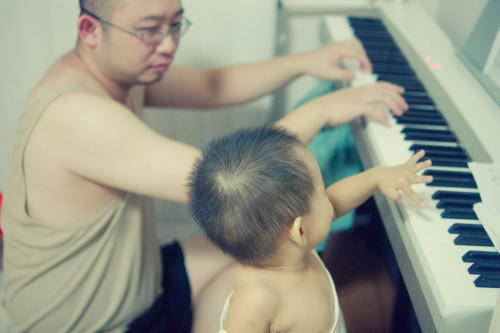

          
            
**2013.11.06**

春节家庭聚会时，父亲抱着喵坐着，握着喵的双手，和着儿歌，有模有样地指挥。喵也毫无抗拒地享受着爷爷带来的音乐指导，自己一个人的时候也挥着小手儿，回味着刚才的指挥课。更有甚者，全家吃饭的时候还非要爷爷来给上“指挥课”。我代替爷爷握着喵的小手，她会对我露出“不好意思，请换人”的笑容，继续呼唤爷爷。

看着喵享受着这手把手的音乐指导，不禁感慨万千。小学时学钢琴的一幕幕又闪回到眼前。对那时的我，钢琴就是“天上掉下个大箱子”。从此之后，玩的时间、看电视的时间等等都被这个“大箱子”分流了，而这个“大箱子”几乎没有带给我什么快乐的回忆。汗流浃背地弹各种超长名字的外国人写的以大写字母命名的曲子、每周接受老师的各种指导、乐理课上各种不理解带来慌乱、比赛时弹错音的恐惧。面对谱子上的各种大于号、小于号（渐强、减弱），虽然完全不能理解，但是也还能机械地去照做。然而最让人痛苦的就是所谓的音乐感情，也就是父母那时总说的“跟着乐曲，你要摆头”。

跟着乐曲摆头，印象比较深的是当时看理查德.克莱德曼演奏时会这样。但是我从曲子里感觉不出那些所谓的感觉，准确的说那个年龄的时候根本不知道那些悲怆的感觉是什么。谱子里如果像渐强渐弱那样标出来“此处摆头”，“应如何摆头”就好了。

不摆头的后果有时很严重，那时的父亲可没有现在对喵那样的耐心，轻抚着小手教。对我那可就是食指戳在头上，怒吼着“摆头啊”，然后我脑袋就拍在谱架上了。

小学六年级的时候，考七级没通过，父母说要准备升初中考试了，就不学钢琴了。当听到不学琴的消息，我感觉这一生似乎就是在等待那一刻。现在回想起来还真是奇怪，能为不做一件事感到如此快乐。小学毕业后一直到参加工作，几乎就再没有打开过钢琴。

学琴时在舞台上表演自己不擅长的东西，各种尴尬，似乎都在不停地暗示我对舞台的恐惧。直到研究生外教课上进行英语演讲时才发现，原来我也可以在公众面前完美的展示自己擅长的东西，似乎一夜之间对舞台的恐惧再也没有了。

学钢琴带来的益处就是肌肉记忆了，双臂和双手背下谱子，然后一边想着晚上的动画片，一边机械地弹。这一只延续到后来体校游泳队训练，教练讲过什么脑子完全不记得，也不去记，最终的一切都交给肌肉去记了。这带来的恶果就是现在教媳妇 [&gt; 游泳的时候，不知道该怎么教，只能让她一遍一遍的看我游，让她自己去悟。应试也是一样，不停的做题，高考时证明题两边乘的因子不知从何而来，似乎就是从指尖流出，于是命题就得证了。](https://link.jianshu.com?t=http://www.lofter.com/mentionredirect.do?blogId=421039)

到了现在写程序也是，看着新东西总是要找个demo先跑起来，才能去琢磨原理，一切都成了自下而上，从实践中来，才能到理论中去。

可是现在看着喵，一切似乎又不同了。她从出生就一直伴随着音乐长大，到现在一岁半，会伴着任何音乐的节奏轻舞，甚者听到街上乞讨者放的跑了调的佛教音乐，她都会翩翩而起。她在音乐的环境中长大，习惯、接受并乐在其中。所以面对爷爷带来的“指挥课”完全没有抗拒。自己在家的时候她会在钢琴上各种乱按，对重音、低音、音阶带来的震撼，都会本能地摆头或者跳起来做出反应。

再反观我的历程，小时候父母工作很忙很辛苦，平时回家基本就是看看电视，给我念念书，很少听音乐，所以对于音乐并没有一种习惯。接着就是钢琴从天而降，开始学习，缺少了接受的过程。各种考试和比赛带来的恐惧又使得本来就缺少的兴趣更加减少，如此恶性循环下去，便是今天的结果了。

虽然有种种不开心，但还是感谢父母不辞辛劳的带我学钢琴，没有要求我做音乐家，只是当作头脑体操，于是每个学琴的周末，都可以顺便去打乒乓球、羽毛球、篮球、逛公园。

学钢琴也确实让我开始接触音乐了，现在大了，反而开始重拾钢琴了，弹琴的时候也终于能感受到那些“摆头”的原因了。

这一切只能说是我和钢琴相遇在了不是太恰当的时间和环境了。一边给喵弹琴伴舞，一边回忆这些往事，虽有苦涩，但仍然惬意。

**个人微信公众号，长按二维码加关注，或搜索：摹喵居士**

**喜欢作者写写哪些话题，可以公众号留言**

          
        