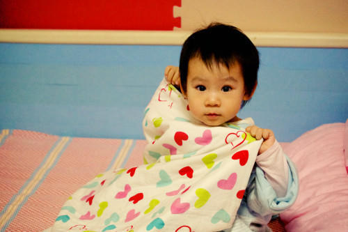

          
            
**2014.01.28**

喵起床说明书：
<ol>
* 
随着透过窗帘洒进来的光线越来越强，喵会开始翻动。
* 
慢慢坐起来，睡眼惺忪地开始喊“奶，奶”。
* 
我也起床，拿奶瓶去热奶。
* 
奶热好后，喵自己拿着奶瓶，还同时抱着蒙奇奇，开始吃奶。
* 
利用吃奶的时间，我开始叠被。
* 
吃完奶，坐到喵跟前，让喵说墙上的表正在显示什么数字。
* 
读完数字，让她抱着蒙奇奇躺下，把睡裤和尿布脱下来。
* 
喵蹬腿反抗的时候，问她：“脱了裤裤凉快吗？”，她微笑着嗯一声，就不反抗了。
* 
接着拿湿巾擦屁屁，又开始反抗，马上远远地对着屁屁吹一口气，问她：“凉快吗？”，她微笑着嗯一声，就不反抗了。继续用干纸巾擦干。
* 
让她站起来，再读表显示的数字，利用这个机会迅速穿上尿布（运气不好的话，可能会不开心）。
* 
拿“白”（小白熊）和“妮妮”（阿格妮丝）和喵的蒙奇奇打闹一下，然后跟喵说：“坐爸爸腿腿。”
* 
抱喵坐在我大腿上，她玩着奇奇，利用这个空隙给她穿裤子和袜子。
* 
穿好后，把上衣折成刚好能套头的状态，解开睡袋，做钻钻的动作。
* 
喵会假装躲开，开心得到处跑，看准她站住的时机，迅速把头套进去。
* 
套好头马上说：“小胳膊钻钻，嗖。另一只也钻钻，嗖。”
* 
最后让喵站起来继续看表说数字，利用这个机会把秋衣塞进裤子里。
* 
对喵说：“你的鞋呢？”，于是喵爬向床边，坐下，把小脚伸出去。
* 
扶着她慢慢下地穿鞋。
* 
一切结束，就跑出去和姥姥玩了。
</ol>

**个人微信公众号，长按二维码加关注，或搜索：摹喵居士**

**喜欢作者写写哪些话题，可以公众号留言**

          
        