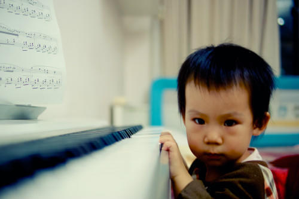

          
            
**2014.05.28**

昨天一位朋友问起了孩子练钢琴的事，如何能让孩子不产生抵触情绪开始接受练钢琴。

听到问题时有些惶恐，这么多年过去了，一听到“学琴”、“练琴”这些词还是心里一惊。

当年和钢琴的缘分之前的文章里提到过，一句话概括就是“天上掉下个大钢琴”。之前不知道钢琴为何物，甚至对音乐都没有太多感觉的6岁孩子，突然开始每天要拿出很长的一段固定时间去进行枯燥的练习，确实是会产生一些抵触。

练琴的枯燥是一点点积累，但在陌生人前进行表演，以及表演中种种尴尬的失误带来的心理上的冲击却是很强烈的，会让人对钢琴产生排斥。

也许并不是对钢琴本身的排斥，更多的是对在陌生人面前表现自己不擅长技能的一种排斥，这种排斥反过来又会在练琴上带来不好的影响。

琴练的不好，表演会更差，于是便如此恶性循环下去。

不过这种情况可能只是我这种性格孩子的轨迹，记得当时一起学琴的有些同学，他们真是发自内心的喜欢钢琴，喜欢去演奏。

那时的我越是羡慕他们，自己感受到的压力也就越大。

反而是十年不摸琴之后，第一次对钢琴有了兴趣，对钢琴表达的情感有了兴趣。

于是有了喵以后，买了一架电钢琴，开始和喵一起弹一弹琴，跳一跳舞。

喵能坐了以后，时常会报她坐在琴凳上，看她乱挥着小手儿，拍打着琴键，惊讶于发出的各种不和谐音。偶尔按下一个好听的和旋，便会回头望向我们，投来幸福的目光。

喵能走以后，会向上图中那样，一个人霸占钢琴，用一个指头精确的按键，感受这个黑白相间的庞然大物，有时又会拉着妈妈跟着琴声快步起舞。

喵能说话以后，整个人都变了。她会要求我把她抱上琴凳，调节好琴凳和琴的距离，将我平时的五线谱拿开，把平时她最喜欢的一个饼干盒盖放在谱架上，对着这个满是花草、小猫、姐姐的漂亮画面，煞有介事的按着琴键，时不时嘟囔几句”咪发“，”搜啦“。

希望以后她也能这样快乐的弹下去。

但是说回来，练琴要下苦功夫，父母的强制还是少不了。虽然我对之前的学琴经历有各种微词，但还是很感谢父母能花这么大心血让我有了这么一点技能。当年唯独缺少的就是一点点兴趣。

对钢琴有兴趣首先要对音乐有兴趣，家中要有音乐的环境。

其次对钢琴家的奇闻轶事，以及平时弹到的作品背后的故事都可以和孩子聊聊，而不是让她只听见一些毫无概念的外文名字或各种大调曲子名。最好是能让她渴望通过弹好这首曲子来和和已经作古的大师对话，或者走入那些曾经鲜活的故事中去。

另外最有效的办法就是看和钢琴有关的电影。《海上钢琴师》里的《The Crave》直接导致我重拾钢琴。《钢琴课》里女主角在海滩上弹起《The Heart Asks Pleasure First》，她的女儿在身边欢快地舞蹈。《天使爱美丽》中《Comptine D'un Autre été》配着细雨和流水。画面强烈的冲击配上优美的钢琴曲，任何人都会立刻着迷。

最后说琴的选择，电钢琴其实是一个很不错的选择。不占空间、可以戴耳机弹琴不影响邻居、可以录音、钢琴手感，音色可以接受，起码和我小时候的钢琴比起来没有区别。最最重要的就是不怕受潮，不需要调律。
所以，从建立音乐环境和兴趣开始吧，钢琴真的可以弹一弹。

**个人微信公众号，长按二维码加关注，或搜索：摹喵居士**

**喜欢作者写写哪些话题，可以公众号留言**

          
        