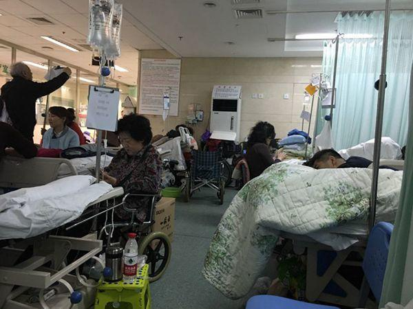
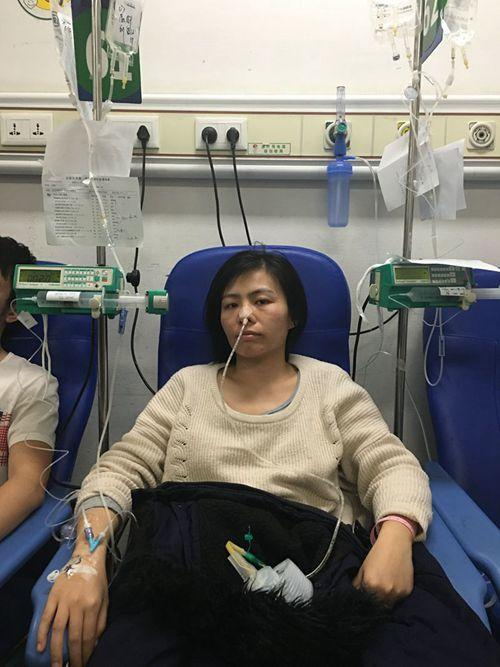

          
            
**2016.03.24**

封面图里就是三院的急诊观察室，这次胰腺炎的一周，几乎一直是住在这里。

这里充斥着老人绝望的呻吟、护工间的嬉笑怒骂、护士急促的脚步、大夫的惊鸿一瞥。

病发来医院时，以为是肠胃问题，去的是内科急诊。验了淀粉酶之后，确定了胰腺炎，由于指标很高，才被内科大夫转到普外。

普外接诊后还要重新挂号，重新排队。时间太长，于是取了内科开的液准备开始输了，结果这时外科冲过来，把药换成了6年前那次用的善宁。

观察室没有床位，只能在输液室坐在椅子上输液。

这时最重要的是赶紧找到护士把名字排在等位的列表上，一定要亲眼看着她手写上，同时注明床位要有电源，能用善宁的泵。

img1.jpg

上图就是输液室开始输液的样子了。

为了让胰腺修养，所以要禁食水，鼻子上插胃管，把胃液都抽到腿上的那个小塑料盒里，减少胃液对胰腺刺激。

为了给紧急情况手术做准备，大夫开了心电图，X光、CT和核磁，观察室的男护士很负责，主动把能尽快做的项目都做完了，核磁第二天早上也直接预约做了。

第一个晚上，大夫说如果继续恶化，就要立刻切有石头的肝内胆管，甚至连带一部分肝脏。

药用上后，疼痛立刻就缓解一些了。

第二天，大夫觉得不用切胆管了，要看核磁片子。于是后面几天各个管床大夫前后找消化科专家，又找6年前的大夫看核磁。

最后结论是肝内胆管里可能还有小石头，但是手术取石头有风险，而且收益不大，取出后还可能再长，建议胰腺炎好后，定期复查。

第二天，排的床位终于有了，急诊大夫也给办了住院手续，之后几天的验血单子和药都不用一趟趟交费和自取了，直接就到护士那里了。

每天早上5:00，护士回来抽血化验，8:30左右，管床大夫看了验血结果后，带着急诊室的小大夫们来查房，负责病人的小大夫介绍病人情况，管床大夫会问问感觉怎么样，并且亲自检查一下。之后就是我们把攒了一天的问题一股脑儿地抛向他，但大部分答案都是模棱两可。

第四天，摘掉胃管了。

第五天，大夫说可以喝点米汤了，没问题明天可以出院。

第六天，终于可以出院了。

本来想歇几天再写，但是怕忘了，还是赶出来了。主要的目的是为以后备忘。六年前的很多经验都没有记录，出问题是手忙脚乱。

下一篇会写写急诊观察室里的人间百态。

***下期预告：***

**个人微信公众号，长按二维码加关注，或搜索：摹喵居士**

**喜欢作者写写哪些话题，可以公众号留言**

          
        