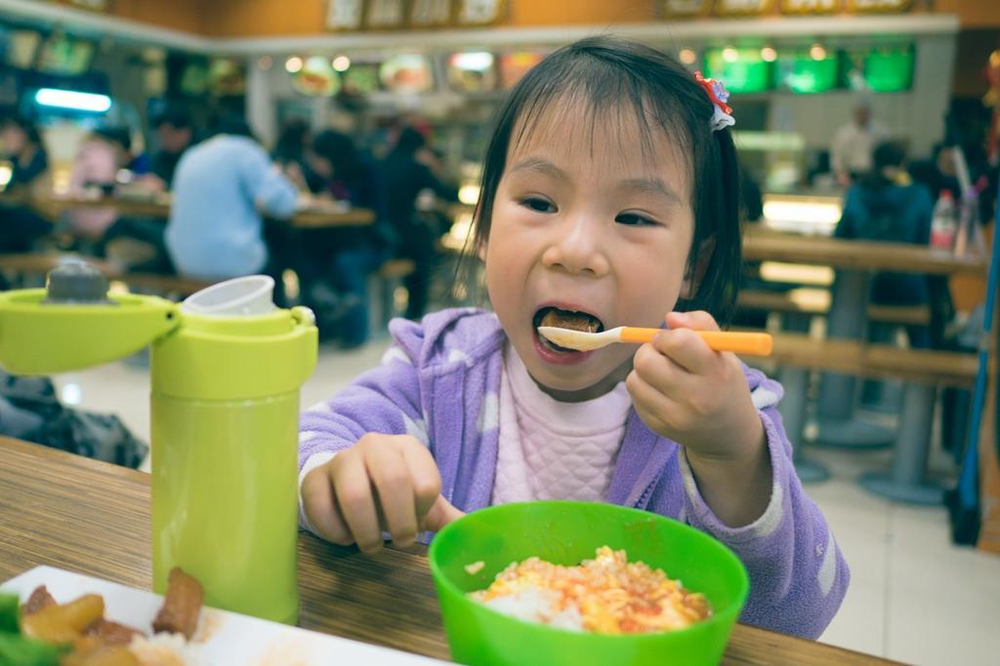
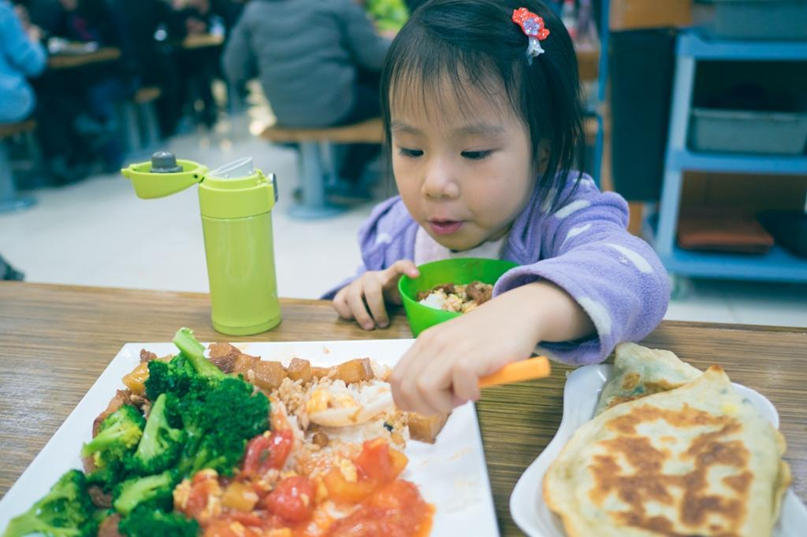
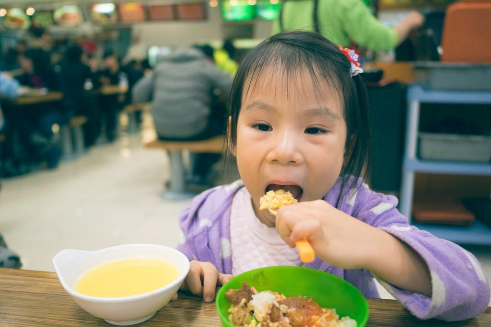
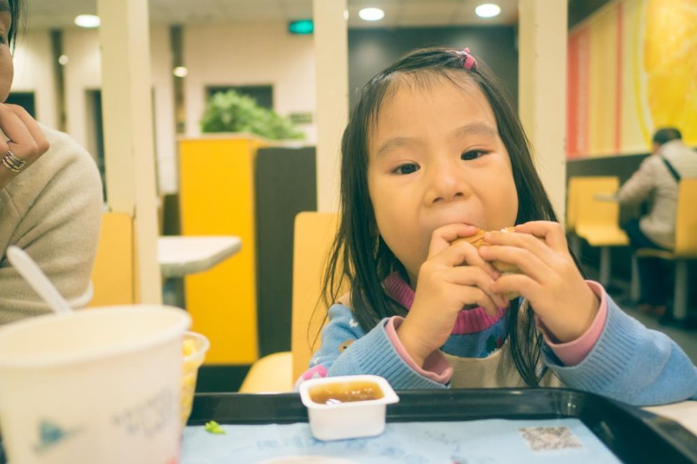
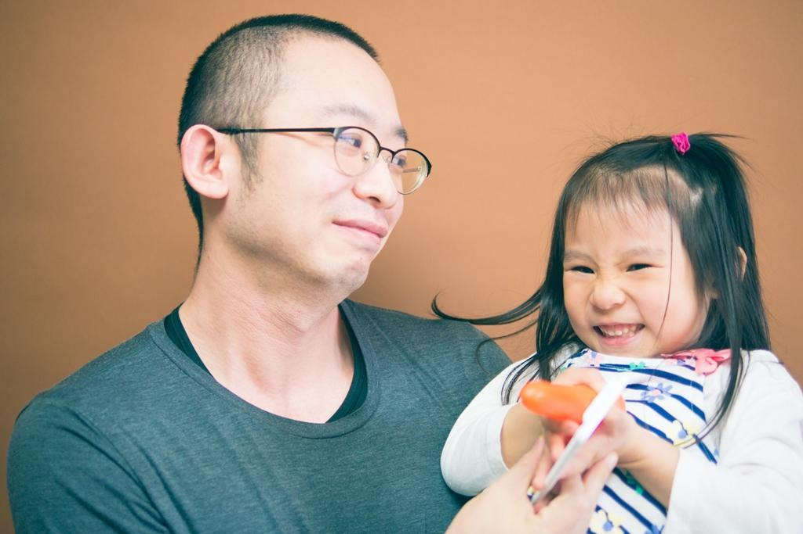

          
            
**2016.04.08**

最近半年，喵之前老大难的吃饭少的问题基本解决了。

应该是长身体的阶段到了，食欲好的时候能吃上一大碗面条，或者一大碗米饭和菜。不会像以前那样，吃两口就饱了。

在游乐场玩儿累的时候，是吃饭最认真的时候。

吃完了也会自己主动去添菜。

吃到高兴处，完全不顾自己的形象。

如果碰上了爱吃的汉堡，更是能吃下一整个。

随着胃口大开，喵的身高也迅速突破了1米大关。

然而随着胃口大开，新的问题也来了。

如果她不是特别饿的时候，就会一边玩儿一边吃。在奶奶家的时候，一会儿坐上椅子；一会儿爬下来站着吃，跟爷爷逗几句，跟奶奶聊聊天。吐几口菜，假装撒娇说菜硬。

回到家也是，吃饭的时候一会儿要听歌；一会儿说累了，在椅子上躺会儿。

通常这种情况下，我们就会正常吃，中间提醒她几次好好吃饭。

吃完饭后，我们会等她一会儿，如果还是不好好吃，就给她定个表，过了时间，我们就撤退，她只能自己吃。

半年前实行的时候，我们一走她就闹，闹一会儿发现没用时，就会回去自己把饭吃完，然后拿着碗给我们看。

现在的情况是：
<ol>
* 我们吃完饭，她还在磨蹭。
* 妈妈走，我陪一会儿。
* 继续磨蹭着吃，我上一个5分钟的表。
* 表响了，我要走，开始闹。
* 我在她周围干些别的事，一会儿来一会儿走，若即若离地给她些压力。
* 知道自己玩儿过了，开始和我商量，米饭吃不了，想剩一些。没问题，商量好，能做到就行。
* 开始认真吃饭，大概5分钟之内，胃口上来，之前说好不吃的饭都能吃完。
</ol>

以至于，现在我们吃完要走，她就会说：
>“爸爸表响了，还能再陪我一会儿。”

通常情况下，我是家里对她最严厉的那一个，但我也经常站在她的角度考虑。吃饭慢也不是没有道理，吃饭时是一家人难得聚在一起的时候，没那么饿的时候，她想逗我们玩儿会儿，也是完全能理解的，所以也不会完全拒绝陪她吃一会儿。

但是我和喵反复说：
<ol>
* 吃饭长大个儿第一重要。
* 做事认真，不分心也很重要。
* 吃不了可以商量少吃点，但是说好吃完就一定要吃完，说到做到。
</ol>

每次事后她也能头头是道的跟我讲这些道理，但是每到用时，她的心还是控制不住，不过能看到不断的进步。

有时我也会担心，太过严厉，她会对我不亲，但是时常她也会表达出很温暖的情意。

之前喵妈出院回家，爷爷奶奶带喵回来，姥姥姥爷也在，全家一起吃午饭，喵进门说道：
>“想要爸爸也一起吃饭。”

听到喵妈转述给我时，虽然嘴上说：“算这个小崽子还有良心”，但心里确实很温暖。

希望这样的合影能一直这么拍下去，总是这样看着她的笑容。

***新篇预告：跑步去打饭***

**个人微信公众号，长按二维码加关注，或搜索：momiaojushi**

**喜欢作者写写哪些话题，可以公众号留言**

          
        