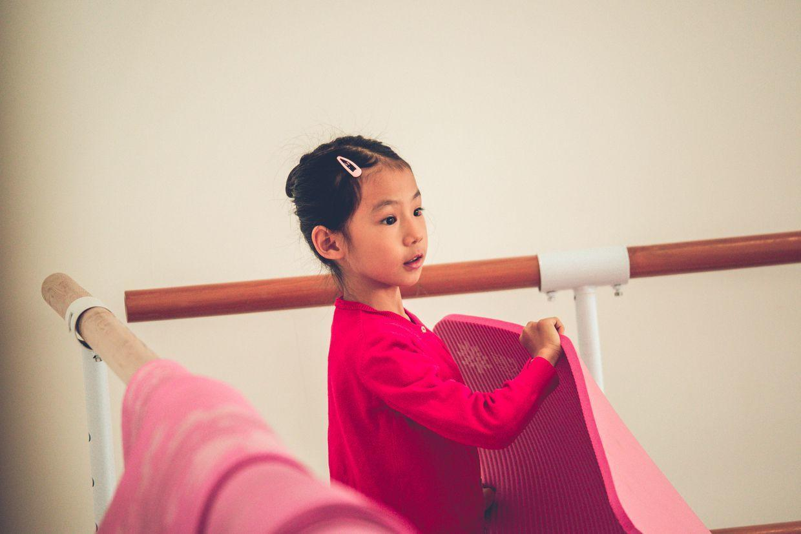
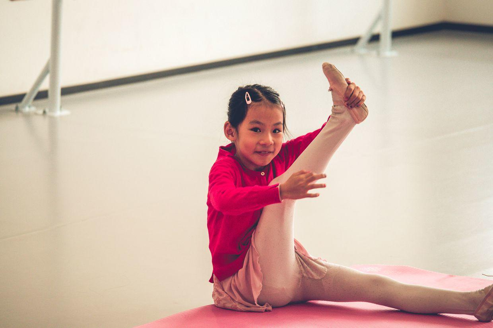

          
            
**2018.11.03**

周六啦，一大早上雾霾更严重啦。

吃过早饭，开车去上芭蕾舞课。

到了教室，先自己铺垫子。

进行热身活动，腿老是伸不直。

芭蕾舞课通知要准备毕业演出，看来要更加把劲才行啊。

下了课，回家和姥姥姥爷视频聊天，问了好多算数问题，基本答不上来，还要努力啊。

吃午饭的时候，看了陈晓卿最新拍的《风味人间》第1集，非常香，非常下饭。

中午睡个大觉，下午去上钢琴课。

车尔尼虽然只练过一天，但是弹起来也还行。

回到家继续练琴，又是练到不欢而散。

果然学习不是请客吃饭。

***最近喜欢的诗文***
>以前只听说过逍遥游开头的名句，自己读了以后，才发现后面更有道理
逍遥游节选
且夫水之积也不厚，则其负大舟也无力。覆杯水于坳堂之上，则芥为之舟，置杯焉则胶，水浅而舟大也。
风之积也不厚，则其负大翼也无力。故九万里，则风斯在下矣，而后乃今培风；
背负青天，而莫之夭阏者，而后乃今将图南。

**个人微信公众号，请搜索：摹喵居士（momiaojushi）**

          
        