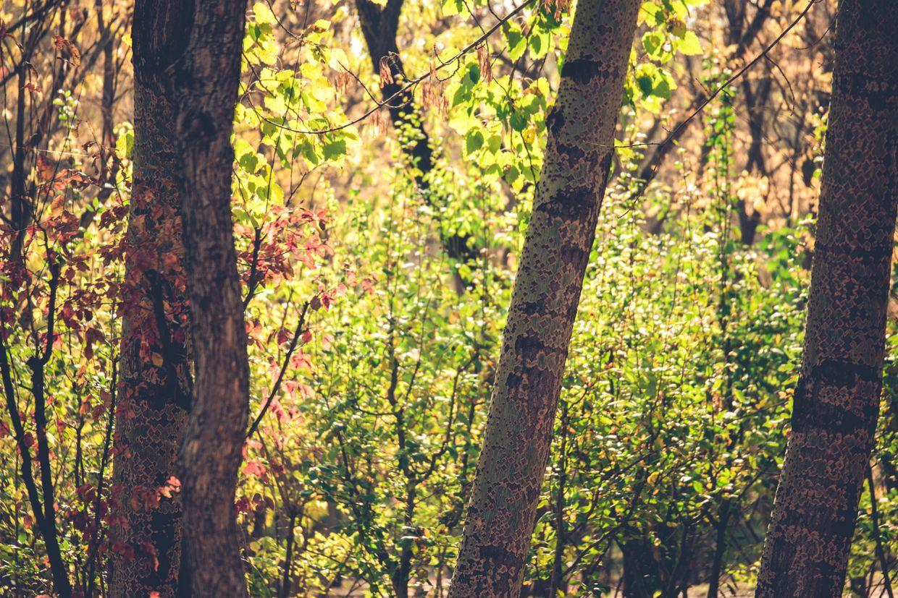

          
            
**2018.11.11**

周日啦，天公作美，秋天的尾巴是个好天气。

早上起来洗衣服，去窗外拍鸽子。

一切收拾利索，去朝阳公园。

终于赶上了银杏的尾巴。

一个可爱的小朋友打破大泡泡的瞬间。

玩儿银杏叶子。

一只可爱的小麻雀。

红黄相间的菊花们。

黄绿相间之下，五颜六色的人们在晒着太阳散步。

这有点烟锁池塘柳的意思。

杨树林里的一束光。

树叶被阳光点亮。

趴在妈妈身上。

一起玩儿银杏叶。

封面

使劲地扔出来。

跑过来偷袭。

树叶魔术师。

向这个金秋说声再会啦。

玩好之后，去蓝色港湾吃饭，饭前练习一下口算。

吃过饭回家休息一下。

开着车，一路上太阳暖洋洋的，有种开春的感觉。

***最近喜欢的诗文***
>诗很普通，算是顺口溜，但是感情真挚，关键是一个普普通通的人，因为厚道，就这样被写入了历史。
赠汪伦
李白乘舟将欲行，忽闻岸上踏歌声。
桃花潭水深千尺，不及汪伦送我情。

**个人微信公众号，请搜索：摹喵居士（momiaojushi）**

          
        