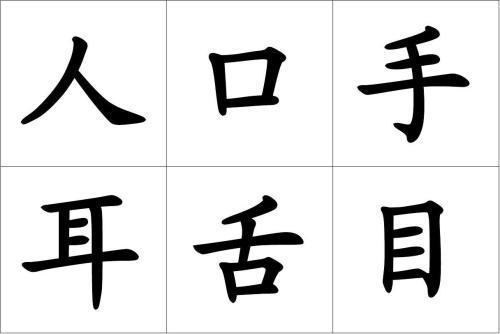

          
            
**2018.11.13**

上学有一段时间啦，每天晚上睡前，我们都会一起回顾一下这一年上课讲了什么。

我还是对上课的具体过程比较关心，什么时候，都讲了什么，你们怎么做的等等。

有一次，喵对我说，下午拖堂了。

我很奇怪，为什么拖堂？

喵很认真地说，没有什么原因，就是拖堂，老师在黑板上写了“拖堂”两个字。

我很奇怪，拖堂为什么还要写出来？

喵说：
>我看得清清楚楚，拖堂两个字，“堂”是“唐山”的“唐”。

听完之后，我和喵妈交换了一下眼神，哈哈大笑。

后来，我们一起复习课文，喵妈详细讲解了：“站如松、坐如钟、行如风、卧如弓”，其中详细讲解了弓是什么样子的。

喵很开心地说，我知道，就是弓箭嘛。

接下来，喵开始自己背，背到最后一句便是：
>卧如箭

于是，我们三个人一起哈哈大笑。

***最近喜欢的诗文***
>诗很普通，算是顺口溜，但是感情真挚，关键是一个普普通通的人，因为厚道，就这样被写入了历史。
赠汪伦
李白乘舟将欲行，忽闻岸上踏歌声。
桃花潭水深千尺，不及汪伦送我情。

**个人微信公众号，请搜索：摹喵居士（momiaojushi）**

          
        