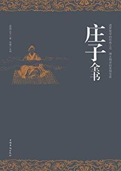

          
            
**2018.11.14**

很多议论文桥段非常精彩，“圣人生而大盗起”很震撼，纪念惠子的匠石运斤非常感人。“风之积也不厚，则其负大翼也无力”终于明白原来鹏的翅膀不重要。
<h2>2018.06.07（周四）</h2>
<h3>《庄子》 - 05</h3>
>尧之师曰许由a，许由之师曰啮缺，啮缺之师曰王倪，王倪之师曰被衣。

师承关系
>子贡南游于楚，反于晋，过汉阴a，见一丈人方将为圃畦b，凿隧而入井c，抱瓮而出灌d，滑滑然用力甚多而见功寡e。子贡曰：“有械于此，一日浸百畦f，用力甚寡而见功多，夫子不欲乎？”

l：“吾闻之吾师，有机械者必有机事，有机事者必有机心m。机心存于胸中，则纯白不备n；纯白不备，则神生不定o；神生不定者，道之所不载也p。吾非不知，羞而不为也。”

反智啊
>美则美矣，而未大也e。”

好虽然好，但不完善。”

这句话现在也常听到
>则天地固有常矣，日月固有明矣，星辰固有列矣，禽兽固有群矣，树木固有立矣p。夫子亦放德而行q，循道而趋，已至矣r。又何偈偈乎揭仁义s，若击鼓而求亡子焉t？意，夫子乱人之性也！”

夫子又被批判
>轮扁斫轮

轮扁曰：“臣也以臣之事观之。斫轮，徐则甘而不固f，疾则苦而不入g，不徐不疾，得之于手而应于心h，口不能言，有数存焉于其间i。

轮扁说：“我从我干的活儿中观察到了这个道理。砍制轮子，榫眼砍得宽了就会松滑而安不牢固，砍得紧了就会涩滞而装不进去，不松不紧，手上顺利而能应合于心，这种奥妙虽然嘴里说不出来，却有技巧在里面。

用心体会，说不出来，不会作老师
>商大宰荡问仁于庄子a。庄子曰：“虎狼，仁也。”曰：“何谓也？”庄子曰：“父子相亲，何为不仁？”

虎狼仁爱
>北海若曰：“井蛙不可以语于海者，拘于虚也m；夏虫不可以语于冰者，笃于时也n；曲士不可以语于道者o，束于教也。今尔出于崖涘，观于大海，乃知尔丑p，尔将可与语大理矣q。

海神若说：“井底之蛙无法跟它谈论大海，因为受到狭小的井底的局限；只生活在夏天的虫子不可以和它谈论冰雪，因为受到生存时间的限制；孤陋寡闻的人不能和他谈论大道，因为他被所受的教育束缚了。

秋水篇，夏虫不可以语于冰
>庄子妻死，惠子吊之，庄子则方箕踞鼓盆而歌a。

妻子死了，唱歌庆祝
>庄子不信，曰：“吾使司命复生子形n，为子骨肉肌肤，反子父母、妻子、闾里、知识o，子欲之乎？”髑髅深蹙曰p：“吾安能弃南面王乐而复为人间之劳乎！”

庄子不相信，说：“我让主管生命的神来恢复你的形体，为你重新长出骨肉肌肤，归还你的父母、妻子儿女、左右邻里和朋友故交，你愿意这样吗？”骷髅皱眉蹙额，深感忧虑地说：“我怎么能抛弃南面称王的快乐而再次经历人世的劳苦呢！”

有点君将哀而生之乎和苛政猛于虎的意思
>仲尼曰：“善游者数能，忘水也h。若乃夫没人之未尝见舟而便操之也，彼视渊若陵i，视舟之覆犹其车却也j。

孔子回答说：“善于游泳的人很快就能学会驾船，这是因为他忘了对水的恐惧。至于那善于潜水的人不曾见到过船也能熟练地驾驶船，是因为在他眼里深渊就像是陆地上的小丘，其看待船翻犹如车子倒退一样。

学划船，要先学游泳
<h2>2018.06.08（周五）</h2>
<h3>《庄子》 - 06</h3>
>几矣，鸡虽有鸣者，已无变矣e，望之似木鸡矣，其德全矣f，异鸡无敢应g，见者反走矣

差不多了，虽然听见别的鸡叫，却已毫无反应，看上去就像是一只木鸡，它的德性已经完善了。其他的鸡见了不敢应战，掉头就跑

呆若木鸡
>庄子行于山中，见大木，枝叶盛茂a，伐木者止其旁而不取也。问其故，曰：“无所可用。”庄子曰：“此木以不材得终其天年夫b！”

出于山，舍于故人之家。故人喜，命竖子杀雁而烹之c。竖子请曰：“其一能鸣，其一不能鸣，请奚杀？”主人曰：“杀不能鸣者。”明日，弟子问于庄子曰：“昨日山中之木，以不材得终其天年；今主人之雁，以不材死；先生将何处d？”

庄子笑曰：“周将处乎材与不材之间。

物物而不物于物l，则胡可得而累邪！此神农、黄帝之法则也。

主宰外物而不被外物主宰，怎么还会受牵累呢！这是神农、黄帝处世的法则。

才与不在之间，要自己来主宰
>庄子曰：“贫也，非惫也。士有道德不能行，惫也；衣弊履穿，贫也，非惫也，此所谓非遭时也

庄子回答：“这是贫穷而不是困顿。士有道德而不得实施，是困顿；衣破鞋烂，是贫穷而不是困顿，这就是所谓的生不逢时。

生不逢时
>阳子之宋a，宿于逆旅b。逆旅人有妾二人，其一人美，其一人恶c，恶者贵而美者贱。阳子问其故，逆旅小子对曰d：“其美者自美e，吾不知其美也；其恶者自恶，吾不知其恶也。”阳子曰：“弟子记之！行贤而去自贤之心f，安往而不爱哉！”

杨朱到宋国去，寄宿在旅店里。店主人有两个妾，一个漂亮，一个丑陋。丑陋的尊贵而漂亮的低贱。杨朱问其中的缘故，店主人说：“漂亮的自以为漂亮，我不晓得她有什么漂亮；丑陋的自以为丑陋，我也不知道她哪儿丑陋。”店主人有两个妾，一个漂亮，一个丑陋。杨朱说：“弟子们记住，行为贤良而抛弃自以为贤的念头的人，哪里会不受爱戴呢！”

自己是什么样子自己不知道？
>仲尼曰：“恶！可不察与！夫哀莫大于心死，而人死亦次之。日出东方而入于西极f，万物莫不比方g，有首有趾者，待是而后成功，是出则存，是入则亡h。

“吾终身与汝交一臂而失之p，可不哀与！女殆著乎吾所以著也q。

孔子说：“唉，这怎么能够不加审察呢！没有比心灵的僵死更悲哀的了，而人的躯体死亡还是次一等的。太阳从东方升起而隐没于最西端，万物没有什么不遵循这一方向，有头有脚的人，期待着太阳的运行而获取成功，太阳升起便劳作，太阳隐没便休息。

“我一直与你过从甚密，而你却不能了解这个道理，能不悲哀吗？你大概只是看到了我那些显著的方面。

交臂失之，哀莫大于心死
<h2>2018.06.11（周一）</h2>
<h3>《庄子》 - 07</h3>
>形若槁骸，心若死灰g，真其实知h，不以故自持i，媒媒晦晦j，无心而不可与谋。彼何人哉

身形静定犹如枯骸，内心沉静犹如死灰，朴实的心思返归本真，而且并不因为这个缘故而有所矜持，蒙蒙昧昧，没有心计而不能与之共谋。他是什么样的人啊！

心若死灰
>卷三

民之于利甚勤%1，子有杀父，臣有杀君，正昼为盗%2，日中穴阫%3。吾语女%4，大乱之本，必生于尧舜之间，其末存乎千世之后%5。千世之后，其必有人与人相食者也！”

人民贪利之心切，于是有子杀父，臣杀君，白日偷盗，正午挖墙之事出现。我告诉你们，大乱的根源，必定起自尧舜，而其流弊将存于千年之后。千年之后，必定有人吃人的事情了！”

尧舜的罪喽?
>一雀适羿h，羿必得之，威也；以天下为之笼，则雀无所逃。是故汤以胞人笼伊尹i，秦穆公以五羊之皮笼百里奚j。是故非以其所好笼之而可得者，无有也。

一只小雀迎着羿飞来，羿一定会射中它，这是羿的威力；把整个天下当做雀笼，那么鸟雀没有一只能够逃脱。因此商汤用庖厨来笼络伊尹，秦穆公用五张羊皮来笼络百里奚。所以说，不用其所好来笼络人心而可以成功的，从不曾有过。

投其所好
>吾相马，直者中绳v，曲者中钩w，方者中矩x，圆者中规y，是国马也z，而未若天下马也@

我的相狗之术，又不如我的相马之术。我观察马的体态，直的部分要合于墨线，弯的部分要合于钩弧，方的部分要合于角尺，圆的部分要合于圆规。这样的马就是国马，不过还比不上天下最好的马。

中规中矩
>庄子送葬，过惠子之墓，顾谓从者曰：“郢人垩漫其鼻端a，若蝇翼，使匠石斫之b。匠石运斤成风c，听而斫之d，尽垩而鼻不伤，郢人立不失容e。宋元君闻之f，召匠石曰：‘尝试为寡人为之。’匠石曰：‘臣则尝能斫之。虽然，臣之质死久矣g。’自夫子之死也，吾无以为质矣！吾无与言之矣！”

庄子送葬，经过惠子的坟墓，回头对跟随他的人说：“有位郢人用白灰涂一点儿在他的鼻尖上，像苍蝇的翅膀那样薄，让一位名叫石的工匠把它砍掉。匠石挥动斧头成风，很随意地就砍下来了，白灰没有了而鼻子没受一点伤，郢人站着面不改色。宋元君听说此事，召来匠石说：‘试试为我砍一次看看。’匠石说：‘我曾经能够砍，但是，我的对手死了很久了。’自从先生死后，我没有对手了，我没有辩论的对象了！”

唯一献给惠子的，和思想无关
<h2>2018.06.12（周二）</h2>
<h3>《庄子》 - 08</h3>
>周曰：‘诺。我且南游吴越之王h，激西江之水而迎子i，可乎？’鲋鱼忿然作色曰：‘吾失我常与j，我无所处。吾得斗升之水然活耳，君乃言此，曾不如早索我于枯鱼之肆k！’”

我说：‘可以，我将到南边去游说吴国、越国的国君，引西江之水来迎救你，可以吗？’鲫鱼生气变色说：‘我失去了与我常在一起的水，没有容身的地方，得到斗升的水就可以活。你说这样的话，还不如早点到干鱼市场去找我呢！’”

虚伪啊
>小儒曰：“未解裙襦d，口中有珠。《诗》固有之曰：‘青青之麦，生于陵陂e。生不布施f，死何含珠为！’”

小儒士说：“还没解下衣裙，口中有珍珠。《诗》中有一首说：‘青青的麦苗，生在山坡上，生时不施舍人，死后何必含珠。’”

一边偷东西，一边引用诗经
>子列子笑，谓之曰：“君非自知我也。以人之言而遗我粟，至其罪我也又且以人之言l，此吾所以不受也。”其卒，民果作难而杀子阳

列子笑着对她说：“郑相子阳自己并不了解我，而是听别人说才赠送我粮食的，等到他要加罪于我时，也会听信别人的话，这就是我不接受的原因。”后来，百姓果然发难而杀死了子阳。

君非自知我也
>庄子入殿门不趋s，见王不拜。王曰：“子欲何以教寡人，使太子先t？”曰：“臣闻大王喜剑，故以剑见王。”王曰：“子之剑何能禁制u？”曰：“臣之剑，十步一人v，千里不留行。”

十步杀一人，千里不留行，李白引用了
>曰：“臣之所奉皆可

<h2>2018.06.13（周三）</h2>
<h3>《庄子》 - 09</h3>
>庄子曰：“知道易a，勿言难b。知而不言，所以之天也c；知而言之，所以之人也；古之至人天而不人d。”

庄子说：“认识道容易，默不作声而成道却很困难。了解了道却不妄加谈论，这是通往自然的境界；了解了道却信口谈论，就走向了人为的尘世。古时候的人，体察自然而不追求人为。”

难得糊涂

***最近喜欢的诗文***
>诗很普通，算是顺口溜，但是感情真挚，关键是一个普普通通的人，因为厚道，就这样被写入了历史。
赠汪伦
李白乘舟将欲行，忽闻岸上踏歌声。
桃花潭水深千尺，不及汪伦送我情。

**个人微信公众号，请搜索：摹喵居士（momiaojushi）**

          
        