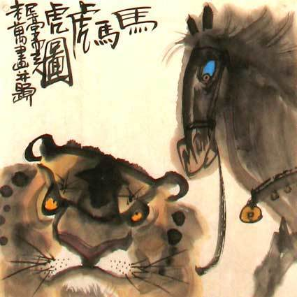

          
            
**2018.11.16**

***有的小朋友对我说不想上小学，因为乘法太难了，其实小学里有趣的事可多了，包括乘法在内。***

这篇文章，我们来说一下马虎吧。

“马虎”这个词是怎么来的？
>相传，古时有个画家，喜欢画虎。一次，他刚画成一个虎头，有位朋友请他画匹马，画家便顺笔一挥，在虎头下面添上了马身。朋友问他：“画得是马还是虎？”画家答曰：“管它是什么，马马虎虎吧！”朋友生气而去。

这个说法看起来是挺有道理的，说白了就是不认真。

这个问题我说了很多次，最早是从弹琴开始，每次开始弹的时候，第一个音按下去都是很草率，发现错了，马上就再重来一次。

这是一个很坏的习惯，你习惯了不正确。

所以我总是严厉地提醒你，要专心，想好了再下手。

学校里的几次单元测试也是一样，老师念题目，你没有专心听，一下就过去了，于是题目就不会做。

做完题目，检查的时候，扫一眼就过去，同样不认真，也看不出错误。

应该想妈妈说的那样，把题目换一种方法做一次，进行检验。

很多时候，我们会说自己不是不会，而是马虎，好像马虎不是问题一样。

实际上，马虎是最大的问题，反复马虎下去，就真的不会了。

***最近喜欢的诗文***
>诗很普通，算是顺口溜，但是感情真挚，关键是一个普普通通的人，因为厚道，就这样被写入了历史。
赠汪伦
李白乘舟将欲行，忽闻岸上踏歌声。
桃花潭水深千尺，不及汪伦送我情。

**个人微信公众号，请搜索：摹喵居士（momiaojushi）**

          
        