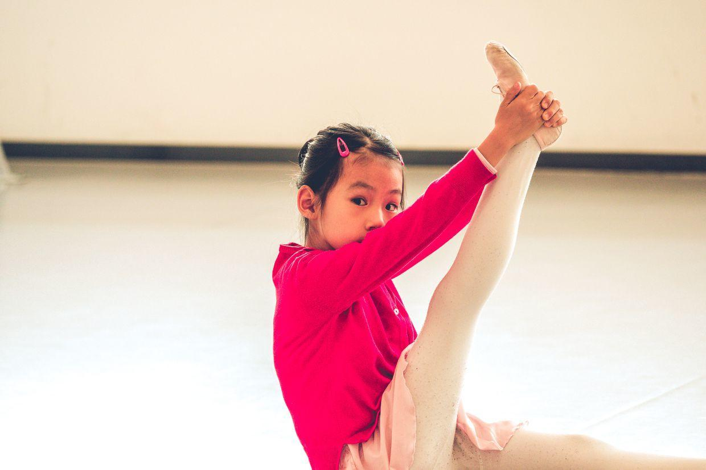
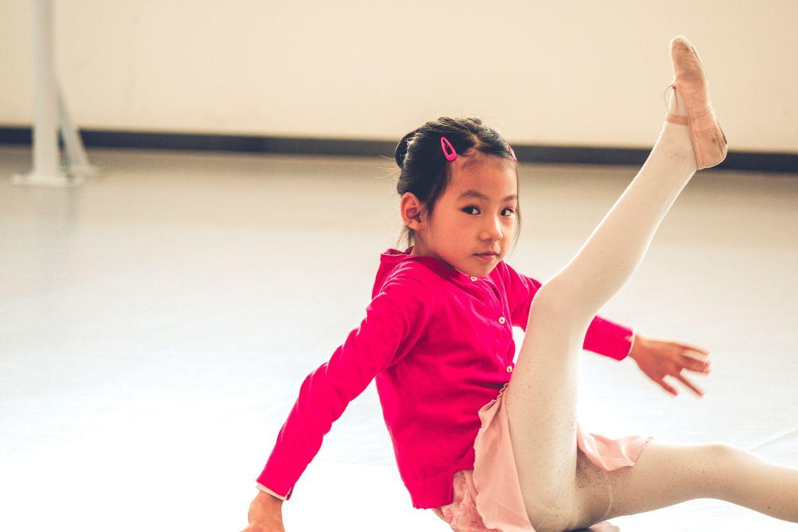
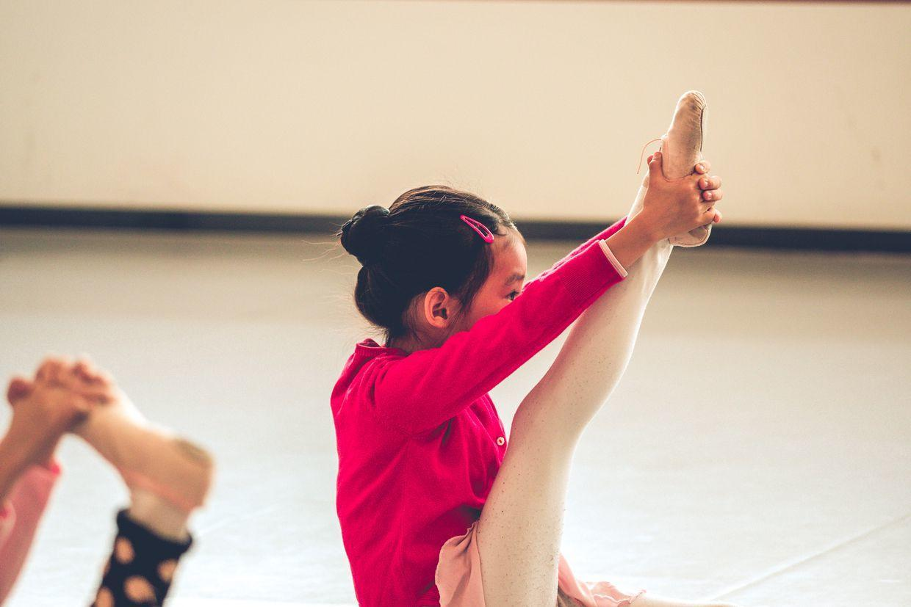
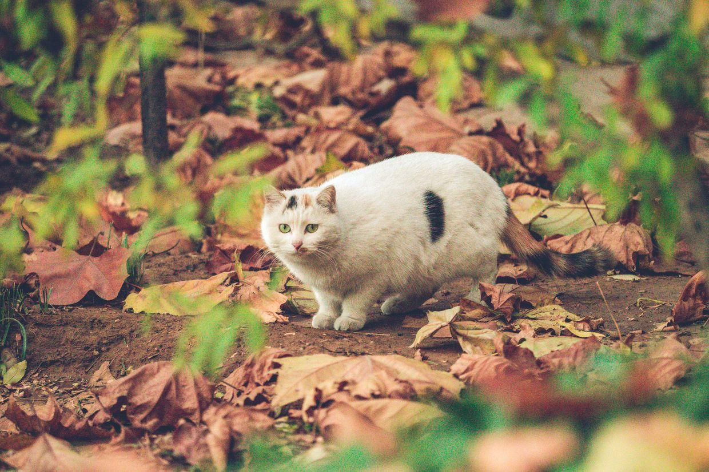
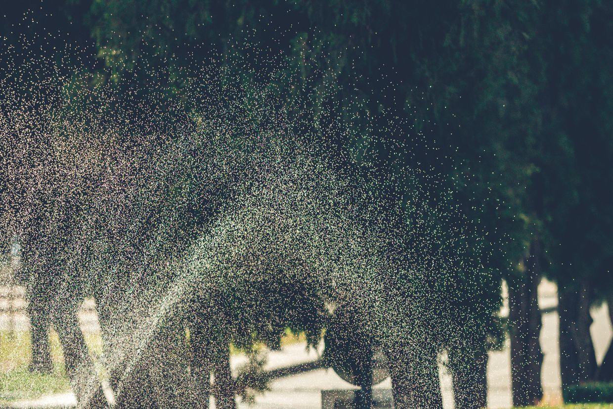
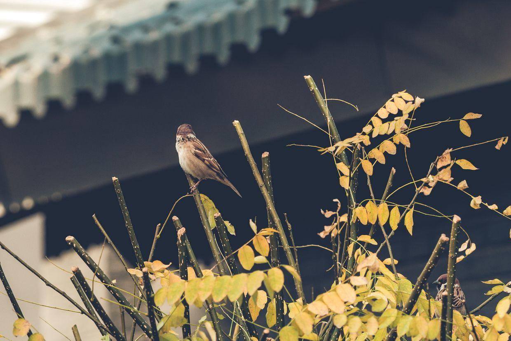
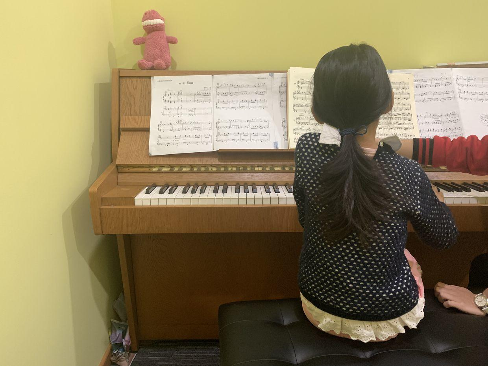

          
            
**2018.11.17**

周六啦，天气还是非常好。

吃过早饭，赶紧出发去芭蕾舞课，到得非常早。

一个人开始做热身运动。

差点摔倒啦。

脚尖崩起来。

园区里在砍树，看这个年轮，真是不容易啊。

枫叶们纷纷变色啦。

黄色非常迷人。

发现了一只树丛里的大肥猫。

封面

草坪上还在喷着水。

天气非常的好。

一直小麻雀，立在枝头。

中午回家和姥姥姥爷视频。

吃午饭，看《风味人间》下饭。

睡个大觉，下午去上钢琴课

钢琴课在旁边楼有了新教室，更加宽敞啦。

三个人又一起合练了《苏珊娜》，效果还不错。

回到家，开始做语文作业，录朗读视频，然后是数学口算。

忙忙碌碌的一天，希望明天还是好天气。

***最近喜欢的诗文***
>诗很普通，算是顺口溜，但是感情真挚，关键是一个普普通通的人，因为厚道，就这样被写入了历史。
赠汪伦
李白乘舟将欲行，忽闻岸上踏歌声。
桃花潭水深千尺，不及汪伦送我情。

**个人微信公众号，请搜索：摹喵居士（momiaojushi）**

          
        