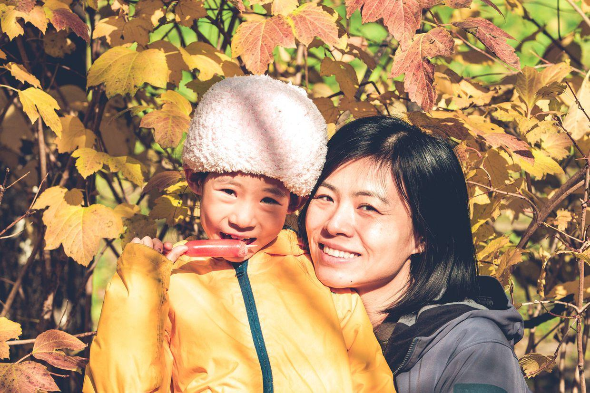
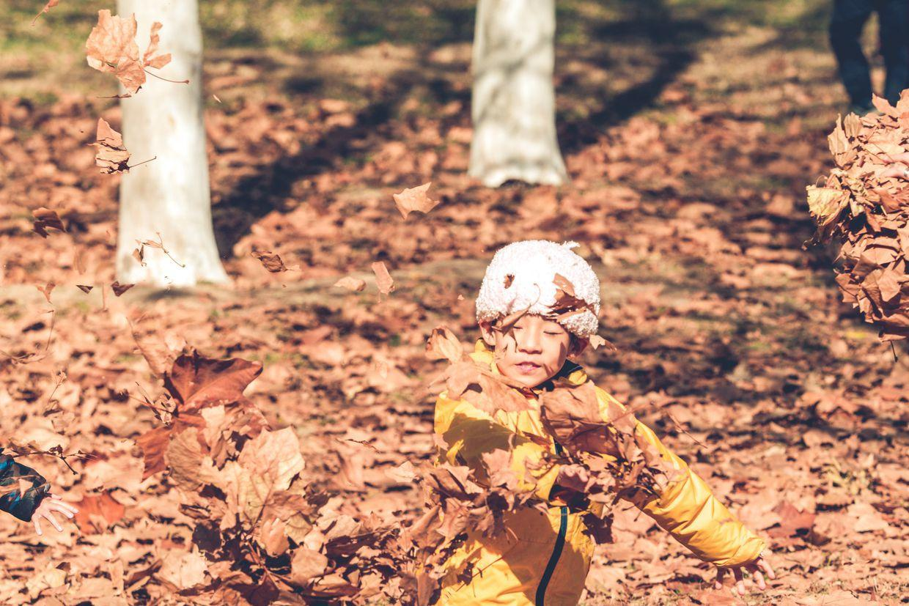

          
            
**2018.11.18**

周日啦，天气依然给力。

一早起床去洗牙，回来的时候，喵在扫地，参加家里劳动。

带上了个大王冠。

出门去奥森，奥运塔上已经有游人了。

冬天了，10点多，人还很少。

还有不少红叶可看。

吃着烤肠，一起合个影。

到了大桐树的山坡，无数的落叶。

巨大无比的树叶。

蜜蜂还在辛勤的工作。

来抛洒树叶啦。

封面

好大的一捧树叶。

挥上天空。

阴影中，有一道光。

阳光下的树叶脉络。

这张非常精彩。

跑起来都吓人啊。

对我使用跆拳道的腿法。

金蝉脱壳。

飘落的柳叶铺满了河面。

中午吃饭，练一下书法。

好长的睫毛。

天气越来越冷啦，不过天空很蓝。

下周姥姥姥爷要来啦，喵已经激动万分啦。

***最近喜欢的诗文***
>诗很普通，算是顺口溜，但是感情真挚，关键是一个普普通通的人，因为厚道，就这样被写入了历史。
赠汪伦
李白乘舟将欲行，忽闻岸上踏歌声。
桃花潭水深千尺，不及汪伦送我情。

**个人微信公众号，请搜索：摹喵居士（momiaojushi）**

          
        