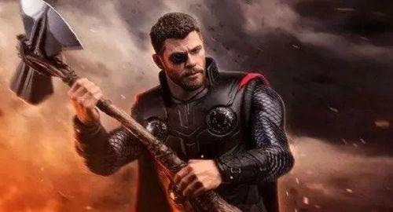
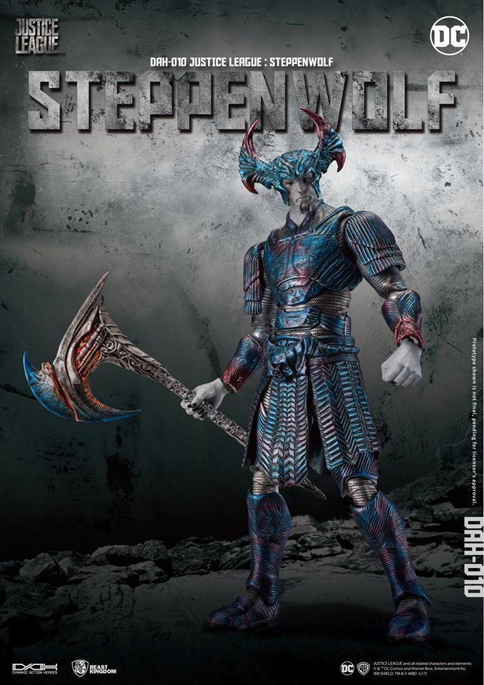

          
            
**2018.11.20**

封面

在看过无数遍《复仇者联盟3》之后，每次看到小树，为了帮雷神赶快做好斧子，自己伸出树枝，把两块通红的斧头抓在一起，然后砍掉自己的胳膊，做成斧头柄，都还会非常感动。

和我一起看完这段的喵，问我一个问题，为什么这个斧子和《正义联盟》里荒原狼的斧子不一样？

当时我回忆了一下，觉得这两个斧子没什么却别啊，无非是荒原狼的稍微大了一点而已。

然而喵仔细地纠正了我的错误，荒原狼的大斧子只有一个大月牙砍人。

而雷神的斧子一边是月牙，另一边是个大锤子。

听到这里，我有点疑惑，于是重新看了一遍，果然是这样。

雷神的斧子头，铸造的时候就是两部分，斧子和锤子，然后合在一起。

看来，喵看得还真是很认真，细节上的不同也注意到了。

这点值得我学习。

***最近喜欢的诗文***
>诗很普通，算是顺口溜，但是感情真挚，关键是一个普普通通的人，因为厚道，就这样被写入了历史。
赠汪伦
李白乘舟将欲行，忽闻岸上踏歌声。
桃花潭水深千尺，不及汪伦送我情。

**个人微信公众号，请搜索：摹喵居士（momiaojushi）**

          
        