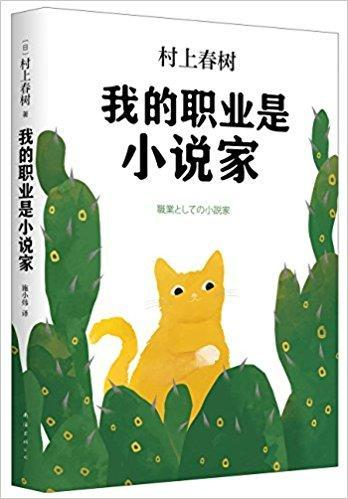

          
            
**2018.11.21**

非常像是自传，有很多生活细节很有趣。
<h2>2018.06.14（周四）</h2>
<h3>《我的职业是小说家》 - 01</h3>
>第一章小说家是宽容的人种吗？

我在写作自己的小说的同时，这三十多年间还在积极从事英美文学翻译，刚开始（说不定现在仍是如此）压力好像相当大，什么“翻译这事儿可不是菜鸟能染指的简单活计”啦，“一个作家玩什么翻译嘛，唯恐天下不乱”啦，诸如此类的闲话好像随处都能听见。

原来是自学英语翻译
>尽管我进的是大学文学院的电影戏剧专业，然而也有时代的原因，我几乎没有学到东西，不过是留着长发，蓄起胡须，打扮得邋里邋遢，四处彷徨游荡罢了。我并没有想当作家的念头，也不曾信手涂鸦练习写作，然而有一天突发奇想，写出了第一篇小说（似的东西）《且听风吟》，拿到了文艺杂志的新人奖，于是莫名其妙地摇身一变，成了一位职业作家。

误打误撞，第一个作品就得了新人奖
>小说这种体裁就好比职业摔跤的擂台，不论什么人，只要心存此意，都可以轻而易举地参与进来。

小说家之所以宽容，或许与文学圈并非一个你死我活的社会有关系。换句话说，（大抵）不会因为一位新作家登场，便导致一位在台上多年的作家失业。这类事情至少不会赤裸裸地发生，这一点与职业体育的世界截然不同。

小说谁都可以来写
>脑袋能对付的期限——不妨浅显易懂地称为“小说家的保质期”——最多不过十来年。一旦过期，就必须有更加深厚、历久弥新的资质来取代聪慧的头脑。换句话说，就是到了某个时间点，就需要将“剃刀的锋利”转换为“砍刀的锋利”，进而将“砍刀的锋利”转换为“斧头的锋利”。巧妙地度过这几个转折点的作家，才会变得更有力量，也许就能超越时代生存下去。

小说家保质期只有十来年
>第二章刚当上小说家那会儿

我还没毕业便结了婚，当然不会有什么资金，于是和太太两个人在三年里同时打了好几份工，总之是拼命攒钱，然后再四处举债。就这样用东拼西凑来的钱在国分寺车站南口开了一家小店。那是一九七四年的事。

没毕业就结婚，开爵士乐咖啡厅
>我把从前用过的立式钢琴从家里搬过来，周末在店里举办现场演奏会。武藏野一带住着许多爵士乐手，尽管演出费低廉，大家却（好像）总是快快活活地赶来表演。像向井滋春啦，高濑亚纪啦，杉本喜代志啦，大友义雄啦，植松孝夫啦，古泽良治郎啦，渡边文男啦，可真让人开心啊。他们也罢我也罢，大家都很年轻，干劲十足。呃，遗憾的是，彼此都几乎没赚到什么钱。

新潮啊
>我在这段时间里完成了社会学习。说“社会学习”似乎太直白，显得傻气，总之就是长大成人了。好几次差点头撞南墙，却在千钧一发之际全身而退。也曾遇到过污言秽语、遭人使坏，闹得满腹怨气。当时，仅仅因为是做“酒水生意”的，就会无端地受到社会歧视。不单得残酷地驱使肉体，还得事事沉默忍耐。有时还得把醉酒闹事的酒鬼踢出店门外。狂风袭来时只能缩起脑袋硬扛。总之别无所求，一心只想把小店撑下去，慢慢还清欠债。

开开咖啡厅认识了社会
>最后一年，我选修了安堂信也先生关于让·拉辛的课程，由于出勤天数不够，眼看学分又要丢掉了，我便跑到先生的办公室向他解释：“其实是这样的，我已经结婚了，每天都在工作，很难赶到学校来上课……”先生还专程来到国分寺，到我开的小店里看了一趟，说着“你也很不容易呀”就回去了。托他老人家的福，学分拿到了手。真是一位古道热肠的人！

花了七年，靠好心的教授才毕业
>第一局下半局，高桥（里）投出第一球，希尔顿漂亮地将球击到左外场，形成二垒打。球棒击中小球时爽快清脆的声音响彻神宫球场。啪啦啪啦，四周响起了稀稀拉拉的掌声。这时，一个念头毫无征兆，也毫无根据地陡然冒出来：“对了，没准我也能写小说。”

那时的感觉，我至今记忆犹新。似乎有什么东西慢慢地从天空飘然落下，而我摊开双手牢牢接住了它。它何以机缘凑巧落到我的掌心里，我对此一无所知。当时就不甚明白，如今仍莫名所以。理由暂且不论，总之它就这么发生了。这件事该怎么说好呢，就像是天启一般。英语里有个词儿叫“epiphany”，翻译过来就是“本质的突然显现”“直觉地把握真实”这类艰深的文辞。

看棒球，灵机一动要写小说，这一年，这个弱队竟然夺冠了
>第四章关于原创性

同样的事情也适用于斯特拉文斯基的《春之祭》。一九一三年这首曲子在巴黎首演时，听众跟不上那种超前的新奇感，全场哗然，场面非常混乱。那打破常规的音乐令众人愕然失色。然而随着演奏次数的增加，混乱渐渐平息，如今竟变成了音乐会上的热门曲目。

到底有多创新，现在理解不了
<h2>2018.06.15（周五）</h2>
<h3>《我的职业是小说家》 - 02</h3>
>与之相比，“并不追求什么的自己”却像蝴蝶一般轻盈，自由自在。只要摊开手掌，放飞蝴蝶，任其自由便好。这么一来，文章也会变得舒展流畅。

自由写文章的状态
>翻译基本上是个技术活儿，与表现欲毫无关系，差不多可以当作一份日常工作来做，同时又是学习写文章的好方法（假如没有做翻译，我大概会找一份类似的活儿）。

自学翻译
>而且兴之所至，还会写些随笔之类。

远方的鼓声这个随笔真是不行
>提及“原创性”这个词，我脑海里浮现的是十来岁时自己的模样。在自己的房间里，我坐在小半导体收音机前，有生以来头一次听沙滩男孩（《冲浪美国》），听披头士（《请取悦我》），心灵深受震撼，暗想：“这是多么美妙的音乐啊，以前可从来没听过这样的音乐！”

那音乐为我的灵魂开启了一扇崭新的窗户，从那窗口吹进前所未有的新鲜空气。那里有的，是幸福且无比自然的高昂之感。我觉得从现实的种种制约中解放出来，身体似乎都飘浮起了几厘米。这对我而言就是“原创性”应有的姿态。

幸福的时光
>第五章那么，写点什么好呢？

尤其是青年时期，应该尽可能地多读书。优秀的小说也罢，不怎么优秀的小说也罢，甚至是极烂的小说也罢，都（丝毫）不成问题，总之多多益善，要一本本地读下去。让身体穿过更多的故事，邂逅大量的好文章，偶尔也邂逅一些不太好的文章。这才是至关重要的作业。

它将成为小说家必不可缺的基础体力。趁着眼睛健康，时间有余，先把这事儿踏踏实实地做好。

多读书
>有一个故事我很喜欢。诗人保尔·瓦莱里采访阿尔伯特·爱因斯坦时，问道：“您会不会随身携带一个记录灵感的笔记本？”爱因斯坦表面上非常平静，内心却十分惊讶，答道：“哦，没那个必要，因为灵感是难得一遇的事儿。”

灵感很少来，来了也忘不了
>同一种素材在随笔与小说中连续出现两次也无不可，只是一旦出现这种内容撞车，小说好像就会莫名其妙地变得单薄。总之一句话，在写小说那段时期，最好保证所有的档案柜都为写小说所用。

小说写作告一段落后，会发现有些抽屉一次也没打开过，剩下很多没派上用场的素材，我会利用这些东西（说起来就是剩余物资）写出一批随笔。不过对我来说，随笔这东西就好比啤酒公司出品的罐装乌龙茶，算是副业。

小说的素材只给小说用，其他的用在随笔
>第六章与时间成为朋友—写长篇小说

我第一次离开日本是在八十年代后半期，当时也有过迷惘：“这么干，当真能活下来吗？”心里惴惴不安。我算是相当厚脸皮的人了，可毕竟需要背水一战、破釜沉舟的决心。尽管谈妥了写旅行记的稿约，好说歹说向出版社要来了一些预付版税（后来成了《远方的鼓声》那本书），但基本上得靠着存款生活，坐吃山空。

不过毅然打定主意追求新的可能性，在我这里似乎产生了良好的结果。逗留欧洲期间写出的小说《挪威的森林》碰巧（出乎意料地）卖得很好，生活总算安定下来，一个类似为长期坚持写小说而设的个人系统初现雏形。

好巧啊，有了《挪威的森林》
>写长篇小说时，我规定自己一天写出十页稿纸，每页四百字。用我的苹果电脑来说，大概是两屏半的文字，不过还是按照从前的习惯，以四百字一页计算。即使心里还想继续写下去，也照样在十页左右打住；哪怕觉得今天提不起劲儿来，也要鼓足精神写满十页。

因为做一项长期工作时，规律性有极大的意义。写得顺手时趁势拼命多写，写得不顺手时就搁笔不写，这样是产生不了规律性的。因此我就像打考勤卡那样，每天基本上不多不少，就写十页。

状态好不好，都要写十页
>以我的情况，当作品在一定程度上成形后，会先让我太太通读原稿。这是我当上作家以后，从最初阶段延续至今的做法。她的意见对我而言就像音乐的“基准音”和我家里的旧音箱（失礼了）一样。我所有的音乐都是用这套音箱听的。

她的批评，有些让我觉得“的确如此”，“说不定还真是这样”。有时候要花上几天才能达成这样的认识。也有些让我觉得“不对，岂有此理，还是我的想法才对”。不过在这样“引进第三者”的过程中，我有一条独门规则，那就是“人家有所挑剔的地方，无论如何一定要修改”。

太太的意见是最基础的
>有一件好玩的旧事。那是上世纪八十年代末期，我写《舞！舞！舞！》那部长篇小说时的事。这部小说是我头一回用文字处理机（富士通的便携式）写出来的。

可在伦敦安定下来之后，打开一看，竟有整整一章消失不见了。我当时还没用惯文字处理机，可能是操作失误吧。

因为那一章的篇幅很长，而且是“连自己都认为写得很成功”、引以为豪的一章，无法简简单单地说上一句“呃，这是常有的事儿”就认命了。

等到这部小说成书发行后，下落不明的那一章竟又飘然现身了，原来是混入了意想不到的文件夹里。

提心吊胆地重读了一遍，先说结论：后来改写的版本显然出色得多。

文章果然是要修改
>第七章彻底的个人体力劳动

小说《挪威的森林》的开头部分，是在希腊各地咖啡馆的小桌上、轮渡的座椅上、机场的候机室里、公园的树荫下、廉价旅馆的写字台上写的。

在罗马的文具店里买来便宜的笔记本（从前的说法叫“大学笔记簿”），用BIC圆珠笔写上蝇头小字。

《挪威的森林》是在各种临时场所里写的
>那么，要想获得持久力，又该怎么做呢？对此，我的回答只有一个，非常简单，就是养成基础体力。获得强壮坚韧的体力，让身体站在自己这一边，成为友军。

我成为专业作家后便开始跑步（正式跑起来，是在写《寻羊冒险记》的时候），自那以来三十多年，差不多每天都跑步或游泳一个小时，已经成了习惯。

身体是持久力的基础
>第八章关于学校

我的父母就是教师，我自己也曾在美国的大学里带过几个班，尽管并没有教师资格证之类。然而坦率地说，学校这东西从来都是我的弱项。

总之，阅读当时在我心中重于一切。不必说，人世间远比教科书更刺激，内容深刻的书应有尽有。

觉得学校没意思，还是看书更有趣
<h2>2018.06.18（周一）</h2>
<h3>《我的职业是小说家》 - 03</h3>
>语言这东西是鲜活的，人也是鲜活的。活着的人想灵活自如地运用活着的语言，就非得有灵活性不可。

活学活用
>学校体系与我自身的体系不能契合，所以上学就成了一件不太开心的事。只是因为班上有几个要好的同学和可爱的女生，我才好歹每天坚持去学校。

荷尔蒙
>说到书，我就像握着铁锨往熊熊燃烧的炭窑里乱铲乱投一般，一本又一本，如饥似渴地读过各种类型的书。

太形象了
>我的父母都是国语老师（母亲在结婚时辞去了工作），所以对我看书几乎没有一句怨言。尽管对我的学习成绩颇为不满，但从来没对我说过“别看什么书了，好好复习迎考”之类的话。也可能说过，但我一点印象都没有了。

不抱怨
>第九章该让什么样的人物登场？

很久以前——我记得是在三十五岁前后——曾经有人对我说：“你的小说里不会出现坏人啊。”

还真是没什么坏人
>写小说时让我最快乐的事情之一，就是“只要愿意，自己可以变成任何一个人”。

自己控制梦境
>第十章为谁写作？

我卖掉了小店，为了能全神贯注地写作长篇小说，搬出东京的住所，远远离开都市，过起了早睡早起的生活。又为了维持体力坚持每天跑步。就这样，我毅然决然地彻底改变了自己的生活。

从《寻羊冒险记》开始，买了咖啡厅，专职写作
>我原则上是所有的邮件都要过目。内容太长的话，就只得一目十行匆匆读完，但总之发来的邮件无一遗漏，全都看过。

还给大约十分之一的来信写了回信。或回答提问，或帮人出出主意，或针对留言写一点感想……

对读者来信很认真
>常常收到来自读者的有趣的信，类似这种内容：“读了村上先生您的新书，感到好失望。非常遗憾，我不太喜欢这本书。不过下一本书我一定会买的。请您加油！”老实说，我很喜欢这样的读者，觉得十分难得。因为这里面毫无疑问有一种“信赖的感觉”。我想，为了这些人，必须扎扎实实地写好下一本书，并发自内心地希望这本书能得到他或她的欢心。只不过“不可能让所有的人都开心”，所以实际会怎样，连我自己也不清楚。

可爱的读者

***最近喜欢的诗文***
>诗很普通，算是顺口溜，但是感情真挚，关键是一个普普通通的人，因为厚道，就这样被写入了历史。
赠汪伦
李白乘舟将欲行，忽闻岸上踏歌声。
桃花潭水深千尺，不及汪伦送我情。

**个人微信公众号，请搜索：摹喵居士（momiaojushi）**

          
        