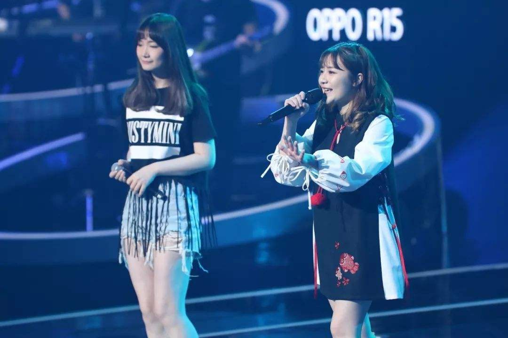

          
            
**2018.11.29**

>紫发髯(rán) 碧色眼眸
孙权长着紫色的头发和胡子，眼睛是绿色的。
这就是对孙权外貌的一个生动描述。

>射猛虎倚黄龙 胆识过凡人 谁敌手
孙权曾经射死过猛虎，后来孙权登皇帝位，年号黄龙。

>御天下 半百之久
孙权执掌江东大权，大概有50年。

>选贤臣 任能将 覆江东云雨 尽风流
孙权治理江东，挑选贤明的大臣，任用有能力的将军。在江东建功立业，成为风流人物。

风流：风流指风度，仪表。犹遗风；流风馀韵。后来指才华出众。
>千秋过 再难回首
千年过去了，再回头看当年的历史已经很困难。

>问古今 兴亡事 几人耀青史 芳名留
问一下，古往今来，国家的兴盛和灭亡，哪些人名垂青史，留下芳香的好名声

>笑谈间 云烟已旧
开这玩笑，谈论这些，古时的云和烟早就已经散去

>终留下 万古叹 生子该当如 孙仲谋
最后，留下了代代相传的叹息，生孩子就应该生孙权这样的孩子。

生子当如孙仲谋：生子当如孙仲谋，刘景升儿子若豚犬耳！

***最近喜欢的诗文***
>这首诗的感情真是细腻，而且有一种镜头转移的美感。
先说不知道何时归来，夜里下雨池水满了，接下来就说到以后我们夜里一起聊这时的巴山夜雨。
有一种说不出的美感。
不过有一种说法是，这首诗是写给友人的，很让人不信服。
夜雨寄北——李商隐
君问归期未有期，巴山夜雨涨秋池。
何当共剪西窗烛，却话巴山夜雨时。

**个人微信公众号，请搜索：摹喵居士（momiaojushi）**

          
        