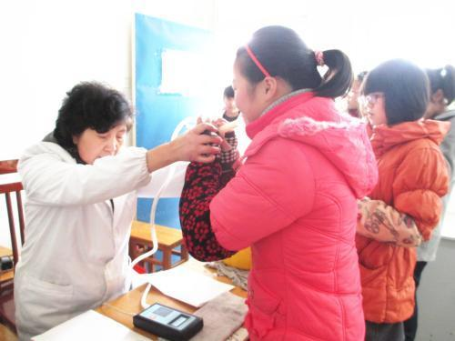

          
            
**2018.11.30**

***有的小朋友对我说不想上小学，因为乘法太难了，其实小学里有趣的事可多了，包括乘法在内。***

这次说说肺活量吧。

前段时间，晚上你说到学校体质测验，测肺活量，我问你多少，你说大概100多。

这简直是少得可怜，不是你记错了，就是你吹的时候，嘴没有贴近。

话说我上大学时，那时吹好像都有3200吧，印象不是很清楚。

吹肺活量的时候，会有一个一次性的嘴，连在管子上，你的嘴要紧紧贴在上面，不要漏气。

深吸一口气，贴上去，使劲吹出来，到最后的时候，使劲收腹，把肺里最后一点空气也挤出来。

这样得到的结果才是最准确的。

肺活量这个指标，提现了你摄取氧气的能力，越高越好。

平时多锻炼、多跑步、多跳绳，肺活量会慢慢提升，这样对你的身体和血管都有很大的好处。

加油锻炼吧。

***最近喜欢的诗文***
>这首诗的感情真是细腻，而且有一种镜头转移的美感。
先说不知道何时归来，夜里下雨池水满了，接下来就说到以后我们夜里一起聊这时的巴山夜雨。
有一种说不出的美感。
不过有一种说法是，这首诗是写给友人的，很让人不信服。
夜雨寄北——李商隐
君问归期未有期，巴山夜雨涨秋池。
何当共剪西窗烛，却话巴山夜雨时。

**个人微信公众号，请搜索：摹喵居士（momiaojushi）**

          
        