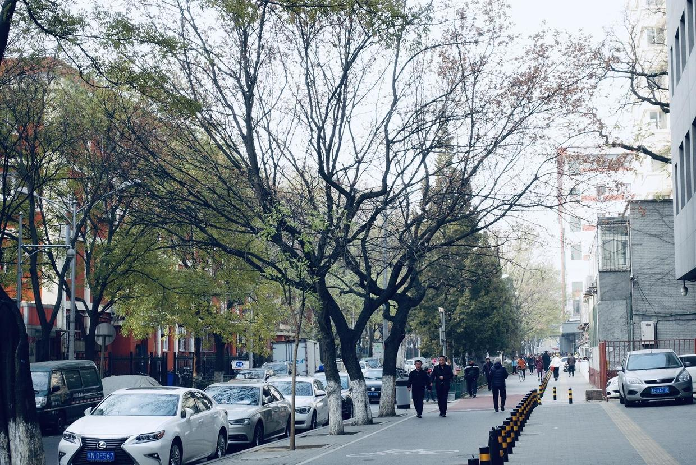

          
            
**2018.12.01**

喵从周二夜里开始发烧，断断续续，到今天终于开始退了。

这次烧得还挺厉害，细菌感染，从嗓子疼开始。

嗓子有痰，鼻子里堵得慌，白天和夜里体温都会高上来一次。

不过和小时候相比，吃退烧药后，体温维持平稳的时间越来越长了，而且精神状态很好。

虽然3天没上学，但是躺在床上还看了课文和口算题。

老是提醒我，要给她的书法作业本上写好假条。

这次发烧，错过了3天的课，还有准备很久的周六钢琴沙龙，也没能和姥姥姥爷多玩儿一会。

病来如山倒，病去如抽丝。

***最近喜欢的诗文***
>这首诗的感情真是细腻，而且有一种镜头转移的美感。
先说不知道何时归来，夜里下雨池水满了，接下来就说到以后我们夜里一起聊这时的巴山夜雨。
有一种说不出的美感。
不过有一种说法是，这首诗是写给友人的，很让人不信服。
夜雨寄北——李商隐
君问归期未有期，巴山夜雨涨秋池。
何当共剪西窗烛，却话巴山夜雨时。

**个人微信公众号，请搜索：摹喵居士（momiaojushi）**

          
        