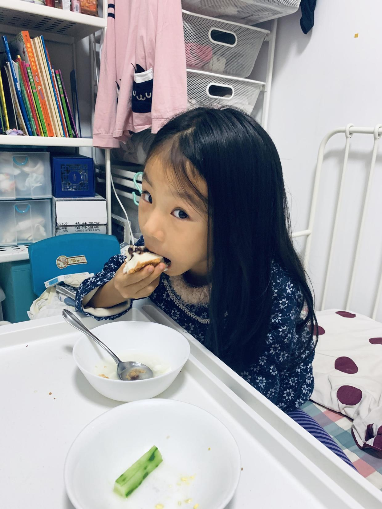

          
            
**2018.12.02**

经过昨天一天的休息，今天彻底不发烧了，还是有点咳嗽和鼻涕。

早上起来，吃了奶奶做的粥、黄瓜和枣馒头。

开始练习学校留的绘本朗读，这次绘本内容比较长，着实花了好一阵子才熟练下来。

朗读完，发了视频已经快11点了。

中午吃了枣馒头和土豆沙拉，喝了梨水，一起去看猫和老鼠。

在一起哈哈大笑之后，开始睡午觉。

一觉又是睡到了下午17点，睡得满头大汗的。

吃过饭玩，继续把书法作业完成一下。

下周一要回学校啦。

***最近喜欢的诗文***
>这首诗的感情真是细腻，而且有一种镜头转移的美感。
先说不知道何时归来，夜里下雨池水满了，接下来就说到以后我们夜里一起聊这时的巴山夜雨。
有一种说不出的美感。
不过有一种说法是，这首诗是写给友人的，很让人不信服。
夜雨寄北——李商隐
君问归期未有期，巴山夜雨涨秋池。
何当共剪西窗烛，却话巴山夜雨时。

**个人微信公众号，请搜索：摹喵居士（momiaojushi）**

          
        