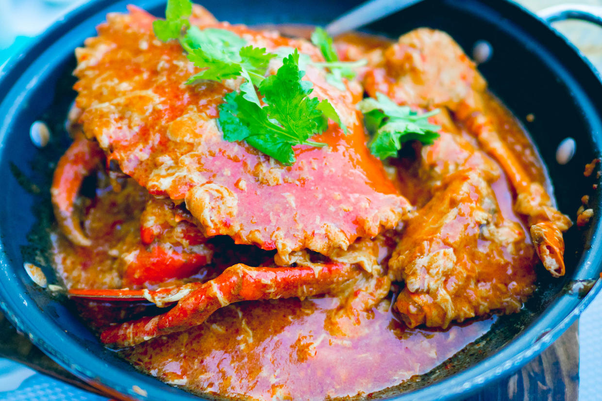

          
            
**2018.12.06**

前段时间国庆去新加坡，在克拉码头吃了大名鼎鼎的珍宝蟹。

乍一看是大螃蟹上泼了西红柿鸡蛋卤，但是实际上卤汁酸甜酸辣，国内从没尝过这种味道，真是相当的美味。

喵一贯不爱吃螃蟹和辣的菜，这次给她弄了一个大钳子的肉，蘸了些酸辣汁，竟然也吃下去了，虽然还是觉得很辣。

带着喵，大老远来新加坡吃个大螃蟹。

这不禁让我又想起小时候，父母带着大老远去北戴河吃螃蟹。

这不过，那时我是绝对不吃螃蟹，就是嫌麻烦，总是吵着要吃炖肉。

可是当年的北戴河，就只有些海鲜，哪里去找牛羊肉。

最后父母找到了一家能炒菜的，做了一道银鱼炒鸡蛋，我是津津有味的吃起来，只不过咸得能让人飞起来。

当年的我，和喵比起来，那可真是差劲太多了。

现在回忆中，父母领着我们赶火车，买个大西瓜当水喝，凌晨带着我们去鸽子窝，其中的辛苦也是很不得了。

今天的我，和当年的父母比起来，也还是有很大差距啊。

***最近喜欢的诗文***
>谁知盘中餐，粒粒皆辛苦的第二首，名气不是很大，但是更有冲击力，喵曾经反复背诵过。
对于农夫犹饿死，很不理解，颇有些“何不食肉糜”的感觉。
据说李绅后来生活腐败，早忘记了当年的怜悯。
悯农二首——李绅
春种一粒粟，秋收万颗子。
四海无闲田，农夫犹饿死。

**个人微信公众号，请搜索：摹喵居士（momiaojushi）**

          
        