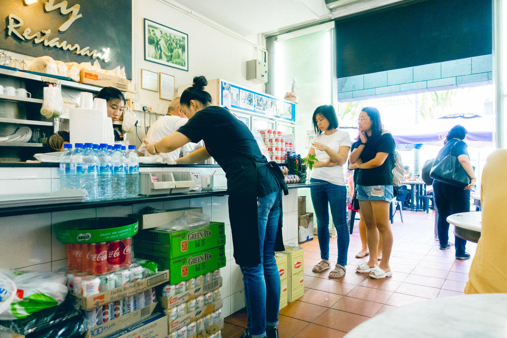

          
            
**2018.12.10**

**拍摄时间：2018.10.02**

**拍摄地点：新加坡玩具博物馆边**

这张照片是2018年国庆去新加坡玩儿，第二天早上吃早饭时拍的。

早起去跑步，回来的时候误打误撞跑到了玩具博物馆，发现旁边就是一家小餐馆，好多人在这吃早餐。

于是，喵妈和喵起床后，我们一起溜达过来吃早饭，位置非常好，正好是我们北上去小印度的路上。

店里有一个老大爷，像机器一样做着奶茶和烤面包，一脸怒容，让人不寒而栗。

两个身穿黑色工作服的姑娘，忙着点单、倒奶茶、送餐，毫无表情，也是像机器一样。

店里面是另一家买卤味的，有豆腐、炒面，服务态度缺如春天班温暖。

夹杂着中文、英文终于买好了早餐，感觉气氛很压抑。

不过咖椰面包、豆腐、热奶茶味道还是很好的。

店里很昏暗，有电扇和空调，大部分人进来也是默默地在吃着，其中很多都是上班族。

这样的服务水平，恐怕连北京的最低水平也到不了。

看起来，新加坡每个人都很愁容满面。

***最近喜欢的诗文***
>这首诗写得极其的工整，描写也非常生动，关键是还非常的长。不过前两句之后，再往后读会觉得有些无聊，只读前两句还是很精彩的。
春江花月夜——张若虚
春江潮水连海平，海上明月共潮生。
滟滟随波千万里，何处春江无月明！

**个人微信公众号，请搜索：摹喵居士（momiaojushi）**

          
        