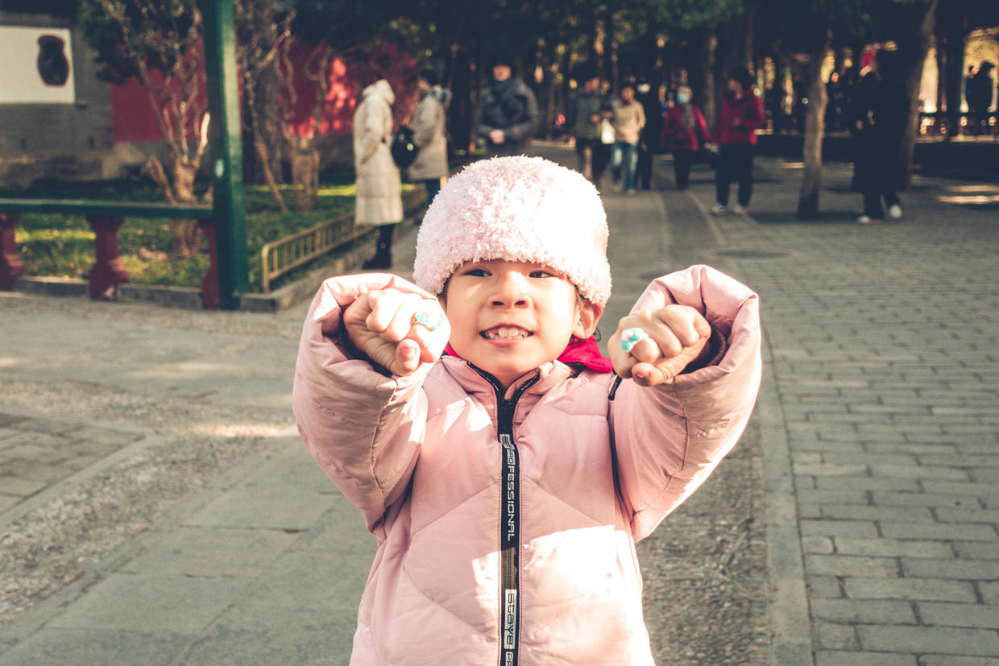

          
            
**2018.12.18**

每天晚上放学回家，喵的时间还是挺紧张的。

一三五要上英语课，如果上舞蹈社团的话，下课也会比较晚。

她比较喜欢先做书法作业，然后再做其他的。

最近好几次，写书法作业的时候，会突然发怒，觉得太难写不好，然后大哭大闹。

甚至是躺在地上不起来。

把奶奶气得够呛，严厉批评了好几次。

我们在一起也分析了一下。

从外部原因看，最近开始供暖，屋里很热，喵回家也不脱衣服不脱鞋，写字越写越热，越来越急躁。

从内部原因看，她之前确实没有面临过类似的困难，写复杂的汉字，对她来说确实比较难，就像10以内的口算一样。

和算术不一样，书法要一个字一个字反复写，但是看到的结果可能是无数个难看的字，这个打击确实会比较大。

成长过程中，都会面临各种各样的打击，一点点想办法克服，等回头看时，就都是笑谈了。

***最近喜欢的诗文***
>这首诗是苏轼在乌台诗案坐牢以为自己必死时，给弟弟苏辙写的绝命诗，其中与君世世为兄弟，感动了宋神宗，最终免于一死。
《狱中寄子由二首》——苏轼
是处青山可埋骨，他年夜雨独伤神。
与君世世为兄弟，更结来生未了因。

**个人微信公众号，请搜索：摹喵居士（momiaojushi）**

          
        