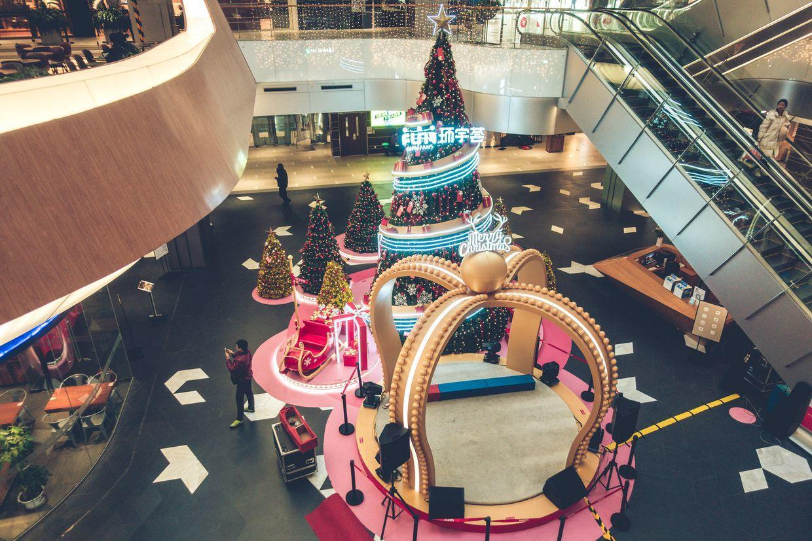
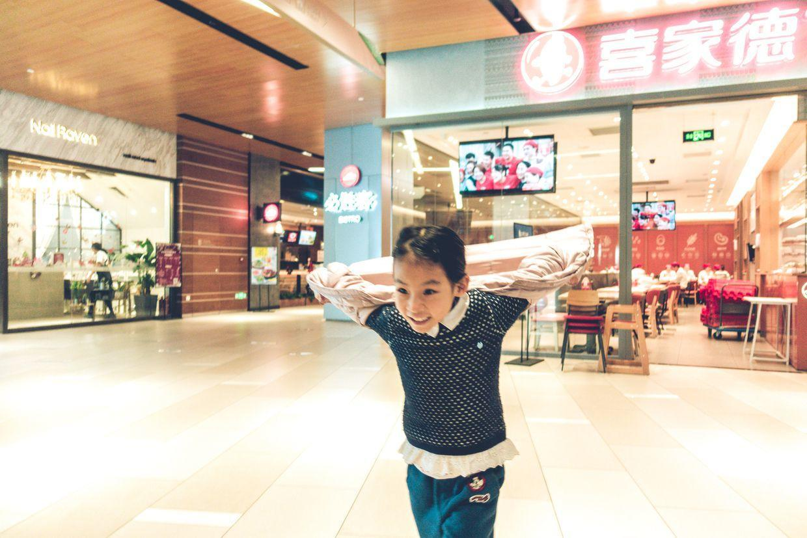
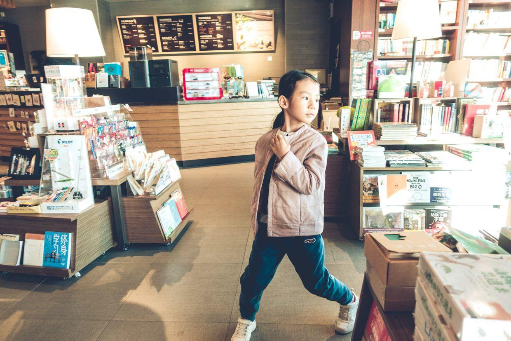
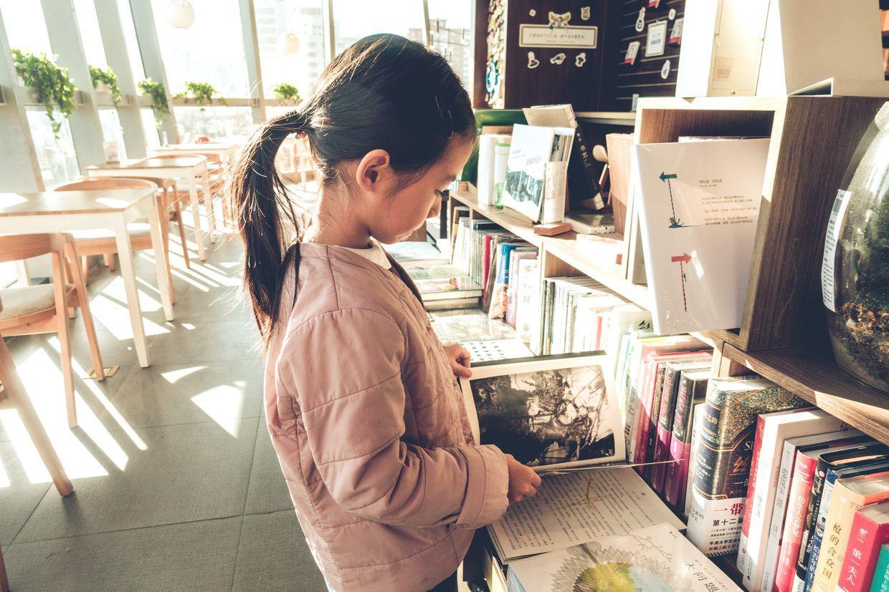
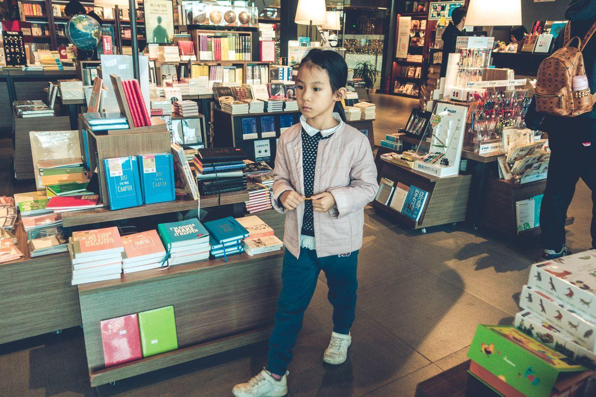
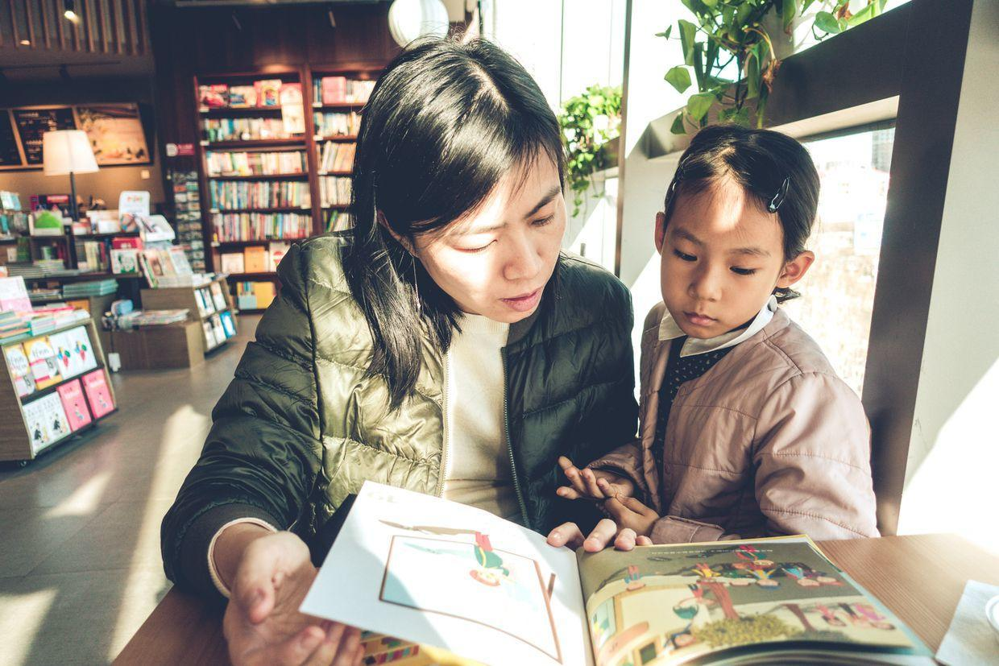

          
            
**2018.12.23**

周日啦，天越来越冷，风非常大。

早饭吃手抓饼，锅了直接热一下就好，非常快。

吃完饭，开始做语文作业，预习课文和生字、复习vipkid，一些词语。

出门去商场，圣诞气氛已经很浓了。

在商场里面奔驰起来。

一早就去书店，还没有顾客。

自己找找书看。

封面

儿童的书相对还是太少。

找了个绘本，一起读一读。

中午去吃饭，看到楼下有外国乐队进行表演。

吃过饭，回家休息。

下午起来，要再一起合练一下《苏珊娜》，晚上就要正式演出啦。

昨天上课的时候，看到了前年的演出视频，当时还真是青涩，希望继续进步。

***最近喜欢的诗文***
>这首诗是苏轼在乌台诗案坐牢以为自己必死时，给弟弟苏辙写的绝命诗，其中与君世世为兄弟，感动了宋神宗，最终免于一死。
《狱中寄子由二首》——苏轼
是处青山可埋骨，他年夜雨独伤神。
与君世世为兄弟，更结来生未了因。

**个人微信公众号，请搜索：摹喵居士（momiaojushi）**

          
        