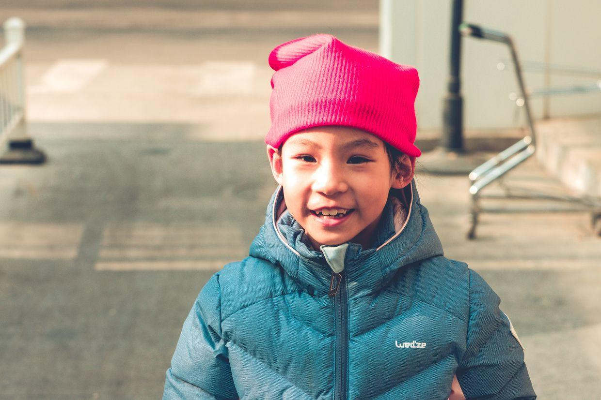

          
            
**2018.12.31**

今天是2018年的最后一天啦，天气还是十分寒冷。

早上睡了个懒觉，起床吃早饭。

早饭过后，开始复习语文词语的默写，还有数学口算。

之后开始练琴，继续《漫长愉快的旅行》，稍微有一些起色。

一起简单回顾了钢铁侠1-3的经典场面，现在看来，还是十分精彩。

快11点了，出门去吃午饭。

吃过午饭，一起晒晒太阳。

一起找掉了的彩色指甲。

笑容非常的灿烂。

封面

散步去彼岸书店看看。

在儿童书架，看了好半天的猫和老鼠。

一转眼，元旦假期接近尾声了。

晚上去国家大剧院看舞蹈演出，非常期待。

***最近喜欢的诗文***
>著名的的书中自有颜如玉，竟然是出自宋真宗的手笔，难得能有文学作品被后人朗朗上口啊。
《劝学诗》——赵恒
富家不用买良田，书中自有千锺粟。
安居不用架高堂，书中自有黄金屋。
出门莫恨无人随，书中车马多如簇。
娶妻莫恨无良媒，书中自有颜如玉。
男儿若遂平生志，六经勤向窗前读。

**个人微信公众号，请搜索：摹喵居士（momiaojushi）**

          
        