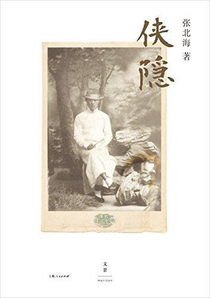

          
            
**2019.01.02**

好久没看到这么差的小说了，竟然以武侠小说自居。

我来了，我是谁，我仇人是谁，我报仇了，结束了。
<h2>2018.07.30（周一）</h2>
<h3>《侠隐》- 01</h3>
>1.前门东站

马大夫就是这一种，尽管他离退休还有一阵。他在洛杉矶加州大学医学院刚实习完毕，就和新婚夫人依丽莎白来到北京，刚好赶上中华民国成立。后来凡是有生人问他来北京多久了，他就微微一笑，“民国几年，我就来了几年。”

马大夫开场，民国开国来中国
>巴掌大的猪油葱饼。李天然吃得又香又过瘾。爆羊肉，西红柿炒蛋，凉拌黄瓜，香椿豆腐。家常菜，五年没吃了。

家常菜
>马大夫舒了口气，“你这几年在美国没听说？这儿可不安静。沈阳事变到现在，华北就没安静过……像你今天火车误点的事，经常发生，尤其是长城战事之后……就上个月，日本坦克车已经在长安街上游行了，还有飞机！……你没听说？就上个礼拜，二十九军撤出了丰台……”

日本占领华北
>他站在那儿，运了几口气，摆了架势，把师父从他刚会跑就开始教他的六六三十六路太行拳，从头到尾打了一遍。

会武功
>2.巧红

刚过了西四牌楼，一阵香味儿飘了过来。他没再犹豫就进去叫了碗羊汤面。

羊汤
>头顶上挂着一个光秃秃的灯泡儿，垂着一根拉线，末端扎了个铜钱。

我姥姥家以前也这样
>3.蓝公馆

他就这么走。饿了就找个小馆儿，叫上几十个羊肉饺子，要不就猪肉包子，韭菜合子。馋了就再找个地儿来碗豆汁儿，牛骨髓油茶。碰见路摊儿上有卖脆枣儿、驴打滚儿、豌豆黄儿、半空儿的，也买来吃吃。都是几年没见着的好玩意儿。

真香啊
>这几天下来，一个人只能叫什么刀削面，最多一荤一素，再么就是炒肝儿、灌肠、奶酪什么的小吃。一个人上大酒缸也没多大意思。他昨天一时兴起，在前门外鲜鱼口的“都一处”，也就只点了个烧麦，还有在外桥头上的“一条龙”，也只吃了回包子。过瘾非常过瘾，可是这种时候多个人，可以叫几样儿他们的炒菜。

重口味小吃
>4.燕京画报

李天然请他介绍。金士贻想了想，跟领班叫了两瓶“玉泉山”啤酒，两客炸鸡。

炸鸡和啤酒
>5.八月节

李天然十二岁那年，顾剑霜借着一次师门聚会，交代下一辈，“万一发生巨变，师徒分散，失去音讯，则切记，圆明园西洋楼废墟，每逢夏历初一午夜，是本师门幸存者约会时地。”

这个设计很好，定期聚会
>6.蓝兰的舞会

蓝田抢了过来，“以前大户人家，有钱请得起老师在家教课，所以是‘先生’，再又家里有钱，吃得好，所以狗也养得肥，丫头也胖……”

家里有钱的标志
>7.小跨院

三个大盒小盒装的是个美国咖啡壶，全套英国蓝白瓷的糖杯奶杯咖啡杯碟。李天然非常喜欢，非常高兴，非常感动……

真会生活
>9.夜店

“我醒过来是在床上，一间白屋子，什么都是白的……这已经两天以后了……救我命的是马大夫……”他脸上显出了少许惨笑，“唉，师叔，您怎么想也想不到，我这条小命叫一位美国大夫给救了……马大夫，马凯大夫……”

李天然被马大夫救了一命
>这个年代，你一身武艺又上哪儿去施展？现在连你们的镖行都没有了，你还能干什么？天桥卖技？去给遗老做护院？给新贵做打手？……跟我们去美国走一走吧，出去看看世界……我告诉你，这个世界很大，大过你们武林，大过你们中国……去看看，这不也是你们老说的跑江湖吗？”

大侠的世界没有了
>10.无觅处

“全变了……连票号银号都在卖什么‘航空奖券’。能叫我想起从前那会儿天桥的，是在地摊儿上喝的那碗牛骨髓油茶，跟‘一条龙’吃的那笼猪肉白菜馅儿包子。”

天桥变了
>11.长城试枪

“我们打南口过来，正前方那座山偏东就是居庸关，再翻几层山就是北口八达岭。这三道城墙是守北京的内长城……”他又喝了两口，“外长城的关口可多啦，光是这一带，往西是张家口，东边没多远是古北口，当年戚继光在那儿练过兵……再往东还有喜峰口，冷口，一直到山海关。”

蓝青峰点点头，边吃边说，“差不多，还有我们山西那边的娘子关，平型关，雁门关，就是那个‘赵家天子杨家将’那个雁门关……都去过。再往西，甘肃也去过，可是玉门关，阳关，早就没了，最多一两个土堆，就只剩下了一个嘉峪关……”

长城的关口
<h2>2018.07.31（周二）</h2>
<h3>《侠隐》- 02</h3>
>雨下起来了，风也刮起来了，不但斜打到他们小腿，落在地上的雨水还溅回来。伞不太好撑，也不怎么管用……“

他还是把油伞交给了巧红，偏头看了看天，伸手接了接空中飘着的雨丝，又一张手，“这叫什么雨？”

她脸上浮起了笑容，“这不叫雨叫什么？”他又抓了把雨丝，再一张手给她看，“这叫天上洒下来的云。”

关巧红笑了，“您真是外国住久了，”也伸手在空中抓了把雨丝，也张开了手，“这天上洒下来的云，我们管它叫雨……”

和寡妇调情
>14.卓府堂会

“趁热……刚出炉！”徐太太院里一声喊，惊醒了李天然。他去了饭厅。徐太太已经把切成片儿的酱肘子和一堆火烧摆上了桌，还给他夹了一套。他咬了一大口。火烧还热着，肥的都化了。

烧饼夹肘子
>15.羽田宅

他在西单菜市场拐角找了家临街的馆子，叫了十个羊肉包子和碗白菜豆腐汤。

真能吃
>他偏头就看得见“一宇洋行”店门。慢慢吃，又叫了壶茶，一直泡了快两个钟头。

喝两个小时茶
>李天然下了车才看见大门上头有块横匾“顺天府”。门两旁白底黑字两个布条儿，一个“烤”，一个“涮”，给上头煤气灯一照，刺眼极了。

天然夹了十来片儿粉红带白的羊肉放在碗里，佐料儿只是点儿酱油，拌了拌，才放上大把葱丝儿和香菜。

他带罗便丞下了院子，站在火盆那儿，教他先用大筷子把葱丝和香菜放在炙子上垫底，再把羊肉拨到上头，翻了翻，六七成熟，再把碗里的汁儿往上一浇，再又拨弄了两下。烤得肉“嗞嗞”冒着烟。李天然一下子全捞进了碗，一只脚踩在板凳上，另一只立在地上，“来，吃吧！”

罗便丞也学他样，把只脚踩在板凳上。

武吃炙子烤肉
<h2>2018.08.01（周三）</h2>
<h3>《侠隐》- 03</h3>
>薄皮儿猪肉馅儿，猪骨头汤，葱花，香菜，紫菜，蛋皮儿，几滴酱油，几滴麻油，再撒点儿胡椒末儿，李天然吃了两大碗二十个，外加一张烙饼。

香
>李天然看着对面坐的巧红，“不是说有人拜冬吗？那我就拜个冬吧……”巧红喝了一口，也回敬了一杯。乌黑的头发有几绺儿松了，搭在额头。她伸手捋了捋，用银簪子重新给绾住，突然发现李天然在盯着看她，脸上浮起了浅浅羞红，“今儿晚上不算……”“不算？”他一呆，“不算什么？”“不算是一块儿出来……”声音越说越小。

真是暧昧
>27.东宫

他要了两个白干儿，一碟韭菜拌豆腐，又劳驾掌柜的去给叫四两爆羊肉。

酒缸上头已经堆了四个二两锡杯。德玖又叫了两个，再来四两爆羊肉和四个麻酱烧饼。

好吃
>30.春饼

案桌上摆满了碟盘。黄酱，葱丝儿，酱肘丝，熏鸡丝。那些要等吃的时候才炒的，也都洗好切好了。韭黄肉丝，菠菜粉丝。就鸡子儿还没打。火上正熬着一大锅小米儿粥。

讲究
>36.事变卢沟桥

“延安！小苏投共了！”老金几乎在叫。

苏，投共

***最近喜欢的诗文***
>著名的的书中自有颜如玉，竟然是出自宋真宗的手笔，难得能有文学作品被后人朗朗上口啊。
《劝学诗》——赵恒
富家不用买良田，书中自有千锺粟。
安居不用架高堂，书中自有黄金屋。
出门莫恨无人随，书中车马多如簇。
娶妻莫恨无良媒，书中自有颜如玉。
男儿若遂平生志，六经勤向窗前读。

**个人微信公众号，请搜索：摹喵居士（momiaojushi）**

          
        