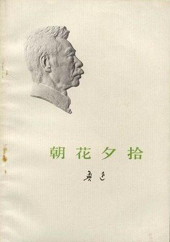

          
            
**2019.01.03**

前段时间，同事们一起聚餐，包间叫“嘎达梅林”，席间竟无一人听书过这个名字，我介绍到这是我小学学的蒙古族歌曲，嘎达梅林是一位反抗王爷的英雄。

结果话题一转，说到了鲁迅先生作为课文的文章。

大家互相问起学过的第一篇鲁迅先生的文章。

那肯定就是《朝花夕拾》中的《从百草园到三味书屋》了。这篇文章非常精彩，介绍了很多植物学知识。

《朝花夕拾》这个集子，并没有太战斗，里面是浓浓的乡愁和人情味。

那个不被人知道名字的阿长，逼着迅哥一定要在新年早上给她拜年，拜完年给了他一个桔子，原来她也有孩子，但是夭折了。

闰土的故事更是深入人心，少年闰土的灵气，在圆月下，手持钢叉，在瓜田里抓獾。到了中年闰土来的时候，两人家有了可悲的厚障壁，回城的船上，仿佛又看到了圆月下的那个少年。

这篇文章精彩至极，前后两段，完全一样的文字，像诗经里的反复吟诵，一下烘托起了感情。

上学时读这些没有什么感觉，现在每次读，都非常的泪目。

***最近喜欢的诗文***
>著名的的书中自有颜如玉，竟然是出自宋真宗的手笔，难得能有文学作品被后人朗朗上口啊。
《劝学诗》——赵恒
富家不用买良田，书中自有千锺粟。
安居不用架高堂，书中自有黄金屋。
出门莫恨无人随，书中车马多如簇。
娶妻莫恨无良媒，书中自有颜如玉。
男儿若遂平生志，六经勤向窗前读。

**个人微信公众号，请搜索：摹喵居士（momiaojushi）**

          
        