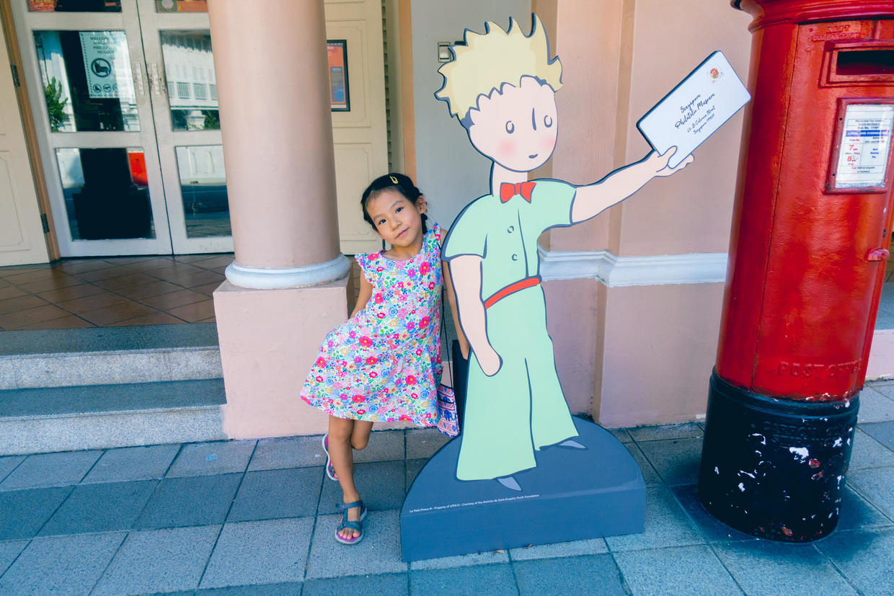

          
            
**2019.01.07**

**拍摄时间：2018.10.02**

**拍摄地点：新加坡邮票博物馆**

这张照片是2018年国庆节去新加坡时拍的。

上午逛了小印度，下午去圣安德烈大教堂，然后出发去邮票博物馆。

到了门口，发现这里在做小王子50周年的展览活动。

所有元素都和小王子有关。

喵还没有听过这个忧伤的故事，所以没有什么感觉。

邮票博物馆坐落在一个小山坡上，稍稍往上走两步就到了。

馆里非常的小，一进门是小卖部，卖各种各样的邮票、明信片。

很多邮票都是前所未见的，似乎任意一点小事，就能发行。

往里走，有很多小屋子，都是单独的专题，这次1层主题就是小王子，各种版本、作者生平介绍等等，充斥了整个展区。

可惜我们都不是小王子迷。

中间来了一个青年，想找法语版的小王子，但他本人是马来人。

真是无奇不有。

***最近喜欢的诗文***
>李商隐不愧是律诗最高峰，都是名句啊
《无题·相见时难别亦难》——李商隐
相见时难别亦难，东风无力百花残。
春蚕到死丝方尽，蜡炬成灰泪始干。
晓镜但愁云鬓改，夜吟应觉月光寒。
蓬山此去无多路，青鸟殷勤为探看。

**个人微信公众号，请搜索：摹喵居士（momiaojushi）**

          
        