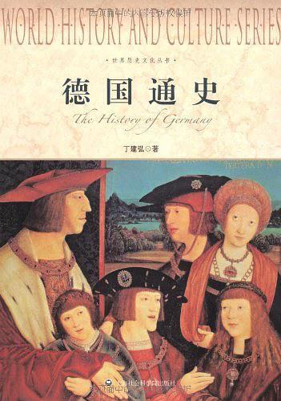

          
            
**2019.01.16**

非常精彩，读到威廉一世凡尔赛加冕德意志皇帝时，真是让人心潮澎湃。
<h2>2018.08.03（周五）</h2>
<h3>《德国通史》- 01</h3>
>导言德国在哪里？

德意志兰？它在哪里？我找不到那块地方。学术上的德意志兰从何处开始，政治上的德意志兰就在何处结束。——F.席勒

可怜啊，不知道国家和民族来自哪里
>在当今世界上，除德意志人称自己的国土为“德意志兰”（Deutschland）外，恐怕只有中国人和日本人是按其音而予以称谓的，中国人称德意志兰为“德国”，日本人称之为“独逸”，而其他多数国家则称之为“日耳曼”（Germany）或其他名字。

还真是，我们是称呼国土
>从德意志民族和国家的发展史考察，只有到1871年俾斯麦统一德国后，德意志兰才包含了国土和国家相一致的含义，把德意志兰译成“德国”才真正名实相符。

德国很晚，一直是个民族概念
>1830年大文豪歌德（JohannWolfgangGoethe，1749—1832）痛苦地说：“我们没有一个城市，甚至没有一块地方可以使我们坚定地指出：这就是德国！如果我们在维也纳这样问，答案是：这就是奥地利！如果我们在柏林提出这样的问题，答案是：这里是普鲁士！”

歌德
>综合起来说，德意志民族发展史上的重大不幸，是政治上长期处于分裂状态。“德国在哪里？”主要也就是指责德意志兰的政治分裂。

政治上一直不统一
>斯大林的领土扩张政策首先割取了奥得－尼斯河线以东的11.4万平方公里的德国土地，交波兰管辖，而自己则占领了原波兰东部的10多万平方公里土地，并取得了东普鲁士的整个北部，包括德国哲学家康德的故乡柯尼斯贝格。波兰等于整个被西移了。德国失去1938年以前领土版图的1/4左右。

东部给了波兰
>1990年两个德国的和平统一，形式上是某种平等的联合，实际上是民主德国被合并到联邦德国，也就是说联邦德国统一了民主德国。

联邦德国
>第一章立国时代：日耳曼人与德意志人

日耳曼人又夺取了设在他们土地上的罗马据点，把驻屯军赶过莱茵河。罗马帝国在莱茵河以东地区的统治被推翻。莱茵多瑙河上的国境墙堡垒和城市，也就成为后来德意志兰最早的城市。

日耳曼人兴起和罗马对抗
>公元375年，匈奴人在黑海摧毁了日耳曼哥特人部落联盟的抵抗，引起一直处于非固定状态的日耳曼各部落联盟雪崩似的迁移。东哥特人归附匈奴人，西哥特人南渡多瑙河，进入罗马帝国领土。

匈奴人还是匈人？
>战争和征服还是查理的主要业绩。当我们想到他南征北战中每战必胜，以及他所扩展的帝国范围时，真似一种奇迹。他镇压了阿基坦人的反叛；征服了伦巴德人并将伦巴德王国并入法兰克王国；在威尼西亚、伊斯特里亚、达尔马提亚和科西嘉建立了统治；对萨克森人发动了十八次进攻，最终征服了萨克森；征服了巴伐利亚人并使之信奉基督教；征服了多瑙河下游阿瓦尔人建立的汗国。

查理大帝
>“德意志”（deutsch）一词大概同“日耳曼”（Germann）一词一样，都是外人所给予的。据说“德意志”一词源自古日耳曼词语diutisc（由theoda即部族民一词而来），最初它只是指生活在法兰克王国东部的古老部落和部族讲的方言，时间大约在八世纪。

德意志这个词时法兰克东部方言
>德意志人同其他任何欧洲民族一样，是不同的“种族”群体的混合物，他们有“北欧人”即日耳曼人的血统，但却吸纳了凯尔特人、斯拉夫人、马札尔人、地中海人和所谓阿尔卑斯人的成分。

混合了很多民族
>公元前9年，古希腊人波息同尼乌斯在其著作《历史》中大约第一次使用了日耳曼这个词。有人把日耳曼解释为是用投枪（Gera）的人（mann），但被一些德国史学家斥之为天方夜谭。

这个挺有道理
>第二章封建时代：民族国家的被延误

961年，罗马教廷为摆脱罗马城市贵族的控制，向德意志国王求助，奥托即率兵越过阿尔卑斯山，重新吞并伦巴德邦国，征服意大利大部地区。

962年2月2日，教皇在罗马圣彼得大教堂为奥托加冕，把“罗马皇帝”称号加给德意志国王，重演了162年前查理大帝在罗马加冕的一幕，重又出现了“罗马帝国”，但这一次是形成“德意志民族的神圣罗马帝国”的开始。

奥托一世加冕神圣罗马帝国皇帝
>奥托一世虽被尊为“罗马皇帝”、“大帝”，但皇帝的头衔不是自动传给每个德意志国王的，德意志国王为得到皇帝称号和皇位，必须去罗马由教皇加冕方可，没有加冕的只能称作“德意志国王”或“罗马人国王”。

大家选出来的，还要教皇同意
>亨利四世陷于困难境地。他只得接受德意志封建主们的要求以图保持王位。1077年他带少数随从到意大利

北部的卡诺莎（托斯卡纳伯爵夫人的城堡，教皇当时在此），赤足披毡，在风雪中等候三天，向教皇忏悔赎罪。

能屈能伸
>1177年，弗里德里希一世不得不与教皇亚历山大三世缔结威尼斯和约，答应归还所占教产，不折不扣执行沃尔姆斯和约，并屈辱地吻了教皇的脚。

有一次去收拾教皇，最后失败，彻底分裂
<h2>2018.08.06（周一）</h2>
<h3>《德国通史》- 02</h3>
>最强大最重要的城市同盟是汉撒城市同盟。13世纪末来往于戈特兰岛、尼德兰、英格兰和德意志兰的商人，为保护自己的利益而成立称为“汉撒”（Hansa）的组织。1266年汉堡商人、次年卢卑克商人都在伦敦建立一个“汉撒”。1282年，所有“德意志的汉撒商人”组成了统一组织，克服了德意志商人的分散状态。1299年德意志汉撒城市同盟取代了商人“汉撒”的地位。极盛时期加盟的有北德和波罗的海沿岸的80个以上城市。它在北德意志兰起过重要作用，且取得过许多外交成就。

商人的汉萨同盟，我国从没有过商人联盟
>海盗船只的头目和船员出身于下层穷人，一部分是逃荒的奴仆或城市贫民，带着对社会复仇的心理，高喊“作上帝的朋友，作全世界的敌人！”口号进行抢掠。

梁山泊
>但在14和15世纪之交，特别是在其他一些欧洲国家（俄国、荷兰、英国）走上国家政权集中化以后，原先的格局就发生了变化。汉撒同盟的特权开始到处受到限制或者根本被取消了。汉撒同盟瓦解了，它的作用消失了（在德国，人们直到今天还常常把从前属于汉撒同盟的沿海城市称呼为汉撒城市，例如汉堡）。

中央集权强大了，商业联盟就不行了
>为排除教皇的干预，1338年七大选侯在伦塞开了德意志选侯会议，“伦塞选侯会”决议说，凡由选侯选出的德意志国王毋须取得教皇同意就可成为皇帝并执政。此后不久，“神圣罗马帝国”就成为“德意志民族的神圣罗马帝国”。选侯们只是感觉到教皇干预的威胁而要起来保护自己的利益，根本谈不上要求一个民族的国家，但客观上总是向民族化国家迈进一步。

拒绝教皇加冕干涉，开始形成民族国家
>当1438年哈布斯堡王朝继承卢森堡王朝时，这种情况也没有改变。15世纪中期起，帝国联系的瓦解过程开始了。德意志骑士团国家陷入波兰国王的统治下。什列苏益格－荷尔斯坦因归了丹麦国王。瑞士成了一个在帝国之外的独立国家。

德意志还被波兰统治
>可以这样说，如果没有“罗马皇帝”的称号和由此而来的称霸世界的野心，以及国王皇帝要由选举这两条，德意志兰内部虽然缺乏经济联系，但还是会实现甚至还可能更早实现中央集权和形成民族国家的。在11—15世纪，德意志王国一直是在侵略别人而很少遭人入侵，

这就使它并不强烈地感到需要民族统一，不像法国那样（面对百年战争），不像刚刚从摩尔人手里夺回的西班牙那样，也不像不久前才赶走鞑靼人的俄国那样。15世纪德意志兰没有形成为中央集权民族国家的主导原因，我以为是政治而非经济。

没有外部压力，就不容易形成独立民族
>第三章宗教改革时代：民族运动的发端

教廷力促百姓相信，只有购买一份教皇的赎罪券，即使不真心忏悔，也可以保证免受惩罚。这就形成一句民间谚语：“钱在匣子里铛响，灵魂就从涤罪所跳上天堂。”

赎罪券
>路德翻译圣经的重要意义在于，他在翻译时追溯到完全未经后人窜改过的圣经原本，并把它译成一种由他确定下来并通用起来的“标准”德语版本，这种德语来自人民的语言。

圣经翻译工作一直到1534年。路德的翻译工作对于创立统一的德意志语言文字是一个伟大的贡献。

马丁路德翻译圣经，出现标准德语
>骑士等级在城市的眼中是打家劫舍的“强盗”，在农民的眼中更是一帮“老爷”剥削者，骑士起义得不到市民、平民、农民的支持，失败自然难免。但是我们也必须说，骑士起义的失败，毕竟是一出历史的悲壮剧。济金根还有胡滕在反诸侯的斗争中扮演的是被历史认可了的唐·吉诃德。

骑士起义不被人民支持
<h2>2018.08.07（周二）</h2>
<h3>《德国通史》- 03</h3>
>发生在1618—1648年的三十年战争，是1555年奥格斯堡宗教和约以来欧洲宗教改革进程的结果。

三十年战争来了
>天主教会为巩固内部和加强集中而进行一系列的内部改革，消除了一些最坏的弊病，例如解除渎职和不守教规的教士职务，规定教士必须独身，取消赎罪券买卖等。

除了这种思想控制外，天主教会还建立了耶稣会作为反宗教改革的最重要工具。

耶稣会是一个有严格纪律的准军事性质机构。成员经过审慎选择，严格服从纪律。罗耀拉的训词这样写道：“下属必须服从上级，像一具可以随意移动的尸体，像一根可以任意转动的棍子，像一块可以任意捏扁或拉长的蜡团。”

教会的准军事组织
>通常史书把三十年战争分为四个时期，但没有一致的时期冠名，各时期的内容重点也不尽相同。我在这里分别称为捷克起义时期（1618—1623），丹麦干涉时期（1624—1629），瑞典入侵时期（1630—1635）和法国参战时期（1635—1648），

三十年战争四个时期
>捷克起义时期。1618年的“掷出窗外事件”是捷克民族起义的信号，也是三十年战争的开端。捷克民族起义的目的是反对哈布斯堡的民族压迫，争取民族独立，因而得到全民的响应。

新教捷克起义，正义却幼稚
>丹麦干涉时期。捷克起义被镇压后，皇帝的权力大为加强。在一次帝国议会会议上，他压制了新教诸侯的反抗，把普法尔茨选侯爵位和部分领土赐给巴伐利亚公爵。

皇帝的同盟西班牙则想重新统治荷兰。这种情况使西北部的新教徒非常惊恐。英法荷等国也行动起来，促动受皇帝威胁最大的新教国家丹麦出兵。1624年，一支受英国和荷兰金钱与武器支援的丹麦雇佣军（约6万人），在国王克里斯提安四世统帅下进入北德，一批新教诸侯和城市也参加了丹麦军队的行动。

支援新教捷克
>皇帝接受了一个叫华伦斯坦的军人的建议：建立一支不受巴伐利亚掣肘的独立的军队。华伦斯坦对皇帝说，他已经募集了一支3万人的军队，不需皇帝出经费，只要皇帝给他一个名义，即可出战。皇帝于是委任他为军队司令。

1630年皇帝免去华伦斯坦的职务，命令其军队解散。就在这个时候，瑞典军从北部侵入德意志兰，战争进入第三阶段。

华伦斯坦
>17岁登上王位的古斯塔夫－阿道尔夫二世（GustavⅡAdolf，1594—1632），立即投入争夺波罗的海霸权的斗争。为了“和那个华伦斯坦决一雌雄”，瑞典开始积极备战。瑞典有一支强大的军队，它不同于欧洲其他国家的雇佣军，是由征兵制征来的自由农民组成，经古斯塔夫－阿道尔夫国王的严格训练和整顿之后，成为一支勇猛善战的军队。

北方雄狮
>1646年，瑞典军队攻入巴伐利亚，法国军队也同时进入。两军合同进攻奥地利。“天主教联盟”在失去西班牙援助后已无力再战。疲惫不堪的皇帝和“天主教联盟”只得求和。同样疲惫不堪的瑞典和法国，面对英国反封建的资产阶级革命的巨大影响，也不得不同意停战议和。这才出现了1648年的威斯特伐利亚和约。

新教瑞典来支援，法国加入
>条约正式承认荷兰独立；正式承认瑞士脱离神圣罗马帝国成为独立国。〔4〕为了保证战胜国的利益，条约确定了大小国地位平等、信教自由的原则。

都打不动了
>三十年战争标志着一个时代的结束：德意志宗教改革时代的结束。1517年由路德发动的德意志民族国家统一运动的目标没有实现。德意志兰依旧是一个四分五裂、残破不堪的国家，依旧生活在古旧的封建生产关系中，它的发展大大落后于西欧其他国家。

签订威斯特伐利亚合约
>第四章普鲁士崛起时代：对德意志民族是祸是福？

但真正充当德意志历史上正经角色的，是1701年到1918年的普鲁士王国。人们很难想象到，普鲁士是从一个小小的、荒蛮的、穷困的东部边区马克，一个被人轻蔑地叫做“神圣罗马帝国的砂石罐头”发展起来的。

普鲁士从东部边区起家
>参加十字军东侵的德意志宗教骑士团这就充当了“德意志化”和“基督教化”的工具。它前后花了近六十年时间才征服整个普鲁士。一个肆无忌惮的日耳曼化时代开始了。由第四任团长赫尔曼·冯·萨尔查（HermannvonSalza，1209—1239在位）奠定的、完全自治的普鲁士骑士团国家，作为“欧洲的角柱”，在普鲁士土地上最终形成，它名义上属于神罗圣马帝国。

普鲁士骑士团团长
>三十年战争留给大选侯两大教益：一是必须保有一支独立的、听命于自己的常备军；二是利用帝国全面衰落、无中央皇权可言之机，建立勃兰登堡－普鲁士邦国诸侯专制政体，在自己邦国内实行中央集权的君主专制主义，在德意志帝国内部“找补”，扩展势力。

三十年战争后期，大选侯已完全抛弃父亲的旧部队，按瑞典人的榜样建立选侯新军。

普鲁士学习瑞典
>1701年1月18日，在柯尼斯贝格王宫举行国王加冕庆典，极度豪华所费不计其数的庆典活动延续了六个月之久。加冕日标志着普鲁士王国的成立，开创了普鲁士国家历史上的“新纪元”。

普鲁士国王登基
>普鲁士王国的真正建筑师，不是父亲弗里德里希一世，而是儿子弗里德里希－威廉一世。在弗里德里希－威廉一世（FriedrichWilhelmⅠ，1713—1740在位）在位期间，普鲁士王国的发展趋势明朗化。

安哈尔特－德骚侯爵莱奥波德元帅（LeopoldvonAnhalt-Dessau，1676—1747，人称“德骚老头”），被认为是当时战争艺术和训练战术最现代准则的掌握者，一位训练大师，他在普鲁士军队中引进“整齐的步伐”和铁的推弹杆。一种毫无意义的操练和对最小的差误施以鞭笞，成为把士兵训练成没有意志的工具的好办法，他在哈勒的军团成为普鲁士军队的“模范军团”。

弗里茨时代”战争旷日持久，战事艰辛，却鲜有发生士兵叛变或临阵脱逃之事，“祖国”的概念也正是在这时渗入普鲁士的国民心中。

普鲁士的军国主义道路
<h2>2018.08.08（周三）</h2>
<h3>《德国通史》- 04</h3>
>1722年他发表题为《论中国的实际哲学》的演说，把孔子的伦理学和基督教的伦理学相提并论。这种推崇理性和非神学的哲学观，遭到新教神学家们的反对。“士兵王”勒令沃尔夫48小时内离开普鲁士，否则处以绞刑。

还知道孔子
>“狂飙突进”运动的真正代表人物，是青年歌德和青年席勒，这两位德意志最伟大的诗人和剧作家的青年时期，给“狂飙突进”运动打上了自己的烙印，虽然他们后来都把“狂飙突进”运动视作他们发展过程中已被克服的阶段，实际上却是他们从青年时期走向古典文学这一成熟时期的过渡阶段。

如雷贯耳
>他还连续发表了著名剧作《铁手骑士哥茨·冯·贝利欣根》（1773）和书信体小说《少年维特之烦恼》（1774）。这就使青年歌德名震文坛，成为“狂飙突进”运动的旗手。

少年维特
>席勒的激进意识促使他在军校学生时期就开始创作剧本《强盗》，该剧描绘青年侠士卡尔报复封建专制社会以及报复贵族家庭对他的猜忌、侮辱和迫害，要求用共和主义的爱国主义代替封建专制主义。1782年《强盗》在普法尔茨选侯领的曼海姆民族剧院上演时，取得了空前的效果，把“狂飙突进”运动的戏剧推到顶点。据一位目击者所记，“剧院几乎成了疯人院。他们圆睁双眼，攥紧拳头，双脚把地板跺得震天响，喉咙都吼哑了！互不相识的人相互拥抱，泣不成声。妇女们踉跄地走向出口处，几乎近于昏厥。那气氛犹如驱散了笼罩在混乱之上的阴霾，露出了一线崭新天地的曙光。”

太戏剧性了
>1823年完成的《第九交响曲》就是代表作，他把席勒的颂诗《欢乐颂》引入乐章，并用人声大合唱的形式作为交响曲的结尾和高潮。

贝九
>普鲁士剩下的领土变得支离破碎，难以防守，人口从1000万骤减到493万，军队被裁减到4万。

普鲁士失去了独立和强国地位，沦落为受异族占领的无权小国，陷入全面崩溃境地。

普鲁士的一些自由主义贵族，寻求社会改革之路，以求复兴和独立。德意志的文化民族主义转变为政治民族主义，促成了德意志民族反对异族统治和压迫的民族解放战争。

被拿破仑打亡国了
>第六章改革时代：民族统一运动的初霞

1818年起，克劳塞维茨在柏林军官学校校长任内，根据自己的战斗体验和认识，写下著名的《战争论》一书，揭示了战争之本质及与政治之间的深刻联系：“战争无非是政治通过另一种手段的继续”；“政治意图是目的，战争是手段，没有目的的手段永远是不可想象的”，从而成为闻名世界的军事理论家。

战争论
>洪堡教育改革的成果，集中体现在三个方面：

第一，推行普遍的义务教育，在小学里用传授一般知识代替单科学习，采用自由主动的教学方法培养学生，从各方面对学生的个性进行塑造；

第二，改革和完善完全中学的教育计划，把古典文化、语言、数学和自然科学定为学生必修的学科；对学生进行人道主义和爱国主义教育；设立学年制、课程表，建立考试及升留级制度等；

第三，建立新型的柏林大学（1810年）。

教育改革才是最重要的
<h2>2018.08.09（周四）</h2>
<h3>《德国通史》- 05</h3>
>海涅最优秀的政治诗产生于40年代。1843—1844年同马克思和恩格斯的结识，对海涅的思想和创作都发生巨大的影响。

《德意志兰，一个冬天的童话》是海涅政治诗中最杰出的作品，这是海涅在1843年返回阔别十三年之久的祖国后写就的，全诗共27章。

海涅来了
>第八章统一时代：“白色革命”与民族统一的完成

我们德意志人除了怕上帝，不怕世上任何人。——O.俾斯麦

好吓人
>俾斯麦出生在勃兰登堡阿尔特马克的舍恩豪森庄园祖宅，一个世代容克的家庭。

就其财富和社会地位来说，俾斯麦家族不是第一流的，但容克的那种专横暴戾作风在他身上却很明显（据说大学期间就与人发生过13次决斗）。俾斯麦的母亲来自有名望的资产阶级家庭，给俾斯麦诸多影响；

贵族出身
>德国的统一是通过三次王朝战争，即1864年的德丹战争、1866年的普奥战争和1870—1871年的德法战争完成的。

拿破仑三世吹嘘说，这只是到柏林的一次“军事散步”，然而他现在碰到的却是一个德意志民族。南德诸邦也参加了这次对法战争。所有德意志诸邦最后都为民族的统一事业而团结起来。南德诸邦动员军队，同北德的军队组成一支50万人的德意志民族军，开拔到法国边境。德军的优势火力和高涨的士气很快击败了法军，转而进入法国。8月份的几个战役粉碎了法国人的抵抗。8月底至9月2日在色当进行了有决定意义的战役，结果是10万法军投降，拿破仑三世当了俘虏。民族战争的任务已经完成。但俾斯麦继续挥戈直逼巴黎。在普鲁士胜利引起的一片狂欢声中，在拿破仑帝国倾覆后的废墟上，在饥饿和准备战斗的巴黎人民面前，俾斯麦正式宣告成立新的德意志帝国。1871年1月18日，威廉一世在凡尔赛镜厅被立为帝国皇帝。

带领国王成为皇帝
>第九章工业化时代：民族国家的现代发展

德意志帝国与其说是建立在铁和血上，不如说是建立在煤和铁上。——J.M.凯恩斯

煤铁工业
>1888年3月9日，91岁高龄的皇帝威廉一世去世，帝位由他的儿子弗里德里希三世（FriedrichⅢ，1831—1888）继承，他登上帝位时已57岁，且是一个患喉癌而垂死的人。他只统治了99天，便长逝了。

中间还有一个短命儿子
>弗里德里希的儿子和继位者威廉二世（WilhelmⅡ，1859—1941，1888—1918在位），无论在性格上和政治上都与其父亲不同。

威廉二世来了
>第十章“英雄时代”：从民族工运到国际工运

莫要说我们一无所有，我们要做天下的主人——E.鲍狄埃

国际歌
>马克思的父亲是一位犹太血统的律师，崇尚法国唯物主义和法国革命，但却是一个德意志的、普鲁士的爱国者。

1841年他结束大学生活，写了题为《德谟克利特的自然哲学和伊壁鸠鲁的自然哲学的差别》的论文，获哲学博士学位。这篇论文虽然贯穿了战斗无神论的精神，但当时马克思还深深陷在黑格尔的玄学之中；他虽然已掌握了黑格尔的哲学辩证法，但没有摆脱唯心主义。1841年费尔巴哈的《基督教的本质》出版，对马克思转向唯物主义起了积极作用。

马克思获得哲学博士学位
>马克思和恩格斯在哲学中最伟大的贡献，是创立了辩证唯物主义，并把它从对自然界的认识推广到对人类社会的认识，创立了历史唯物主义，从而在人类认识史上引起一场空前的大革命。他们在政治经济学中最伟大的贡献，就是彻底揭示了资本和劳动的关系，提出剩余价值学说。

创立辩证唯物主义
>第十一章强权时代：民族沙文主义的膨胀

帝国主义首先是一种经济概念，是资本主义国家工业革命完成时期膨胀起来的民族经济力向外扩张和渗透的载体。

帝国主义来了
<h2>2018.08.10（周五）</h2>
<h3>《德国通史》- 06</h3>
>威廉登上皇位时是一个二十九岁的年轻人。他早年受过英国教育，在卡塞尔大学和波恩大学学过宪法学和政治经济学，受到过时代自由主义思想的影响，但后来在普鲁士近卫军中接受训练，受普鲁士军国主义精神和传统的教育，凝成一种刚愎自用、唯我独尊和崇信浪漫主义封建君主政体的性格。

被封建主义荼毒
>威廉二世还从霍亨索伦家族那里继承了一种对奢华铺张与官场虚饰的喜好。他几乎每天都开一个化装舞会。十六年中他命令自己的卫队换了37次制服。

面子主义
>弗里德里希－威廉·尼采（FriedrichWilhelmNietzsche，1844—1900）是杰出的德国哲学家，“超人哲学”和“权力至上论”的创造者。由于其极高的语言天赋，因而也被视作德国古典语言学家和优秀的抒情诗人。

超人
>阿尔伯特·爱因斯坦（AlbertEinstein，1879—1955），是20世纪德国最杰出的物理学家，世界著名的自然科学家。他在生前就被公认为人类历史上的科学巨人。

爱因斯坦出生于德国乌尔姆一个犹太人家庭。父亲和叔父合办一个电器工厂，使爱因斯坦较早地受到科学的启蒙。1896年，进苏黎世联邦工业大学学物理，1900年毕业。两年后，爱因斯坦被伯尔尼瑞士专利局录用为技术员，从事发明专利申请的技术鉴定工作。爱因斯坦开始利用业余时间进行科学研究。

还在1895年，爱因斯坦乘马车去瑞士途中突发奇想：如果有人以光速和光线一齐前进，是否将观察到光线乃是静止在空间中振动着的电磁波呢？

《关于光的产生和转化的一个推测性的观点》一文，把普朗克（MaxPlanck，1858—1947）1900年提出的量子概念扩充到光在空间中的传播，提出光量子假说，第一次揭示了微观客体的波动性和粒子性的统一，即波粒二象性。爱因斯坦在文章中用光量子概念解释了光电现象，推导出光电子的最大能量同入射光的频率之间的关系。由于他的光电效应定律的发现，爱因斯坦于1921年获得了诺贝尔物理学奖。

《论运动物体的动力学》一文完整地提出了开创物理学新纪元的狭义相对性理论，它突破了牛顿的绝对时空观，提出光速在所有惯性参考系中不变，而且是物体运动的最大速度。

太伟大了，审协出身
>第十二章魏玛时代：共和时期的民族运动

魏玛宪法又是近代主要资本主义国家中产生最晚的一部民主宪法，它吸取了欧美各国宪法的民主精华，成为当时最有民主特色的宪法。在关于德国国体问题上，宪法第一条称：“德意志国是一个共和国”，“国家权力出自人民”。

好厉害
>1923年11月8日晚，冯·卡尔等巴伐利亚地方长官出席贝格勃劳凯勒啤酒店举行的大型集会，希特勒率领数百名武装的冲锋队员破门而入，挥舞着手枪（据说朝天打了两枪）登上讲台，宣布“民族革命已经开始”。在同惊魂未定的冯·卡尔等人讨价还价一番之后，希特勒向集会者宣布推翻共和国政府，在慕尼黑成立全国临时政府，由自己任政府首脑，鲁登道夫任全军总司令，原驻军首领洛索夫任国防部长，冯·卡尔任巴伐利亚执政官，并声称临时政府将向罪恶的渊薮柏林进军，“拯救德国人民”。这就是著名的“啤酒店暴动”丑剧。

有实践精神
>他接受不了德国战败的事实，把德国战败的责任归咎于“十一月革命”，深信所谓“匕首神话”，即德军在战场上并没有被打败，而是背后中了卖国贼的匕首，这些卖国贼就是信奉马克思主义的革命分子（他把社会民主党也算在内）。

自己骗自己
>希特勒能上台的主要原因之一，乃是希特勒成功地把德国的法西斯运动——民族社会主义（纳粹）运动发展成一种群众性的运动，使纳粹党在1929年开始的世界资本主义经济危机时期成为德国举足轻重的政治力量。

到群众中去
<h2>2018.08.13（周一）</h2>
<h3>《德国通史》- 07</h3>
>当1929年从美国开始的像野火一样席卷世界的经济危机到来的时候，大量“中等阶级”和失业工人开始涌向希特勒，希望从他那里得到“解脱”的满足和“安全”的保障。

第一次世界金融危机
>第十三章纳粹统治时代：极端民族主义发了狂

希特勒是一个狂热的、歇斯底里的、魔鬼般的煽惑者。他的狂热不是出自对某种信仰的执着追求，而是产生于过度自信自己的伟大。他的煽动性演说既利用了德国浪漫主义传统中那种浅薄庸俗的哀婉，又利用了魏玛德国“中等阶级”群众多愁善感的情怀。当他奢谈所谓“荣誉”、“祖国”、“人民”、“忠诚”、“牺牲”这些抽象概念时，最能打动德国人的民族感。当他的声音由缓慢的男中音提高到嘶哑刺耳、语无伦次的嚎叫时，却使大量德国听众激动若狂。

演讲天才
>第三帝国”〔2〕原出于观念世界的千年太平说，即世界末日前一千年间耶稣当再来治世之说。

第三帝国时末世说
>德国纳粹法西斯的实质是什么？1933年共产国际执行委员会第十三次全会在希特勒上台后很快作出回答：法西斯是“金融资本的极端反动、极端沙文主义、极端帝国主义分子的公开恐怖独裁”。

法西斯的本质
<h2>2018.08.14（周二）</h2>
<h3>《德国通史》- 08</h3>
>军队、坦克和飞机未经宣战就已全线越过波兰边界，发起闪电突击战。9月3日，英国和法国都对德国正式宣战。战争的片面状态被打破。第二次世界大战终于全面爆发。

二战爆发
>德国挑起的全面世界大战，延续了六年（1939—1945），大体可分为三个阶段。第一个阶段是法西斯国家猖獗进攻的时期（1939.9—1942冬）。这个时期，德、意、日轴心国不断向外侵略，使战火波及欧、亚、非洲和太平洋、大西洋地区。

德军一开始占优势
>1940年6月22日，就在1918年签署德国投降协定的贡比涅森林的同一节车厢内，签署了法国投降协定。协定包括释放所有德国战俘，遣散法国军队，交出法国军舰，由德国占领主要工业区和产粮区以及包括法国整个海岸线在内的一半以上领土。

痛快痛快
>全面世界大战的第二阶段是战争的转折时期（1942年冬—1943年冬）。这个时期几乎在大部分战线上都出现对法西斯轴心国不利的逆转。

江河日下
>在希特勒自杀前几天，留下了一份口授的政治遗嘱和对国防军的最后“指责”，旨在造成这样的印象：战争是犹太人策划的，是总参谋部打败的，他自己是“背叛的牺牲品”。

全赖队友啊
>第十四章盟国管制时代：夹缝中的德意志民族

只有戈林为能坐上这迟到的纳粹首席显得有点洋洋自得。

小人啊
>第十五章重新崛起时代：一个民族两个国家

俾斯麦的三大保险法，都包含在战后联邦德国三大社会保险中，这就是医疗保险，事故保险和养老金保险，但其内容、范围和功能已经大为扩充和提高，赋予全社会性和现代色彩。

俾斯麦时期就又的保险
>柏林墙的重要地段墙高3.5米至4米，厚10厘米，在这光滑的水泥墙顶架上水泥圆管，使人无法越墙而过。墙后是一道5米深的坑道和布满铁丝桩的雷区，铁丝桩后是边防士兵使用的7米宽的大道及照明设备、边防岗楼、地堡和铁丝网，还设置了水泥警犬柱，警犬可在100米的地段上警戒。陆续建起的瞭望台上，每天24小时都有子弹上膛的边防战士值班。

柏林墙设计很周到
>第十六章再统一时代：一曲德意志民族的《欢乐颂》吗？

柏林墙是东西方冷战的象征，是德国分裂的标志，经历了风风雨雨的28年之后，终于被德意志民族要求统一的激情和热望所冲决。1989年11月9日克伦茨政权作出开放柏林墙的决定，只是一种无奈之举，但这个晚上却被两德人民当成“疯狂的欢乐时刻”，演出一出轰动世界的悲喜剧。

要合并了
<h2>2018.08.15（周三）</h2>
<h3>《德国通史》- 09</h3>
>1990年2月1日，莫德罗在访苏回国后，提出了“四步统一”的新方案：

第一步，签订合作与睦邻相处的条约作为条约共同体；

第二步，由两个德国共同建立邦联机构和共同执行机构；

第三步，成立统一的德意志国家，其形式是德意志邦联，或德意志联邦；

第四步，通过东西邦联地区的选举，成立共同的议会，制订统一的宪法，成立统一的政府，政府所在地是柏林。

四步走，统一德国
>1990年10月3日这一天，标志着德意志民族的历史进入一个新的阶段，或者说进入另一个时代。德意志民族与德意志国家既面临由统一带来的巨大发展机遇，也面临着难以预测的强劲挑战。

完成统一
>第十七章龙与鹰：历史上中德民族的文化关系

13世纪蒙古大将拔都率军西侵欧洲，曾遭到“孛烈儿乃、捏米思”部的联合抵抗，其事载《元史》《兀良合台》传。“孛烈儿乃”当为波兰，而“捏米思”即德意志人，“德意志人”一词见诸中国史籍，这大概是最早一次。

捏米思是德意志
>第一个接近中国皇帝、通过担任中国朝廷大员使西学东渐的欧洲人，却是德籍耶稣会士汤若望（AdamSchallvonBell，1591—1666）。汤若望是一位数学家和天文学家，生于莱茵河畔的科隆城。

汤若望是德国人

***最近喜欢的诗文***
>这首诗，在《加勒比海盗》中，周润发用粤语朗诵时，显得特别美
《关山月》——李白
明月出天山，苍茫云海间。
长风几万里，吹度玉门关。
汉下白登道，胡窥青海湾。
由来征战地，不见有人还。
戍客望边邑，思归多苦颜。
高楼当此夜，叹息未应闲

**个人微信公众号，请搜索：摹喵居士（momiaojushi）**

          
        