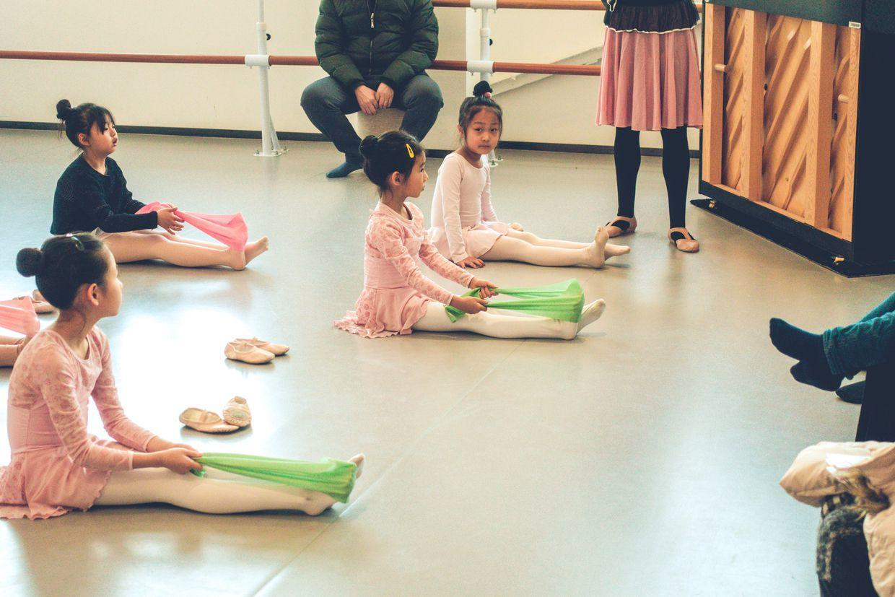

          
            
**2019.01.19**

周六啦，今天是芭蕾舞的公开课，终于可以看看学业展示啦。

吃过早饭，赶紧去教室。

先上一个小时课，然后家长进来观看。

老师给大家讲解动作。

平时在家练习要注意的点。

把杆上的动作。

看起来很恐怖，软度是一切的基础。

用绑带练习绷脚。

还要练习腰背力量。

双臂还要展开。

坐姿很重要。

去站位，表演舞蹈。

开始准备。

手上的姿势还挺讲究。

看起来很整齐。

眼神也到位。

胳膊看起来是直的，但还不能完全伸直。

封面

芭蕾的舞步。

还有一个下腰的动作。

手上动作。

这个动作在舞剧里常见。

中午回家吃饭。

看了最新的《歌手》。

睡个觉，下午去上钢琴课，认音实在是漫长啊。

下了课，晚上和姥姥姥爷视频。

吃过饭，继续认音。

明天去芭蕾舞演出，非常期待。

***最近喜欢的诗文***
>这首诗，在《加勒比海盗》中，周润发用粤语朗诵时，显得特别美
《关山月》——李白
明月出天山，苍茫云海间。
长风几万里，吹度玉门关。
汉下白登道，胡窥青海湾。
由来征战地，不见有人还。
戍客望边邑，思归多苦颜。
高楼当此夜，叹息未应闲

**个人微信公众号，请搜索：摹喵居士（momiaojushi）**

          
        