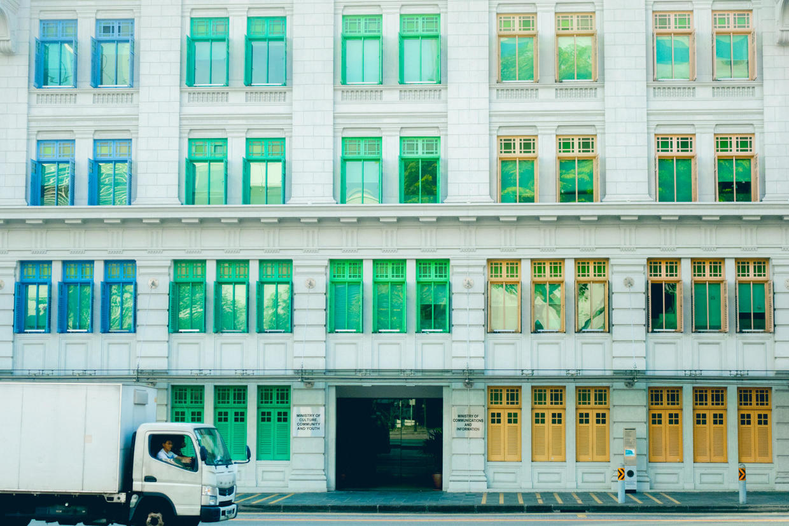

          
            
**2019.01.21**

**拍摄时间：2018.10.02**

**拍摄地点：克拉码头**

这张照片是2018年国庆去新加坡时拍的。

下午从圣安德烈大教堂出来，走到邮票博物馆，看了小王子五十周年展后，继续往克拉码头方向前进。

下午天气有些热，但是不闷，走起路来还挺合适的。

突然看见马路对面有幢很别致的建筑，仔细一看原来是五彩的窗户。

当时正好用的长焦，于是只拍了局部。

绿色、黄色、橙色、红色，颜色非常的轻。

等回了国才知道，原来这还是个很有名的地标建筑，好像是市政厅吧？

在新加坡的这段时间，在建筑上着实被震惊了许多次，看到了无数别致的建筑，大楼的中间几层竟然是花园。

建筑物的外墙涂满新奇的颜色，这在我们的城市里，似乎是难以想象的事。

五彩的颜色，让建筑们都变成了鲜艳的花朵，吸引着游人们前来合影。

***最近喜欢的诗文***
>乍看起来，诗句很感人，但是要是看看作者和妻子和其他女性的故事，就完全不同了，听其言也要观其行，不要被这样的人骗了。
《离思五首·其四》——元稹
曾经沧海难为水，除却巫山不是云。
取次花丛懒回顾，半缘修道半缘君。

**个人微信公众号，请搜索：摹喵居士（momiaojushi）**

          
        