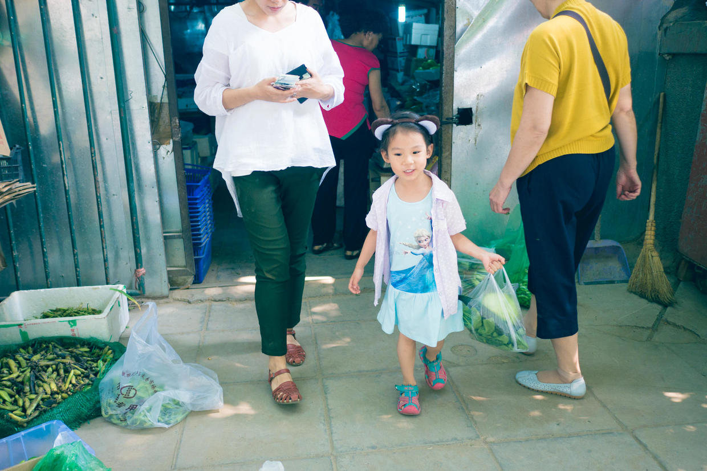

          
            
**2016.06.05**

周日了，起得很早，带上了春节喵妈公司发的猫耳朵。

早早出门，去吃早饭，天气很凉快。

本来想去家乐福大爷爷吃早饭，但是还没开门，于是就先逛超市吧。买到了做冰棍的模子，很开心。

买好东西，大爷爷开门了，结果只卖正餐没有早餐，于是打包了蛋挞和薯条，出去宏状元喝粥。

喵妈喝粥吃素包子，喵开心地吃蛋挞。

分了点妈妈的八宝粥，甜得晕过去了。

回到家楼下，跟着妈妈买菜。

楼下的小菜店，种类很多，就是不太新鲜。

这时，太阳已经开始有点毒了。

买好菜，帮妈妈拎着，快坚持不住了。

回家一进门就开始做冰棍。

酸奶、芒果、火龙果，多重材料。

倒满了以后，盖上小盖子。

全部完成啦，放进冰箱。

接着开始玩儿娃娃屋，上周去婷婷姐姐家看到后，妈妈也给买了一个。

可爱的托腮小人儿。

天气越来越热了，又该开空调了，准备过端午。

***下期预告：看图说话***

**个人微信公众号，长按二维码加关注，或搜索：摹喵居士**

**喜欢作者写写哪些话题，可以公众号留言**

          
        