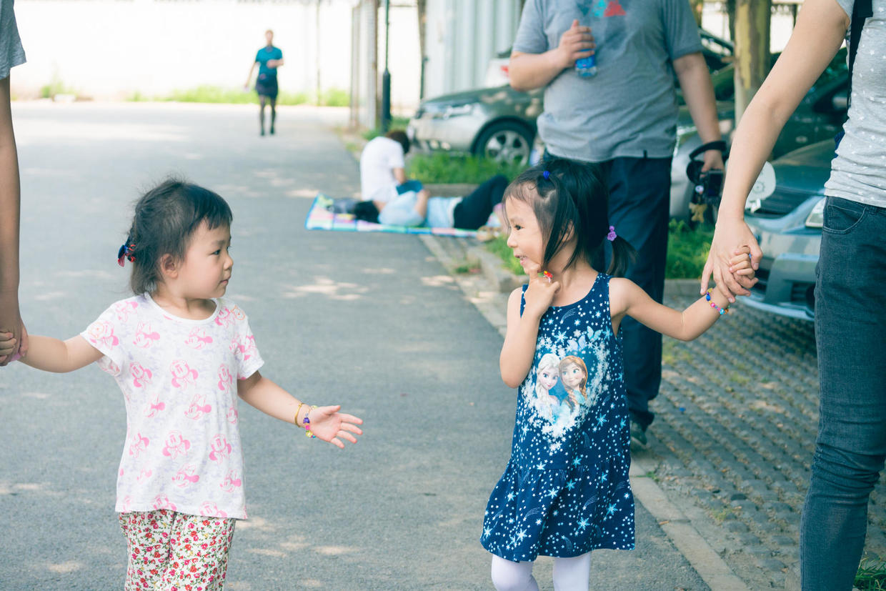

          
            
**2016.06.09**

端午节啦，和兜妹、悦妹一起出游啦。

一早就到了蓝调庄园，下车就碰到兜妹了。

在儿童乐园的白雪公主前面合了影，白雪公主的金身需要重新维护了。

下面去看小松鼠，和兜妹在逗。

笼子里的松鼠们互相争抢核桃。

喂小兔子，在地上捡胡萝卜，小兔子们都很饥饿，有什么吃什么。

悦妹也到了，三个人一起喂萝卜、喂草。

跑到了大舞台上，自然是要表演一番。

在蹦床上，三个孩子尽情的挥洒汗水和尖叫。

活动结束，围坐在一起喝水。

到家了，来看老奶奶。

老同志们准备了丰盛的午餐。

孩子们争抢着洗手，终于有了基本的卫生意识。

不饿的2个小人儿开始玩儿医生的游戏。

吃完饭，三个孩子一个屋睡觉。

3年前她们是这样。

和这样的。

在各种闹之后，终于沉沉睡去。

下午睡醒了，去蹭兜妹的金宝贝活动室。

吃完晚饭，快乐充实的一天结束了，每次见都觉得她们3个人又长大了一些。

***下期预告：端午节***

**个人微信公众号，长按二维码加关注，或搜索：摹喵居士**

**喜欢作者写写哪些话题，可以公众号留言**

          
        