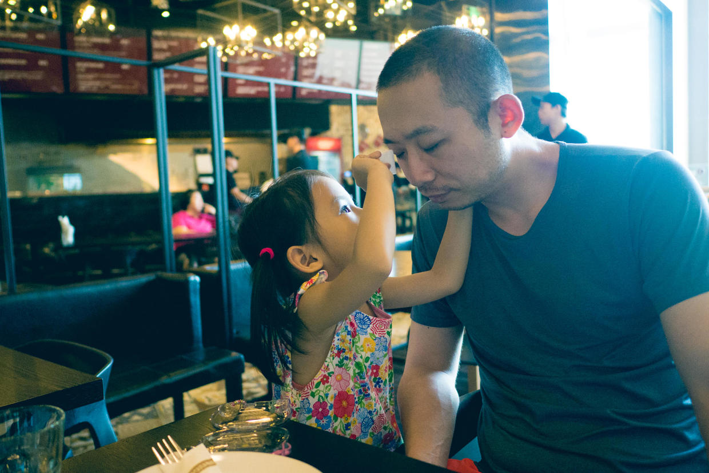

          
            
**2016.06.11**

端午节第3天，依旧是很早就起床。吃了奶奶做的粽子，喝牛奶。

坐在我的腿上看报纸。

难得的好天气，决定去三里屯玩儿喷泉。
下了车，在三里屯的街拍。

结果三里屯音乐喷泉的场地搞了欧洲杯活动，于是改为转战颐堤港。

到了颐堤港也才9点，出了地库就开始跑。

顶着烈日去颐堤港的广场玩儿沙子。

找了个柱子的阴凉，玩儿得不亦乐乎。

接着在沙堆上玩儿秋千，好像蜘蛛侠一样。

三个小朋友一起玩儿，也是很开心。

回到商场真凉快啊，在HM里开始赛跑。

去吃墨西哥料理，学着幼儿园老师六一活动时的样子，给妈妈化妆。

给爸爸化妆，因为班里的男孩子也化妆。

最后自己再假装补补妆。

儿童套餐来了，最后吃了一个卷饼，半份米饭，一盒牛奶。

难得一次吃了这么多，说道：
>吃这么好，一定要奖励个冰激淋。

冰激凌摆到面前，已经笑成了一朵花。

端午节接近尾声了，非常快乐，非常充实，晚上看看天气怎么样，好的话，就去奥体看灯。

***下期预告：端午节***

**个人微信公众号，长按二维码加关注，或搜索：摹喵居士**

**喜欢作者写写哪些话题，可以公众号留言**

          
        