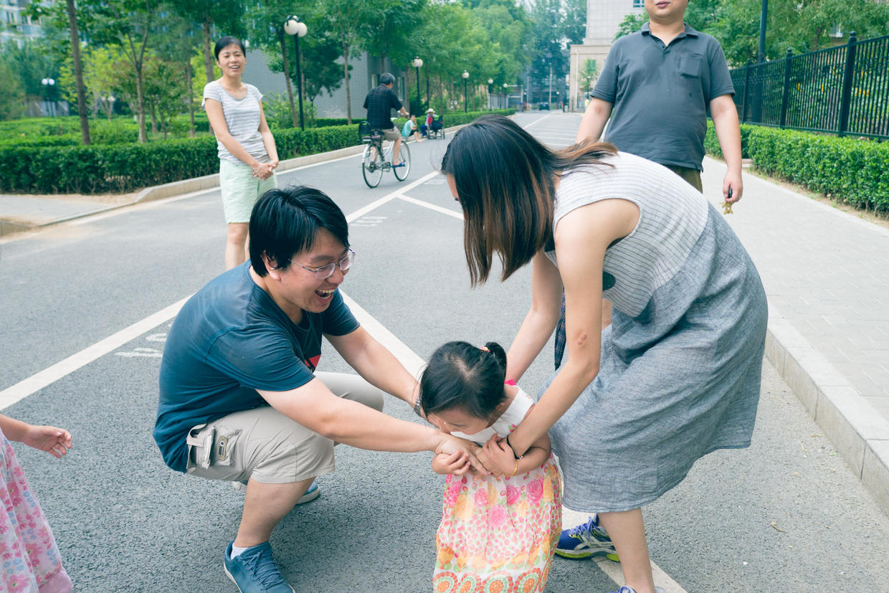

          
            
**2016.07.03**

周日到啦，又可以去和妹妹们一起玩儿了。

早上一大早出门，喊着我们快走。

在楼下就碰到了兜妹和悦妹。

上午天气热，主要是在家活动。

三个小家伙开始玩儿护士看病的游戏。

兜妹和悦妹一起坐在沙发上。

三个人在大床上乱蹦。

喵和兜妹在小床上乱蹦。

终于三个小家伙开始安安静静地看书了。

兜妹在床上一个人认真地看托马斯，问我为什么小火车钻进雪堆里。

喵和悦妹爬到写字台上，在窗边看着各自的。

下午起床，三个人一起带上发卡合了个影。

楼下起风凉快了，去跑一跑。

玩儿一网不捞鱼。

兜妹这个小尾巴鱼被抓住了。

悦妹和爸爸扔网球。

玩儿老狼老狼几点了。

十点了，快跑啊。

站在高处，看着3个小家伙已经能跑在一起，非常非常开心。

转眼间，都上幼儿园了，转眼间，转眼间，时间就过去了。

***下期预告：周末活动***

**个人微信公众号，请搜索：摹喵居士（momiaojushi）**

**喜欢作者写写哪些话题，可以公众号留言**

          
        