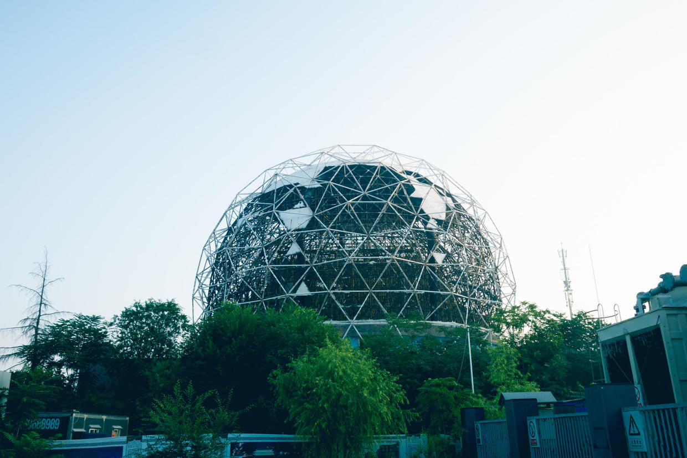
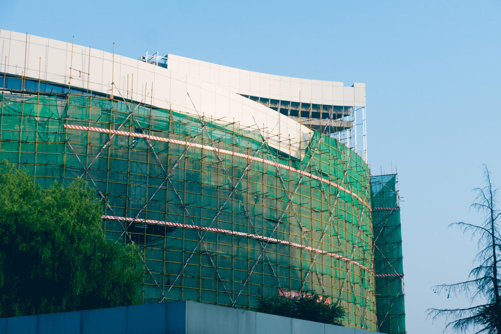
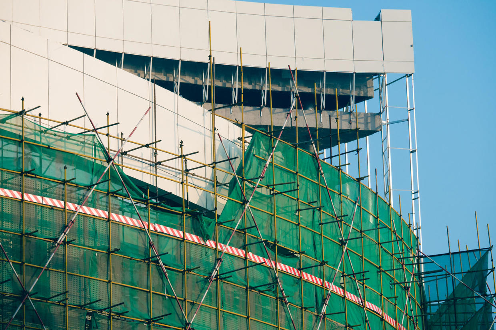
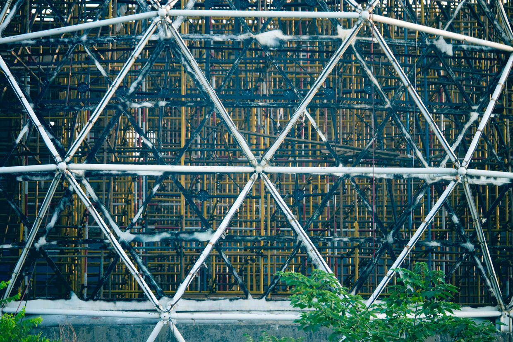
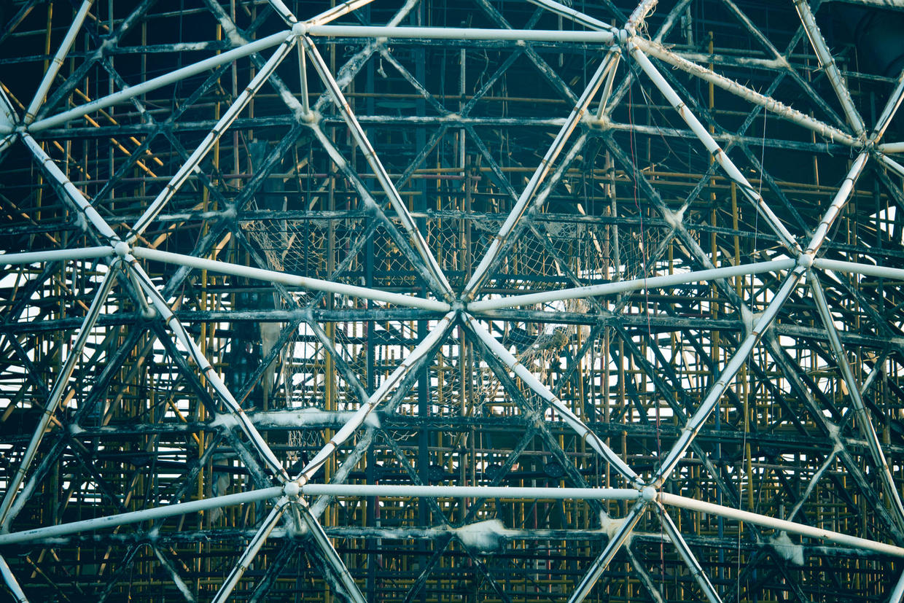
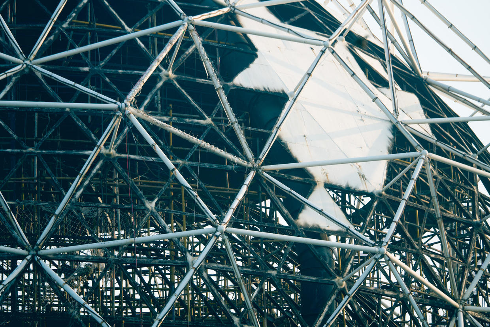
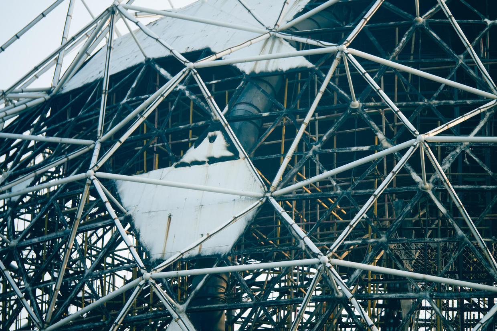
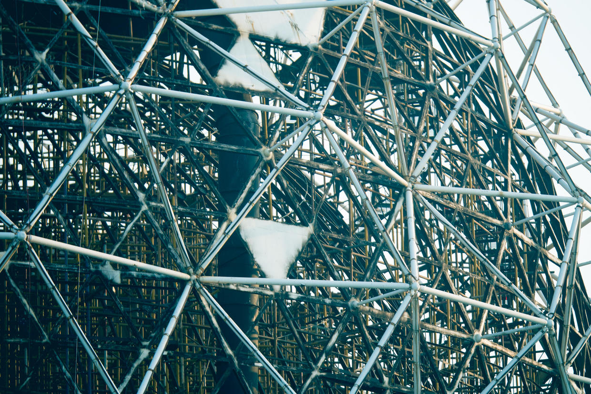
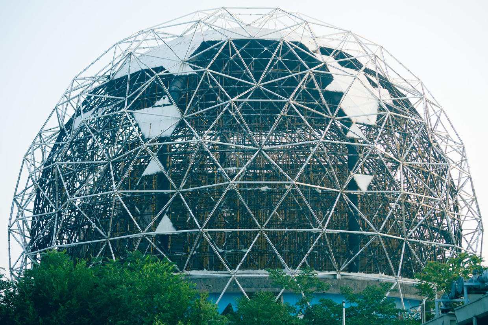
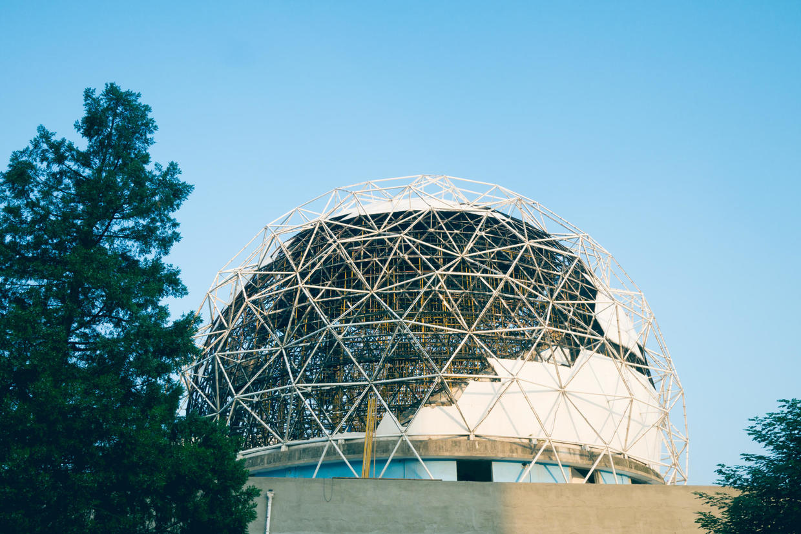

          
            
**2016.07.07**

最近早上送喵去幼儿园，突然发现三环上的老科技馆开始施工了，不知道是要做什么，感觉是要开始拆除了。

巨大的球幕影院的外壳已经一片片剥落了。

新馆大楼也被脚手架围起来了。

记得当年这个波浪形的大楼建起来时，造型还是很新颖的。

透过球幕影院的框架，看着里面层层叠叠。

内部的脚手架错综复杂，交错中越看越美。

破损的蒙皮，零落在骨架上。

一个巨大的管道从上到下贯穿整个影院。

从来没有想过这个大球里面会是个什么样子。

最后再看它一眼。

再见了，老科技馆。

回想最早去科技馆，初中那时只有一幢板楼和球幕影院，板楼里必玩儿的是静电头发飘、肥皂泡和闪电发生器。

球幕影院里，常年在放的是《大峡谷》，第一次看时，镜头冲下峡谷时，我激动地险些从椅子上滚下去。

高中时，波浪形的新楼落成，学校组织去参观，里面最有名的区域其实是个网吧，大家在那里体验什么叫“上网冲浪”。

2008奥运后，新科技馆落成，老科技馆也就停用了，今天终于要拆除改建了。

最后，谨以此文告别老科技馆，以后只能翻出这些照片，告诉孩子们，当年北京三环边上有一个大球，那是老科技馆。

***下期预告：南戴河第1天***

**个人微信公众号，请搜索：摹喵居士（momiaojushi）**

**喜欢作者写写哪些话题，可以公众号留言**

          
        