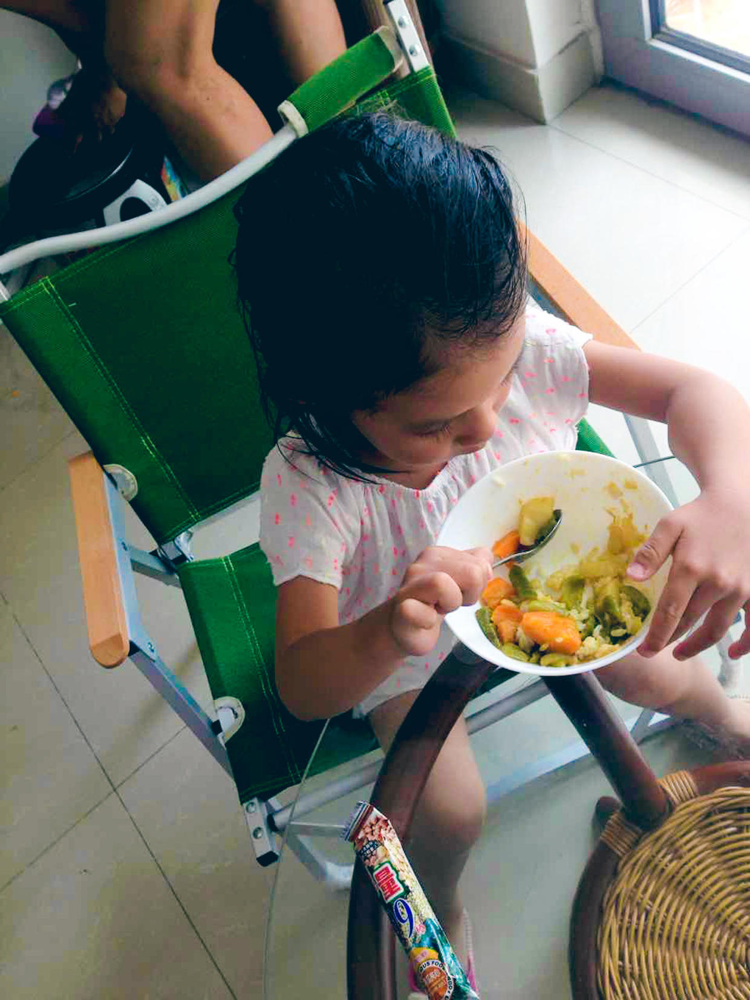
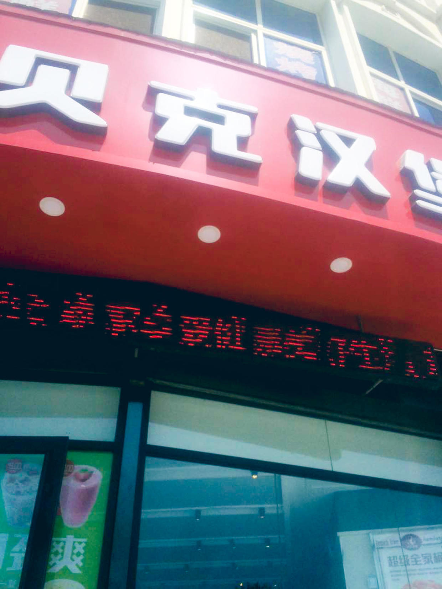
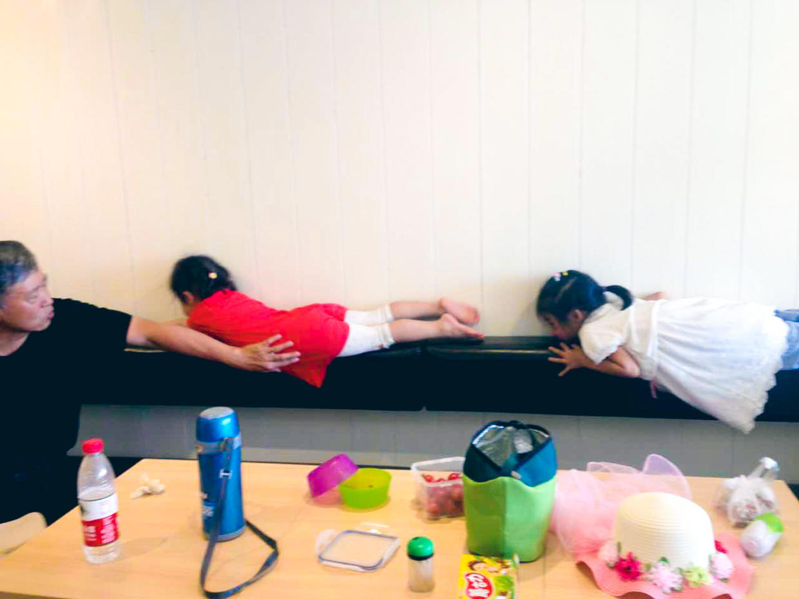
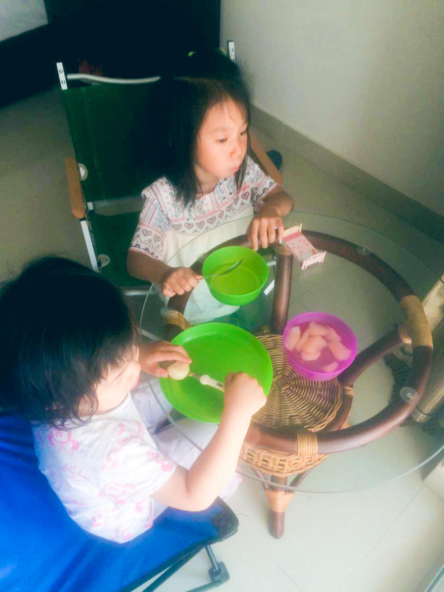
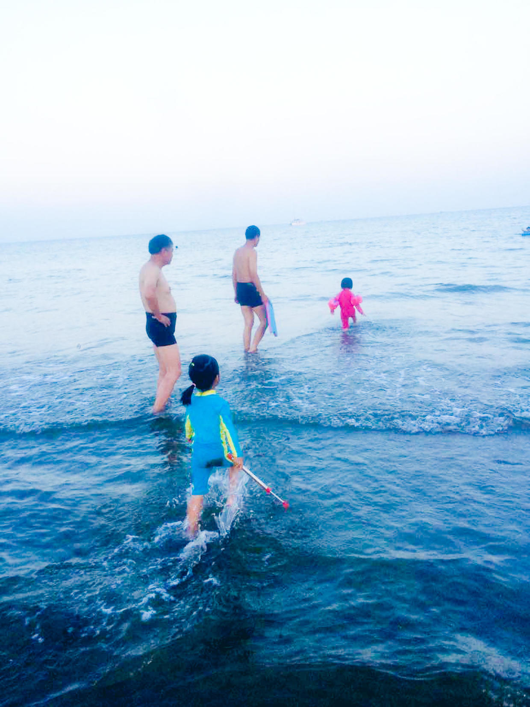
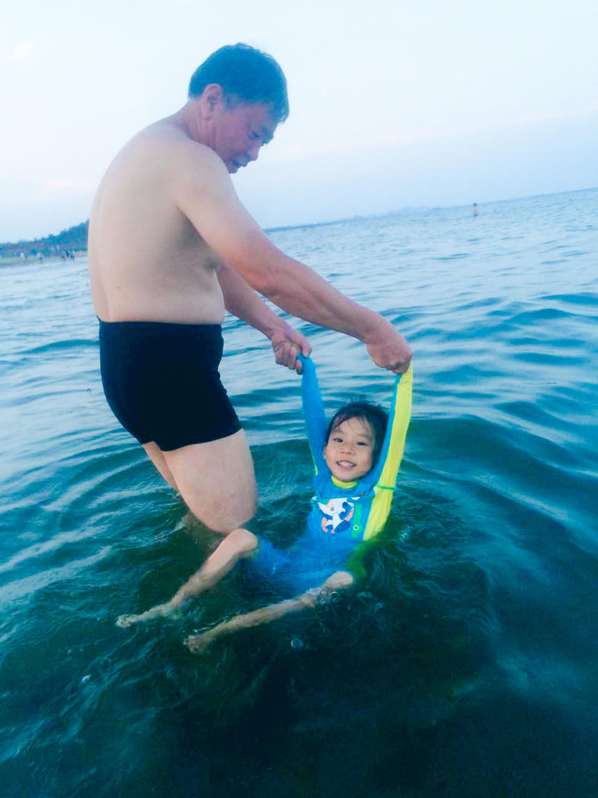
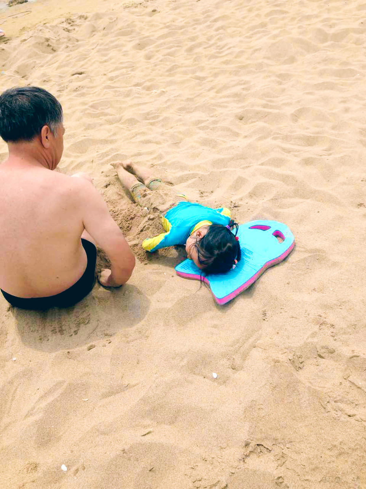
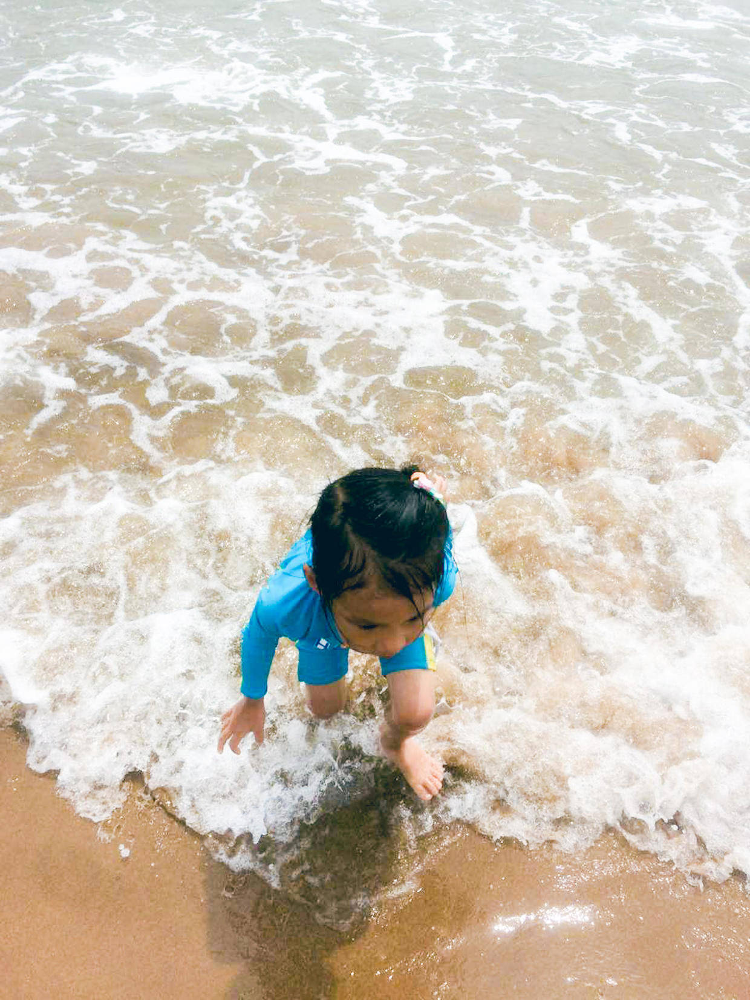
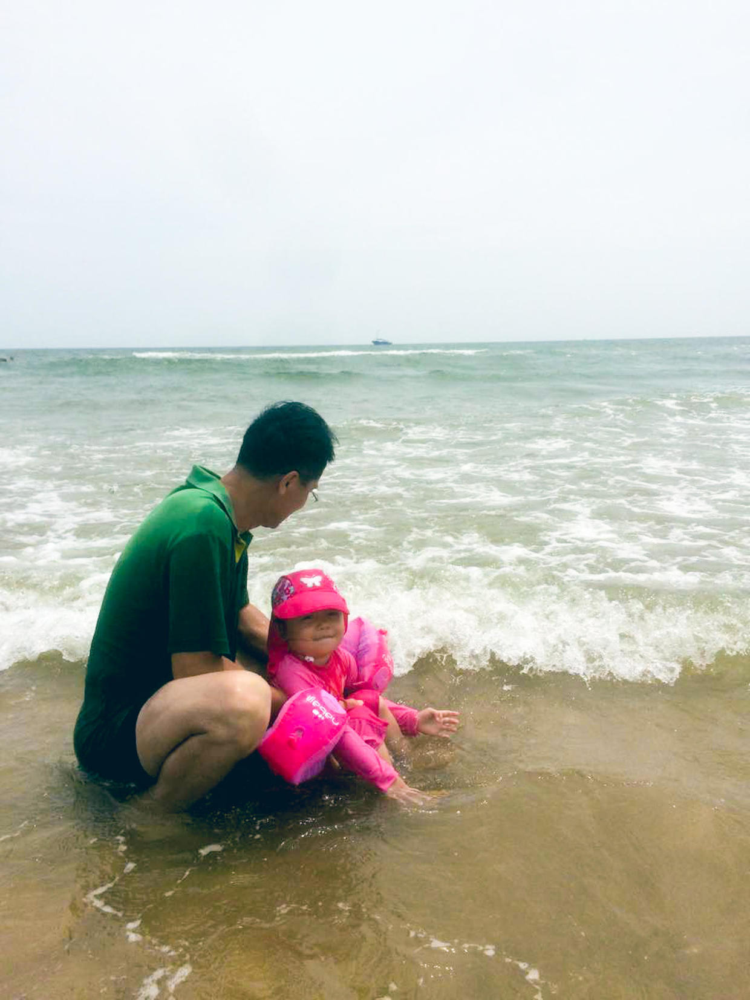
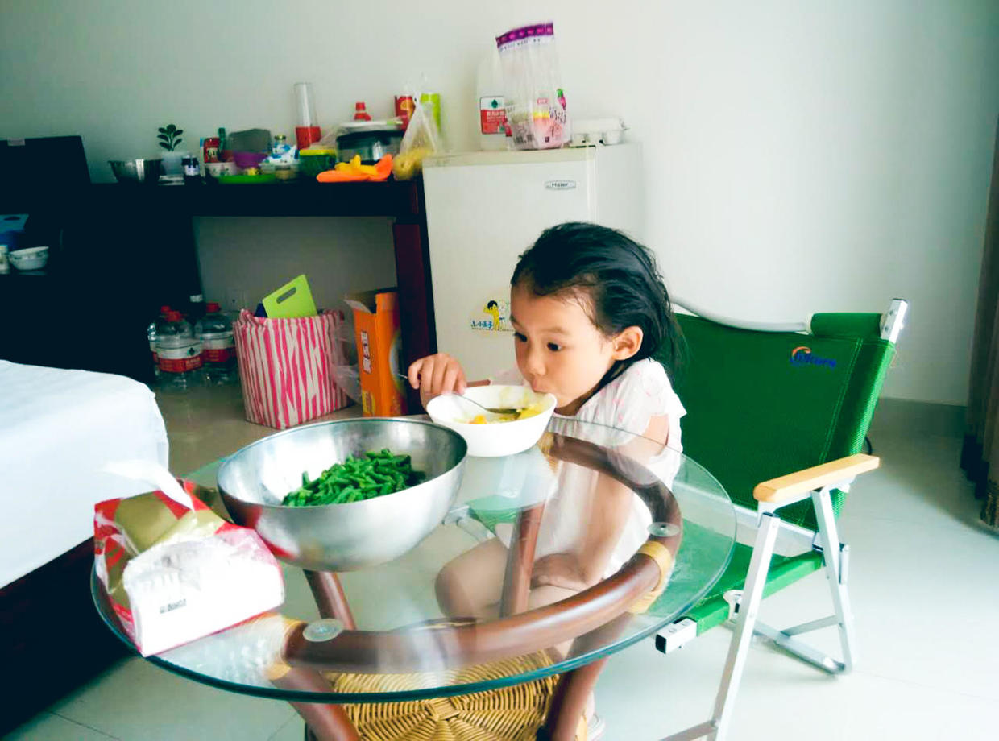

          
            
**2016.07.14**

喵和兜妹在南戴河继续玩儿，已经到了第7天了。

昨天晚上吃的咖喱饭，自己电饭锅做的蔬菜咖喱。

贝克汉堡，就是昨天中午吃的那家，谐音自贝克汉姆吧。

昨天中午两个小人儿，在靠背上玩儿了起来。

睡醒一觉，开始吃奶奶做的梨水。

下午在阳台上晒太阳。

晚上凉快了，和爷爷去游泳。

爷爷拉着手，练习仰泳。

今天一早，趴在沙滩上，让爷爷埋自己。

在沙滩上冲浪。

兜妹和姥爷一起冲浪。

中午喝粥吃菜。

明天就周五了，上午喵和兜妹也要回来了。

晚上视频的时候，还是说不想回家，不想和大海再见。所以提前就开始打预防针了，周五回家，周六休息一下，周日还要去听音乐会，下周还要给幼儿园小朋友去发纪念品。

***下期预告：从南戴河回家***

**个人微信公众号，请搜索：摹喵居士（momiaojushi）**

**喜欢作者写写哪些话题，可以公众号留言**

          
        