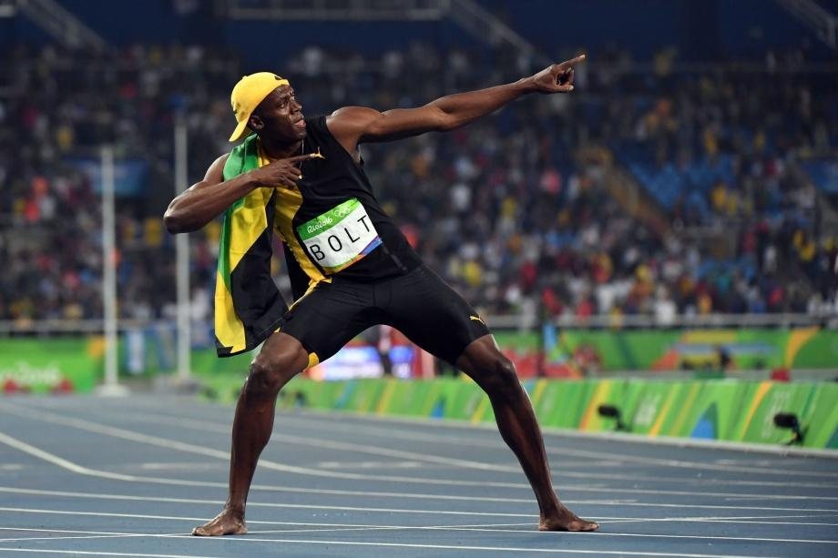

          
            
**2016.08.16**

今天上午，最令人振奋的消息，就是男子百米决赛了。

博尔特令人震惊地，第三次获得男子百米奥运金牌。

现在回忆起来，他第一次夺冠还是在2008年北京奥运会。

当时大家普遍不看好他，觉得他身高太高，步频肯定上不去，再加上他的主项是200米，跑100可能就是打个酱油。

结果没想到一鸣惊人，腿长加上高步频，秒杀众人，即使本届奥运会，前程被超，最后还是能扳回来。

NBA的球星发twitter说，博尔特的对手们，四年时间里，放弃了家庭和社交生活，日复一日的苦练，换来的只是博尔特背影。

天才型选手的确让普通人感到很无力，真希望博尔特能改变主意，再战东京。

另外，男子400米的世界纪录也被破了，是南非的年轻选手。

王军霞女子万米尘封23年的世界纪录也被打破，王军霞非常高兴，证明了自己的纪录并非遥不可及，对于她的种种非议，终于可以落幕。

本次奥运会，第一次看了女子七项全能，包括了田赛和径赛的7个项目。

当电视屏幕上，一个瘦削的女选手，拿起铅球，晃晃悠悠地投出时，我和喵妈都震惊了，这么差的成绩还能参赛，后来才明白这不是铅球比赛，而是七项全能里的铅球比赛。

看着这些瘦高女运动员，晃晃悠悠地投铅球、扔标枪，感觉实在是有违奥运会更高、更快、更强的宗旨。这个比赛最后成了一个万金油项目，每项都凑合，但每项都很差。

今天最新的消息，张国伟没能晋级跳高决赛，赛前就开始炒作，可惜了。

***下期预告：看自行车***

**个人微信公众号，请搜索：摹喵居士（momiaojushi）**

**喜欢作者写写哪些话题，可以公众号留言**

          
        