          
            
**2016.09.04**

昨天去颐和园玩儿了一大圈，今天一早起来，喵说腿一点也不酸疼。

于是，吃过早饭后，准备去游泳。

这次记住了，要带上游泳卡，要不还要求人家查手机号。

很快下水，热一下身。

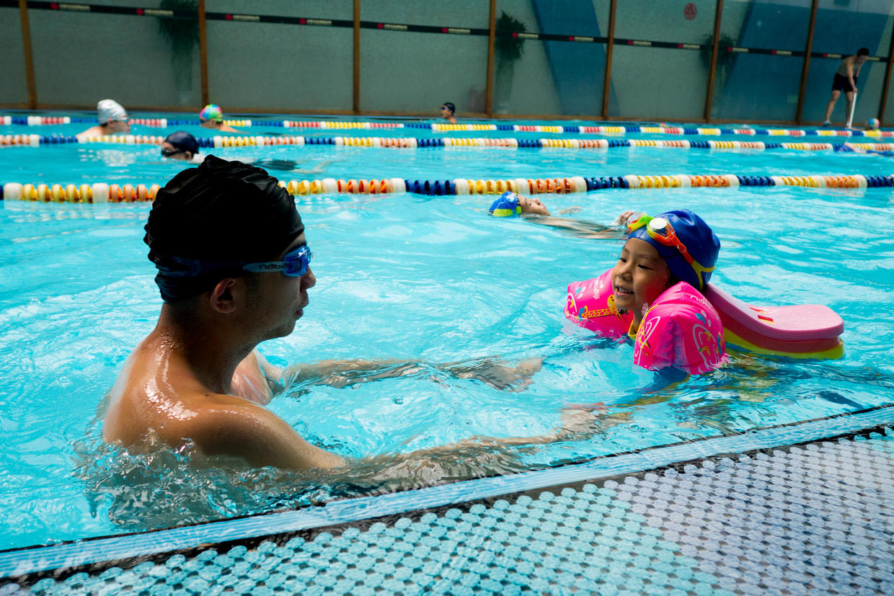

这次游，喵已经很容易就漂起来了。

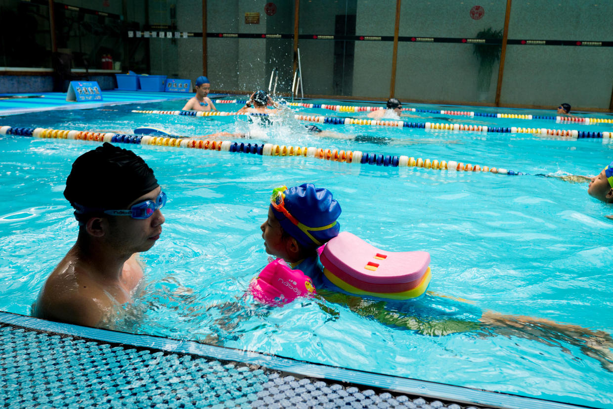

游了一会儿，又来到了蘑菇池，我都伸不开腿。

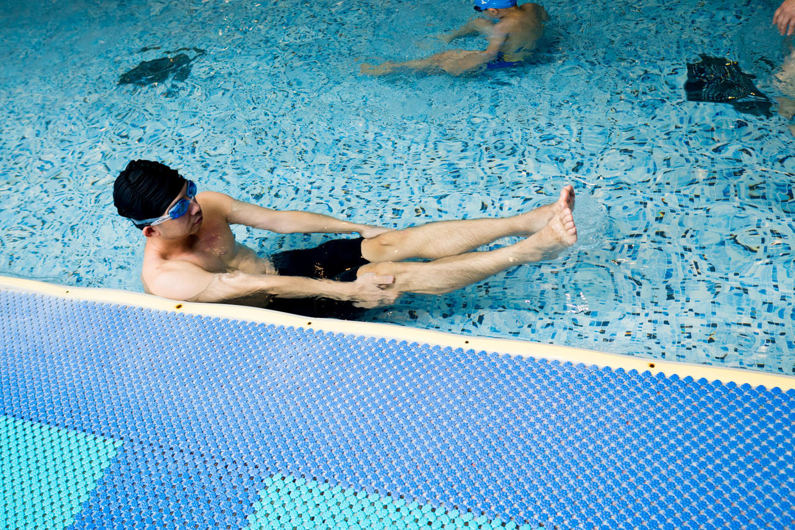

喵在蘑菇池里，也很得心应手。

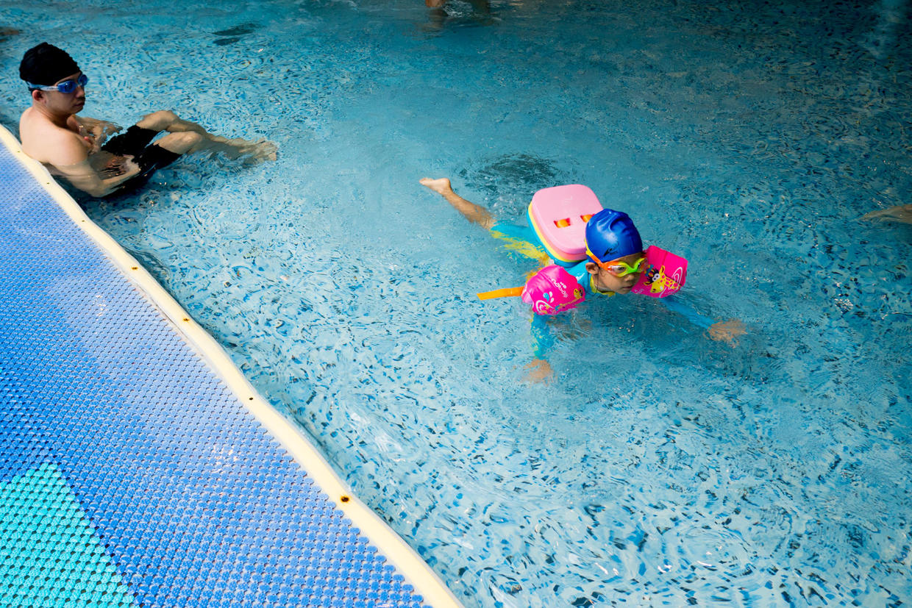

很快就自己游到了岸边。

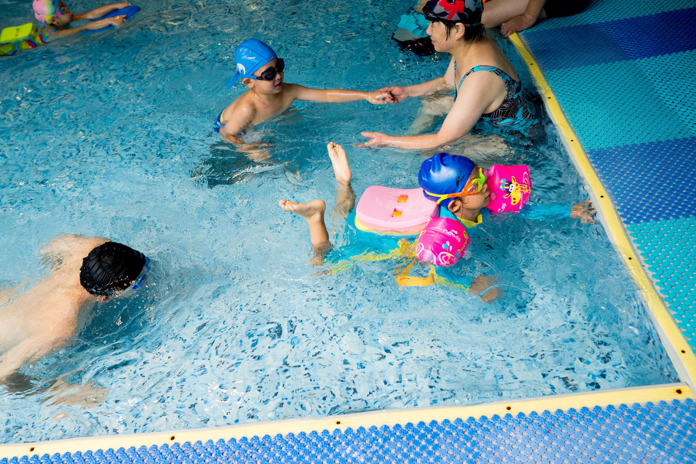

背着浮板，双腿打水，溅起了很大浪花。

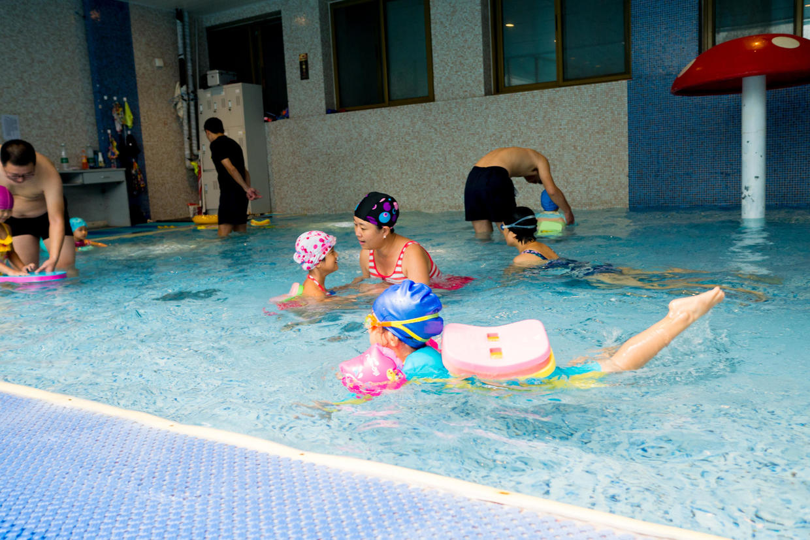

看着妈妈，瞪着大眼睛。

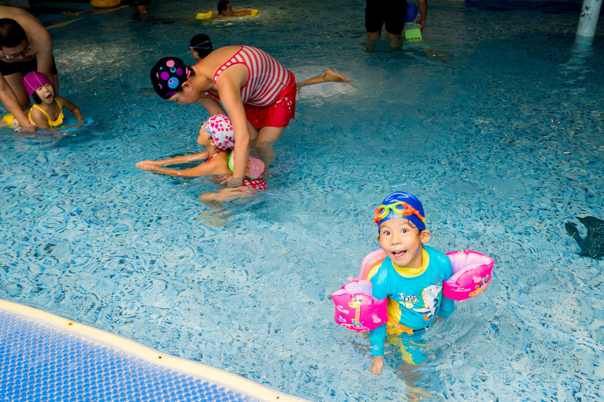

还不忘了摆个造型。

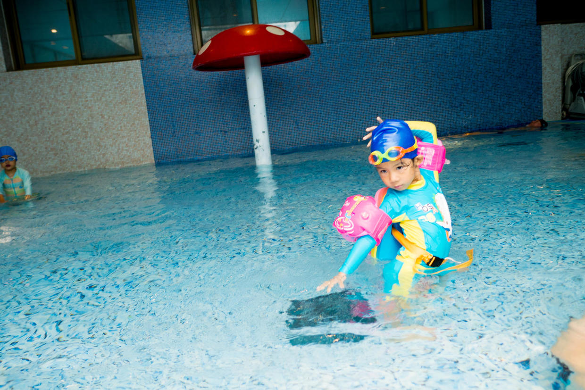

到了岸边也要摆造型。

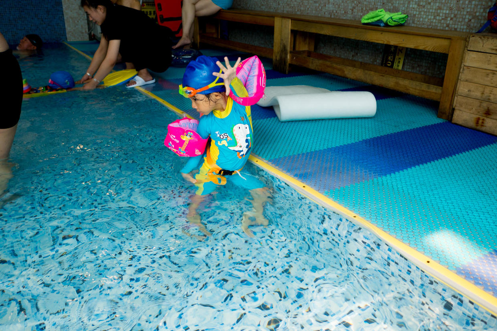

展示一下自己的小长颈鹿。

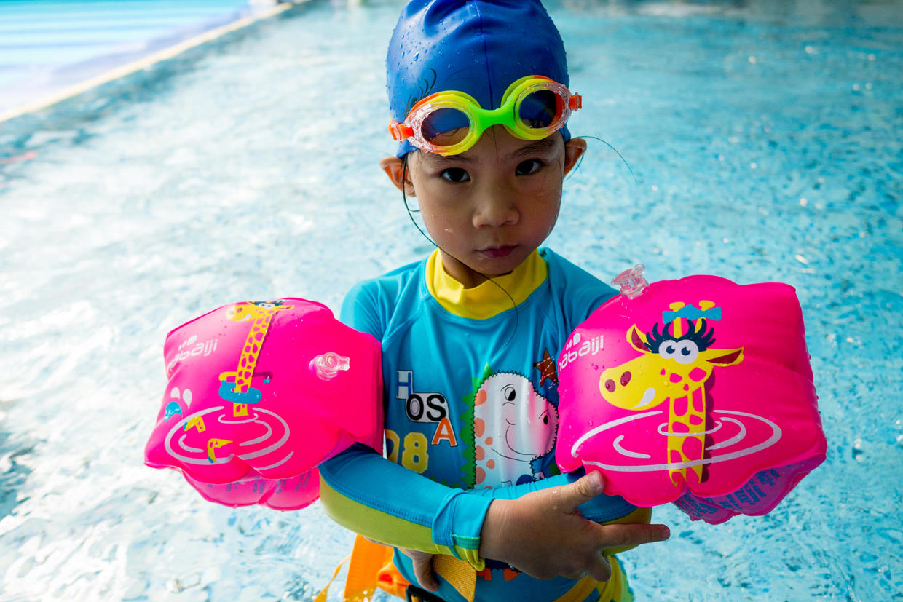

带着游泳眼镜，游得很自信。

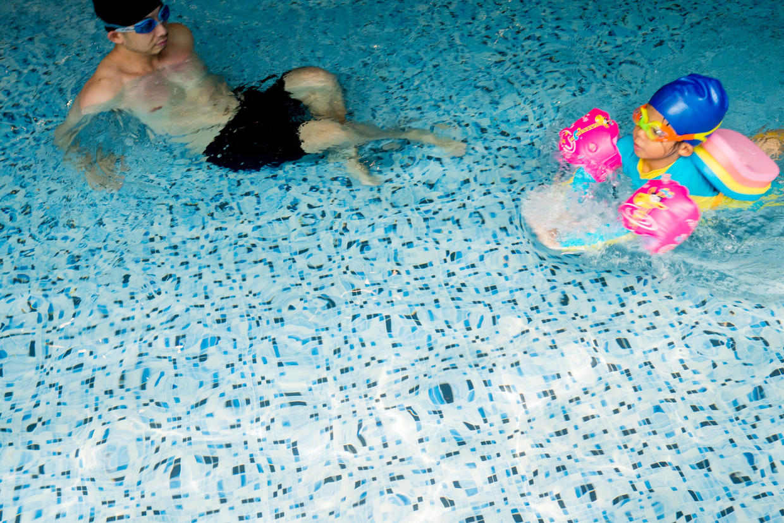

双臂划水。

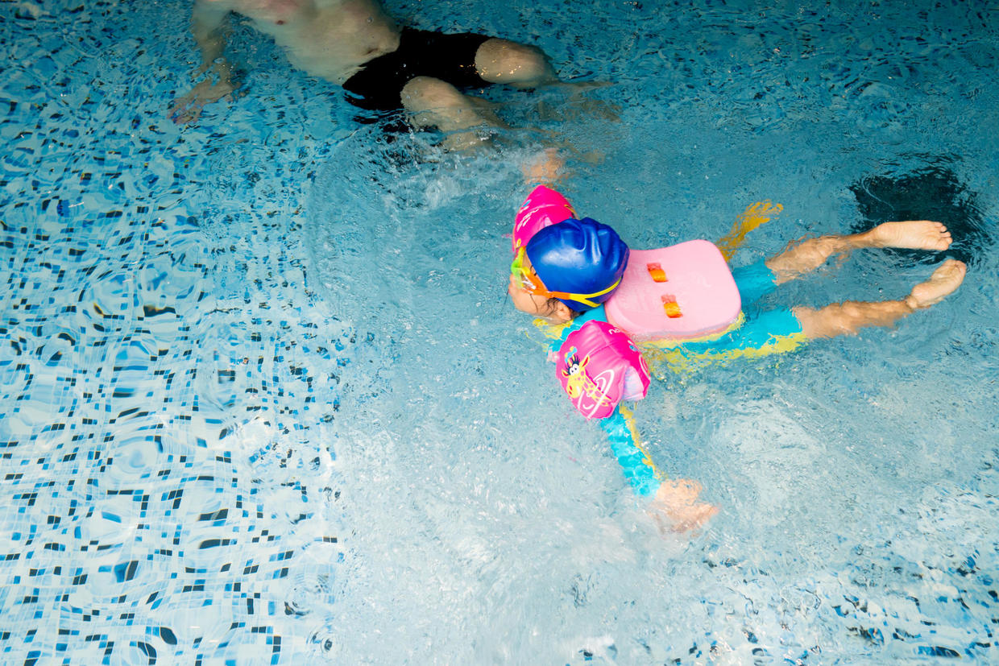

耳朵进水，上岸跳一跳就好了。

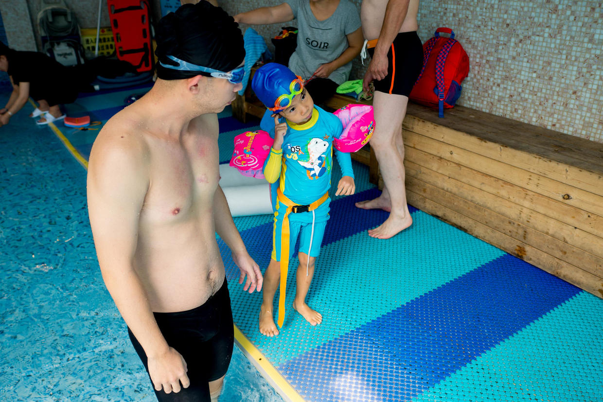

***下期预告：看图说话***

**个人微信公众号，请搜索：摹喵居士（momiaojushi）**

**喜欢作者写写哪些话题，可以公众号留言**

          
        