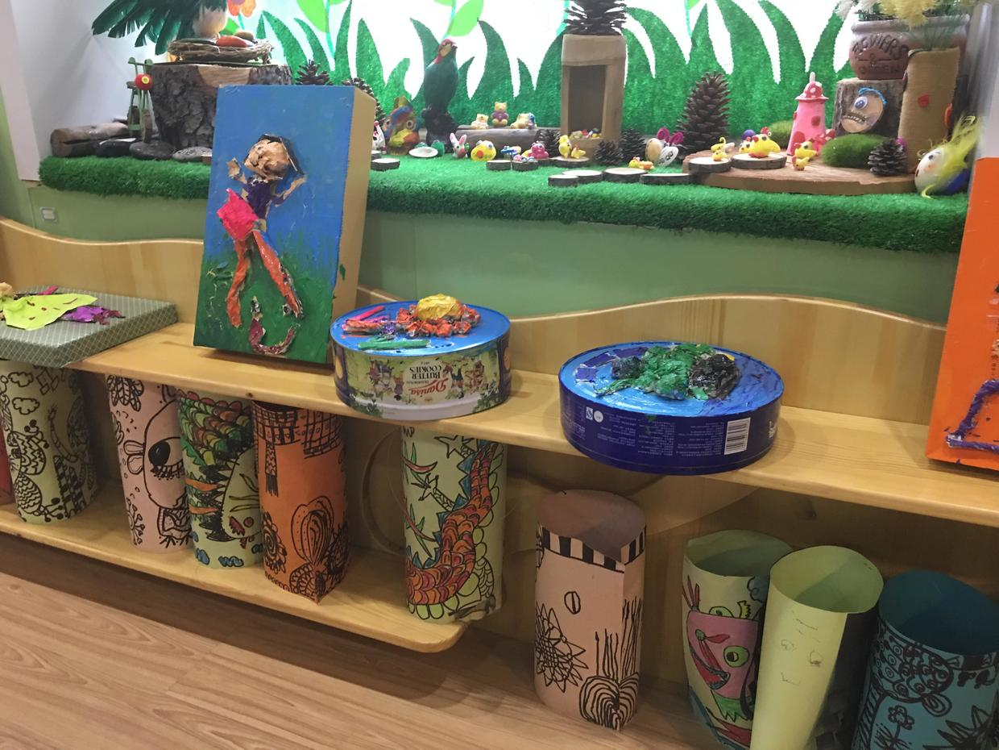
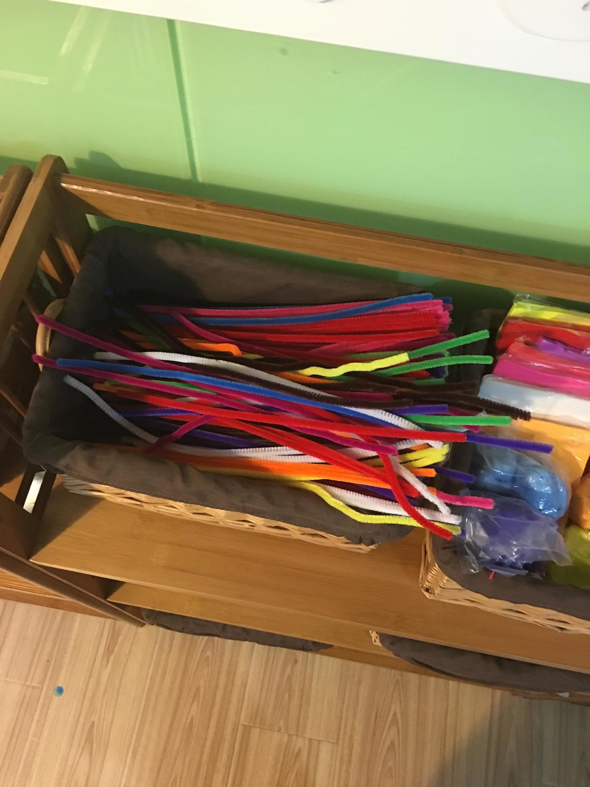

          
            
**2016.09.29**

上周五是幼儿园新学期的家长会。

老师特意把家长会安排在了美工教室，负责中大班的园长老师介绍时，特意说到我们班的老师想向家长们“显呗”一下园里的美工教学环境。

真的是非常漂亮，一进门就看到四周摆满了孩子们的各种作品。

橡皮泥塑，石膏像，陶塑，绘画作品等等琳琅满目。

教室里的各种设施也是为孩子们量身定做，大原木桌子配上小木墩子的座椅，仿佛置身于森林小屋。

穿过孩子们的众多作品，我直接走向最后一排的美工材料区。

小架子上整齐地摆满了各种材料：
* 胶棒
* 小剪子
* 小胶带
* 橡皮泥
* 彩纸
* 以及各种我都叫不出名字的材料

不过，我奔过来的主要目的是要找一下，喵经常提到的“毛根儿”。

喵经常提到，在美工课，用毛根儿做了很多作品，我们详细询问了一下毛根儿的样子，估计就是下面这个，五彩的毛柔柔的软钢丝。

家长会开始，老师们介绍了新学期的工作安排，接下来就是各位家长询问孩子们的情况。

从老师的描述来看，所有的孩子们都有了巨大的进步。

对于喵来说：
* 敢于在众人面前讲话，讲述自己的作业。
* 积极参加活动，一说跳舞，就飞快地跑出去找位置，站在自己的点上。
* 吃饭好一点，实在吃不了能跟老师商量，少一点。
* 有自己的好朋友，性格开朗很多。

真是要好好感谢老师们的辛勤付出，新的学期，新的进步。

***下期预告：当年的国庆书市***

**个人微信公众号，请搜索：摹喵居士（momiaojushi）**

**喜欢作者写写哪些话题，可以公众号留言**

          
        