          
            
**2016.10.04**

国庆假期第4天了，雾霾终于被冷空气雨打风吹去了。

今天和悦妹、兜妹一起去采摘。

兜妹顺着梯子爬到最高处。

喵也是，钻进了葡萄藤里。

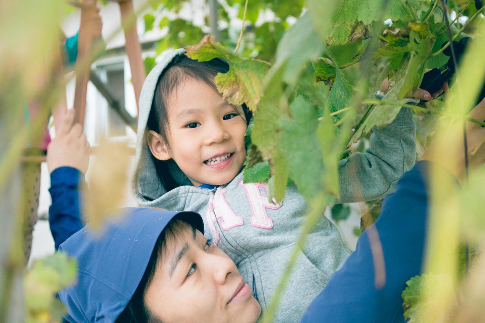

收获了一大串葡萄。

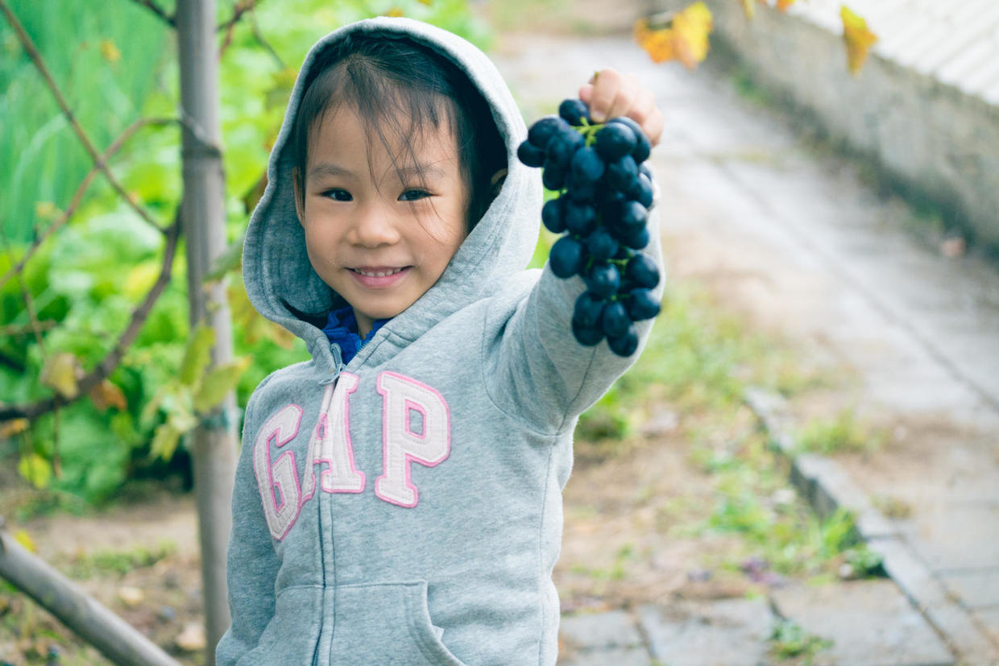

喵和兜妹，一起商量着准备玩儿些什么。

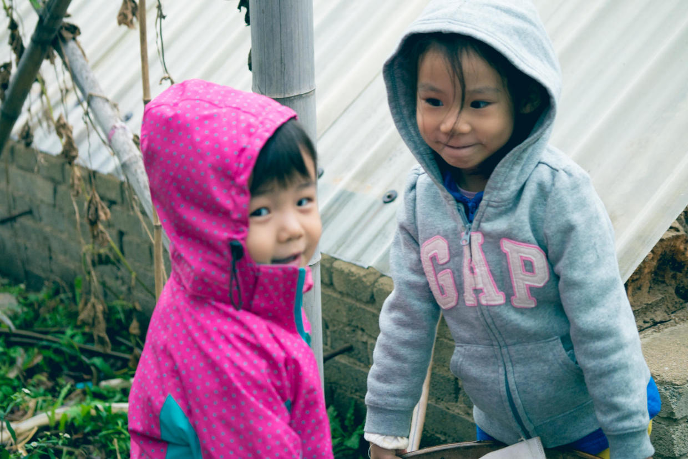

于是一人一个桶和铲子，开始挖土。

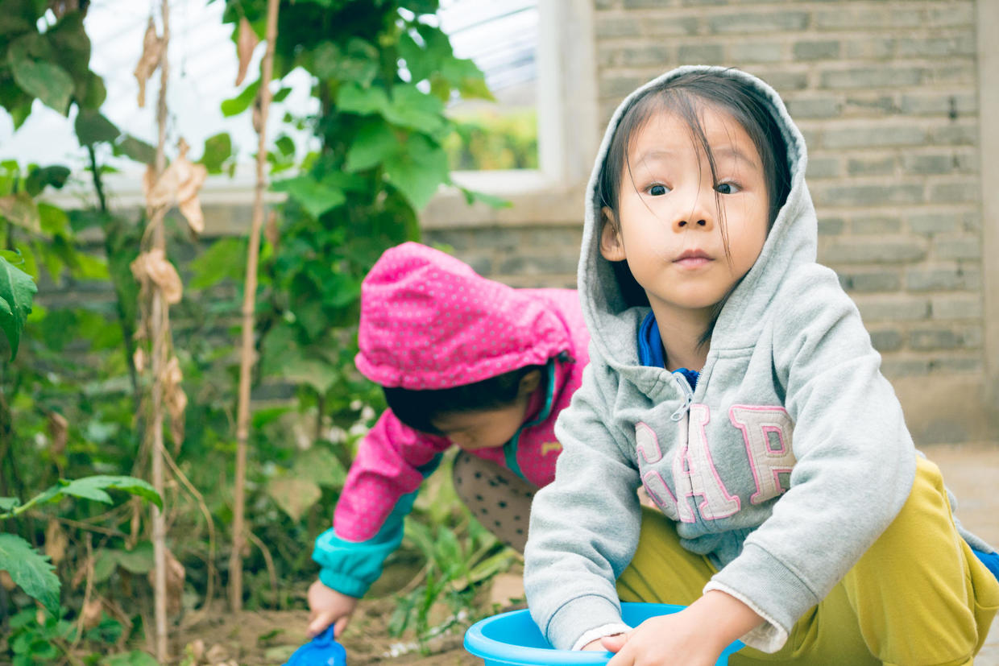

兜妹挖土都挖困了。

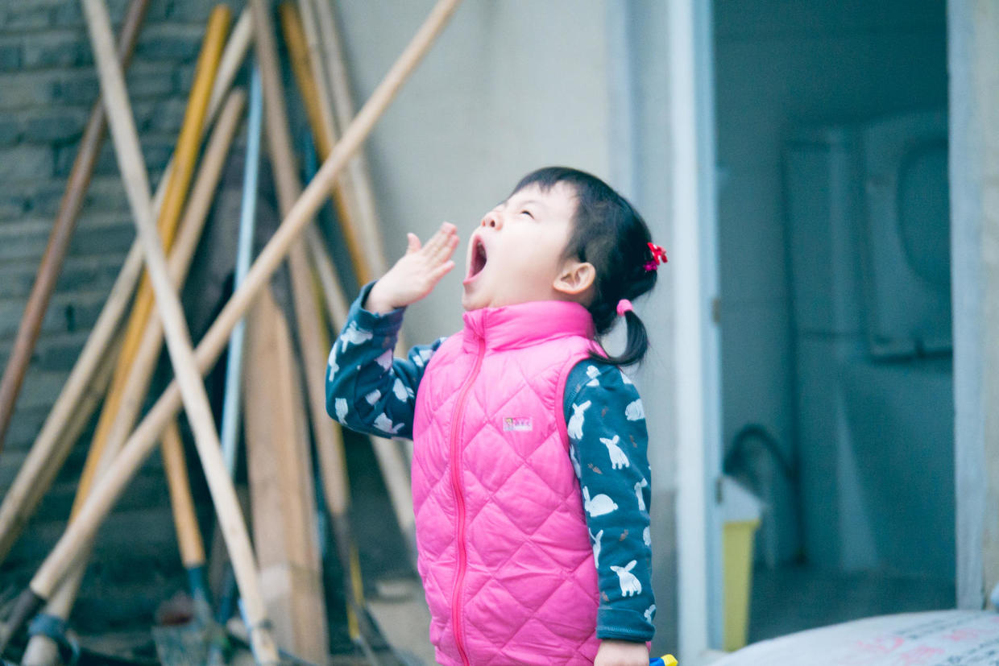

俩人玩儿得很和谐。

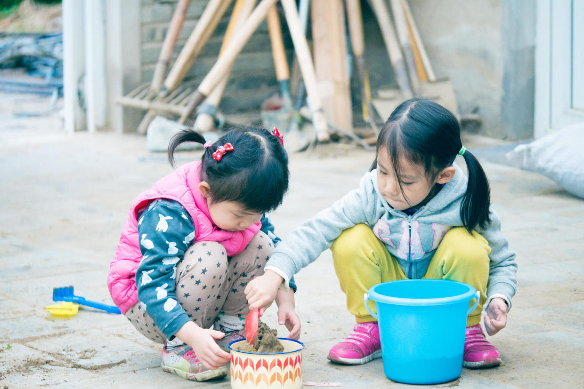

兜妹又去帮着搬白菜。

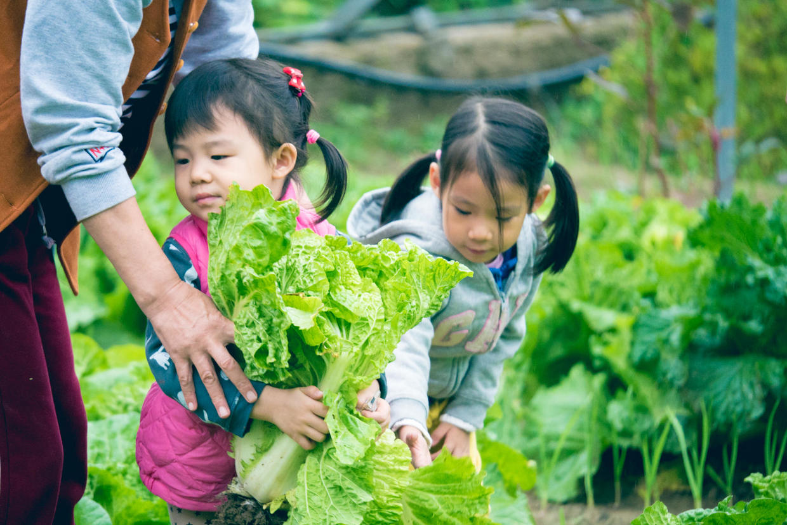

悦妹也到啦，看着浇水哈哈大笑。

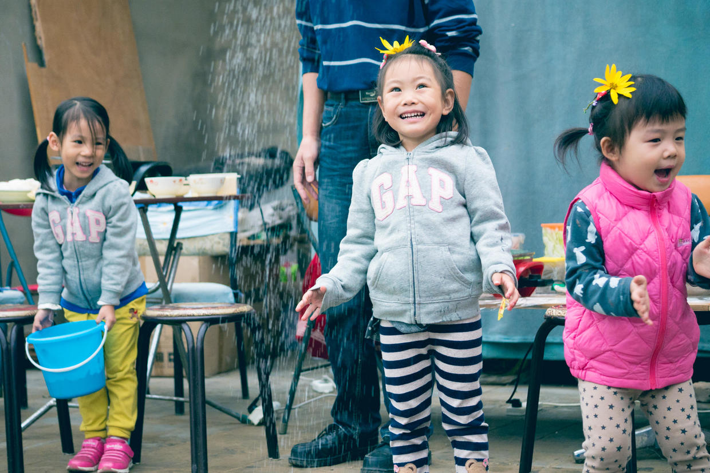

帮着一起收葡萄。

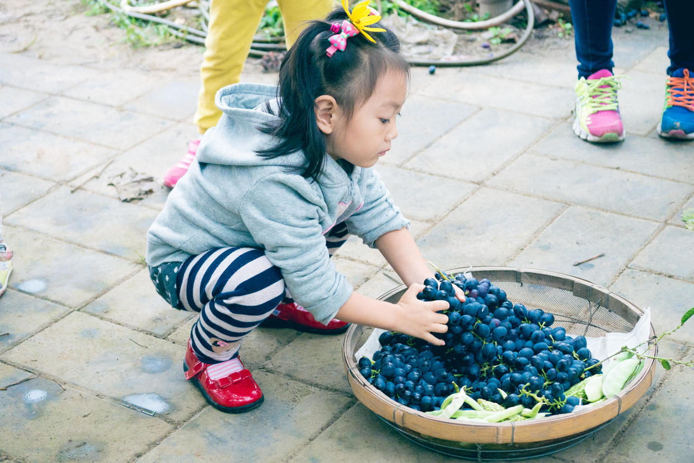

三个人排着队，有说有笑。

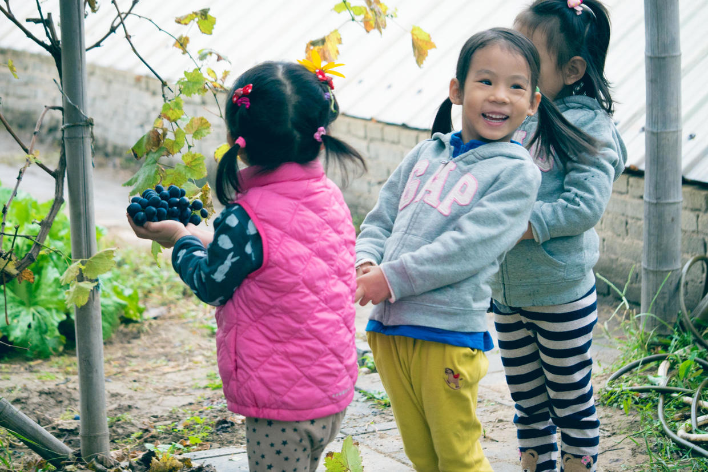

玩儿起了老鹰捉小鸡。

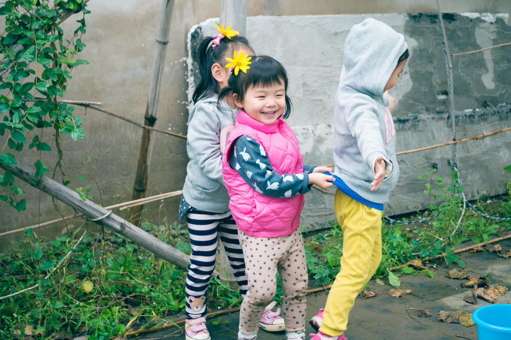

跑起来真是飞快。

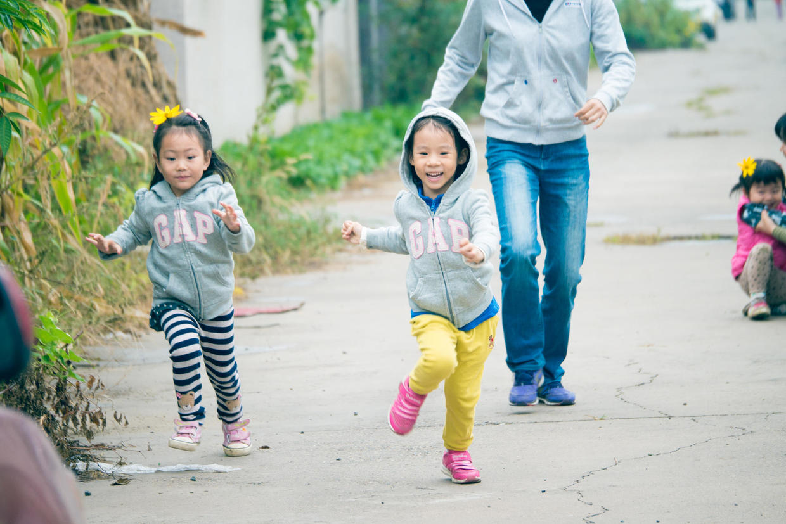

老同志们准备了丰富的饭菜，各种蔬菜、炖肉、火烧、烙饼。

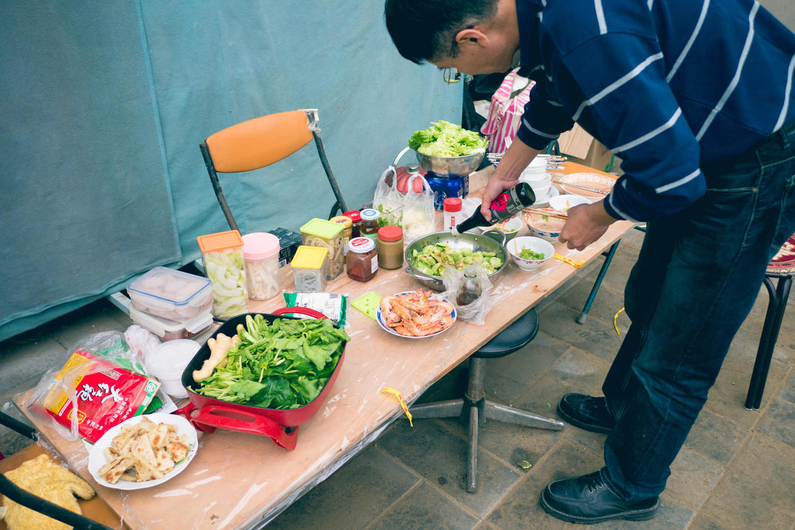

孩子们中午吃得非常好。

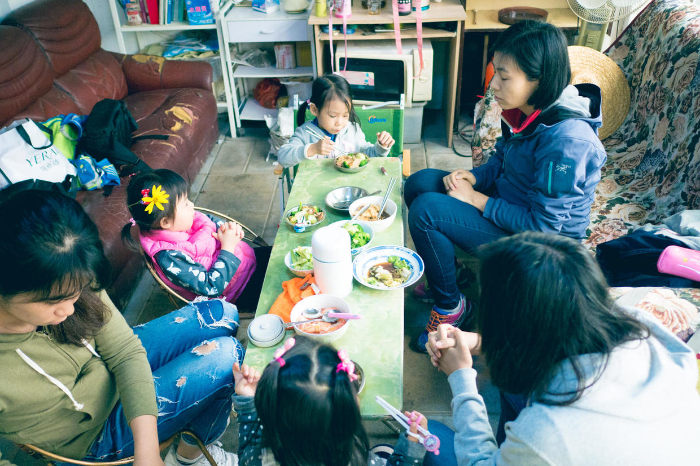

下着雨，吃火锅，真是爽极了。

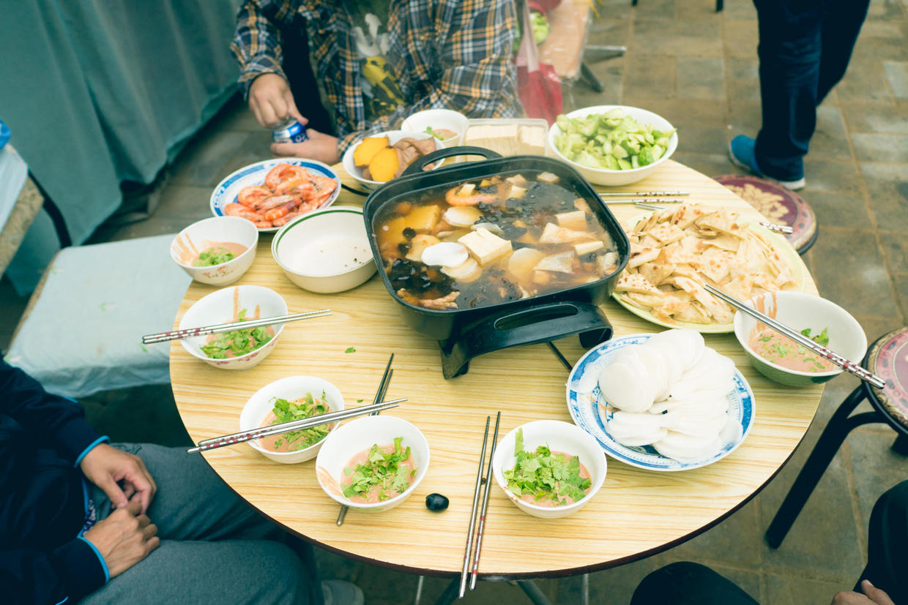

下午回家睡觉，晚上继续去找兜妹悦妹一起玩儿。

***下期预告：国庆第5天***

**个人微信公众号，请搜索：摹喵居士（momiaojushi）**

**喜欢作者写写哪些话题，可以公众号留言**

          
        