          
            
**2016.10.06**

国庆假期第6天了，虽然有些时下时停的小雨，但是空气质量还是不错，于是按照原计划去天安门。

小雨中，长安街边的树叶有些都红了，看起来非常第滋润。

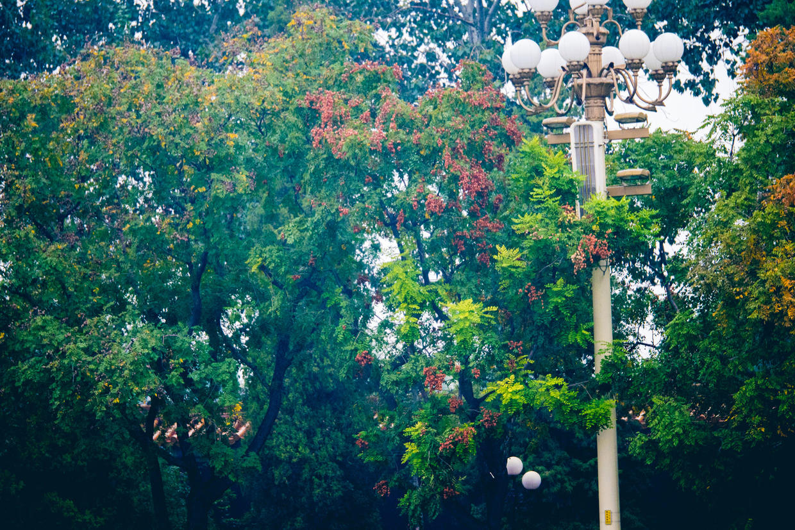

车停在国家大剧院，一出来，买了5元2面小国旗。

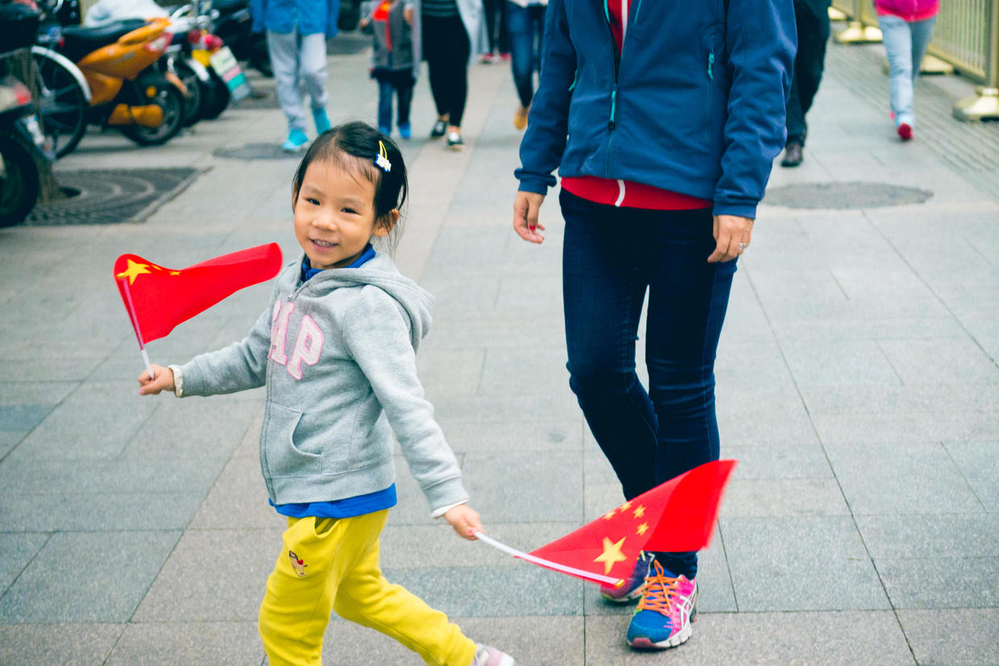

喵马上就拿着国旗，一遍跳舞一边走。

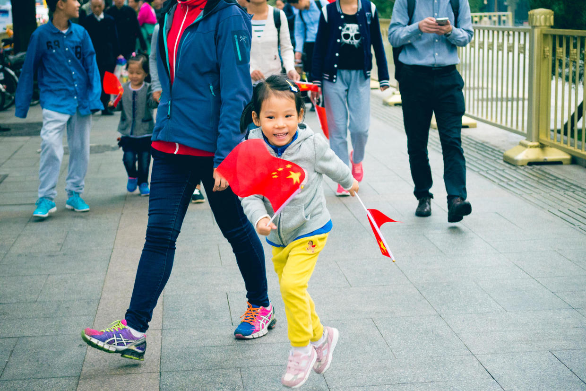

高举国旗，好像海军的旗语一样。

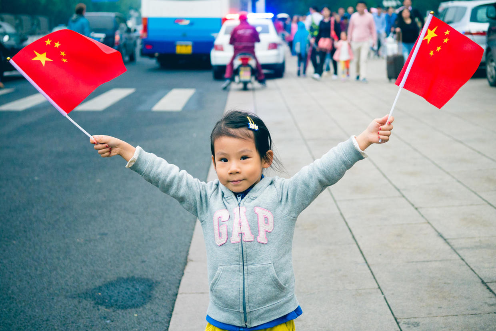

绕了一大圈，经过安检，终于进入广场，和人民英雄纪念碑合个影。

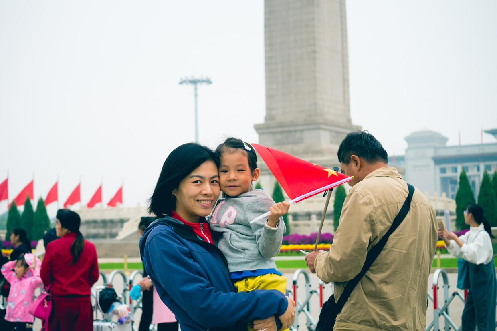

广场上迎风招展的红旗。

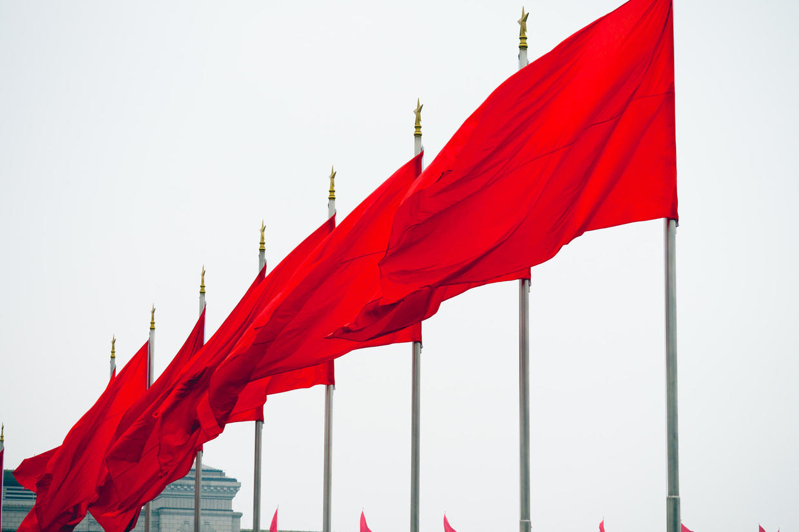

和妈妈一起在花坛前面合影。

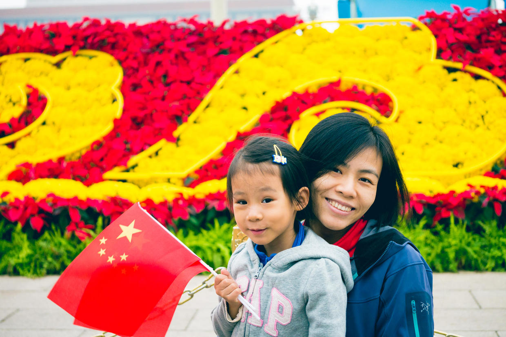

和大花篮合影。

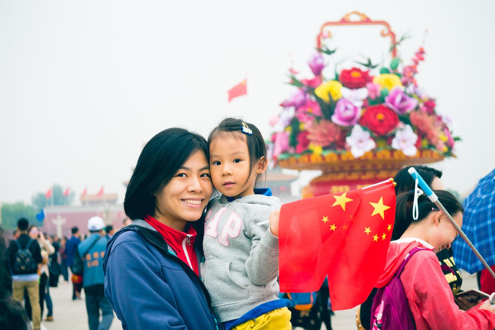

大花篮和天安门。

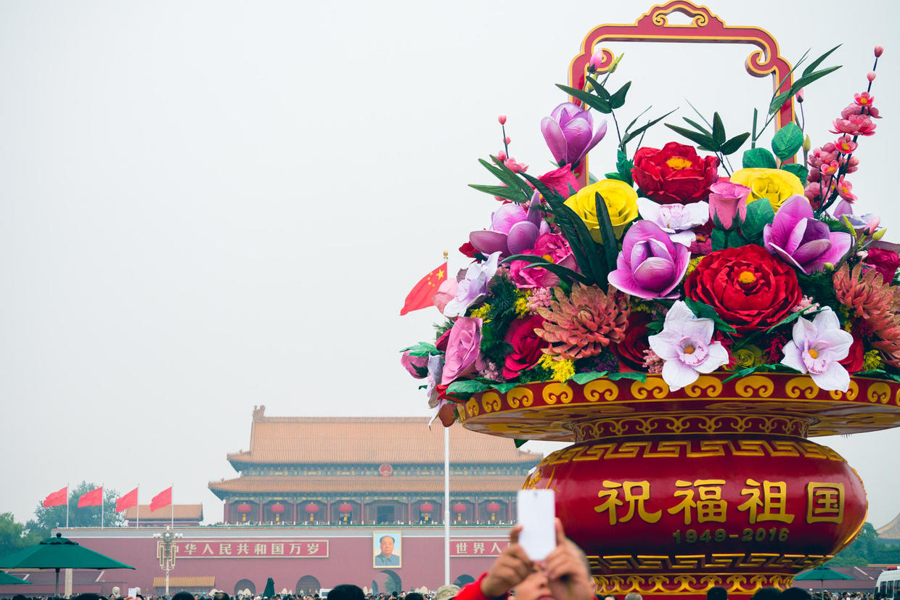

我也跟喵一起合个影。

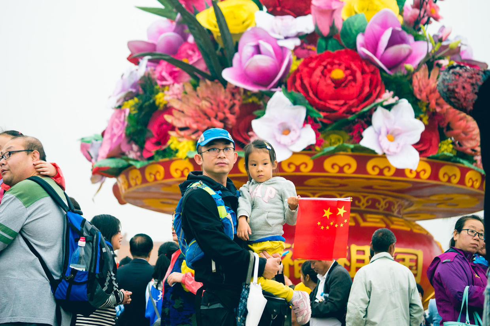

国旗和天安门城楼。

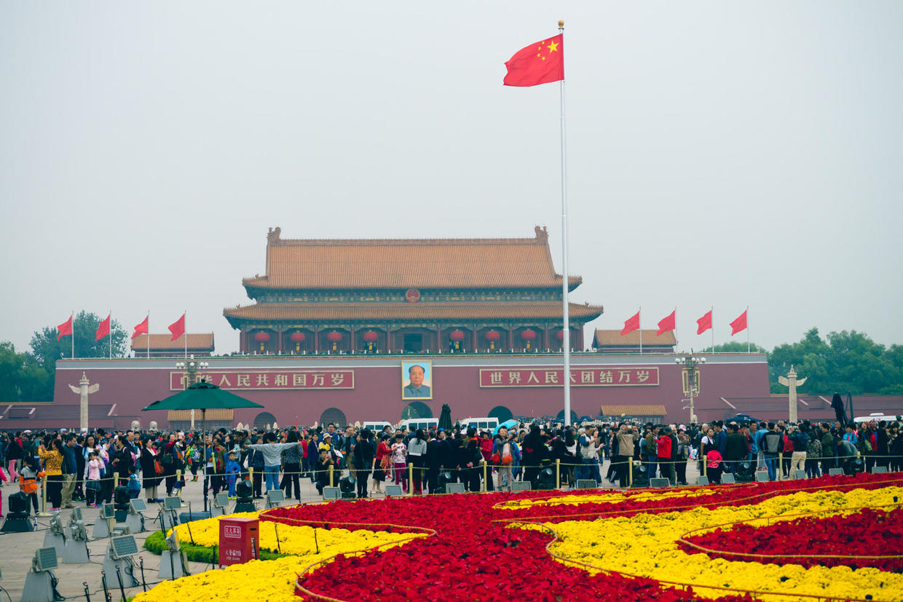

五星红旗迎风飘扬。

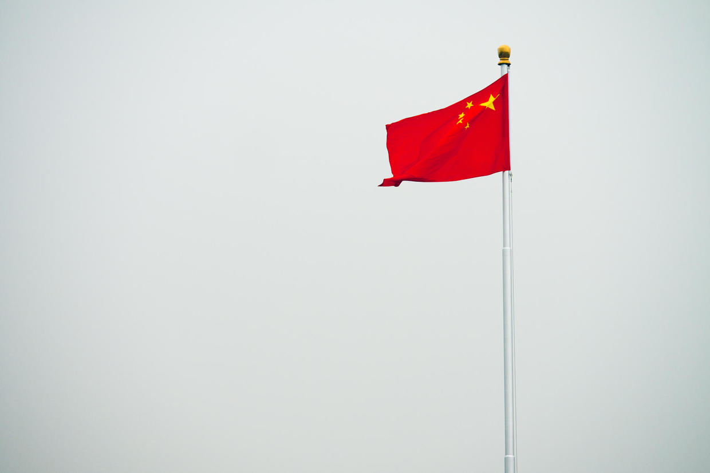

喵手里的两面国旗也高高飘扬。

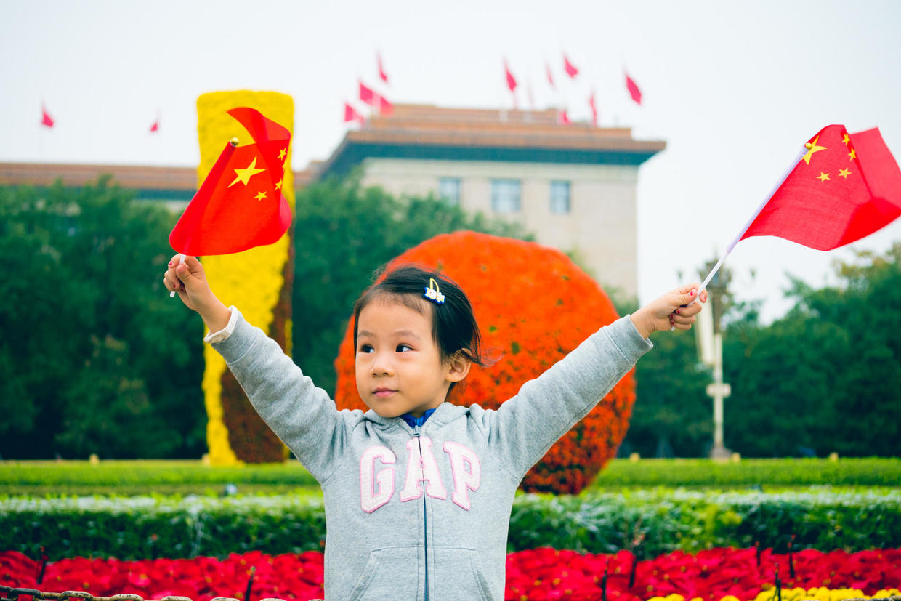

喵自告奋勇，给我们拍了合影。

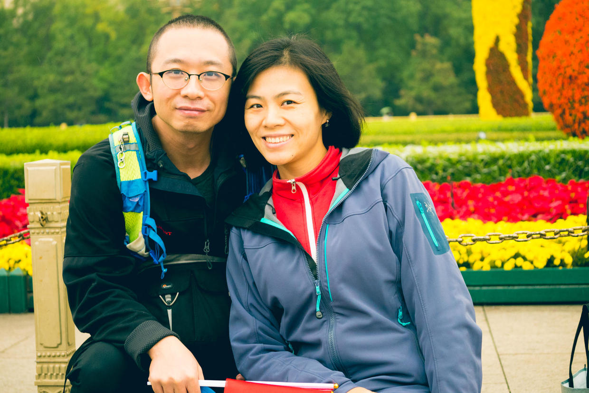

1个小时，转了天安门一圈，小雨时下时停，游客们不多不少。

回到国家大剧院停车场，开车去吃饭，下午回家睡个觉。

明天就是假期最后一天了，真快啊。

***下期预告：国庆第7天***

**个人微信公众号，请搜索：摹喵居士（momiaojushi）**

**喜欢作者写写哪些话题，可以公众号留言**

          
        