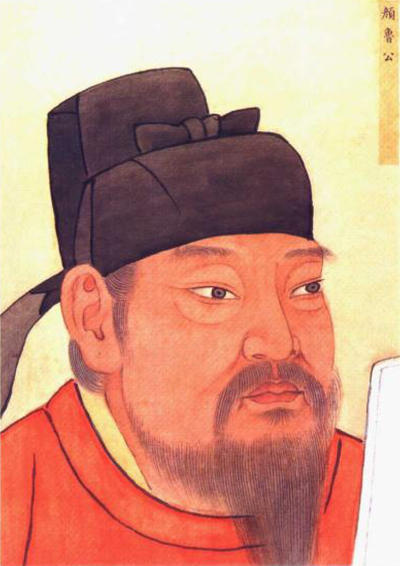

          
            
**2016.10.14**

从小到大，对历史比较感兴趣。但是看得比较多的都是编年体，各种通史。

以时间和事件为核心展开，各色人物轮番登场。这样读历史，对各个重大事件有了了解，但是那些人物却往往只能借助事件展现自己。

最常见的问题是，很多大英雄，如果问到他的人生结局是什么？往往一无所知。

所以，也还是要多看看人物传记。

最近听了很多隋唐史，随便一耳朵，听到了颜真卿，本篇就简单聊聊他吧。

说到颜真卿，当然要从小学学写大字开始，那时还不知道他的名字，只听说过一个“颜体”。

随着学习，知道了，颜体说的是颜真卿的字体。

以我写大字的水平，根本谈不上书法，更不要提去染指颜体了。

接着，小学期间在读连环画版《中国通史》隋唐卷的时候，颜真卿又出场了。这次才知道，他不光是书法家，还参加了平定安史之乱。

虽然年幼的我就不太认可字如其人的说法（蔡京的书法和人品就完全不相配），但是也被颜真卿震撼了。

印象当时连环画里有一张图画的是枪尖挑着人头：
>叛军攻下东都洛阳，派段子光送李憕、卢奕、蒋清的头到河北示众。颜真卿担心大家害怕，哄各位将领说：“我一向认识李憕等人，这些头都不是他们的。”于是杀了段子光，把三颗头藏起来。过了些时候，用草编个人体，接上头，装殓后祭奠，设灵位哭祭他们。

这段描写，在小学读时，心情非常复杂。悲剧英雄有很多类型：
>岳飞的莫须有。
诸葛丞相的出师未捷身先死。
城破身死殉国的将军们。

颜真卿，看着亲人朋友的首级，不能相认，勉强笼络着随时可能溃散和哗变的军队，还要继续战斗下去，这种悲剧色彩又有了新的高度。

之后又有颜真卿的堂兄颜杲卿抗击叛军，全家被杀。后来很长时间里，我都以为是颜真卿抗击叛军死了。

这才有了著名的天下第二行书《祭侄文稿》。
>此文稿追叙了常山太守颜杲卿父子一门在安禄山叛乱时，挺身而出，坚决抵抗，以致“父陷子死，巢倾卵覆”（《祭侄文稿》），取义成仁，英烈彪炳之事。祭悼其侄颜季明更见疾痛惨怛，哀思郁勃。本帖通篇用笔之间情如潮涌，书法气势磅礴，纵笔豪放，一泻千里，常常写至枯笔，更显得苍劲流畅，其英风烈气，不仅见于笔端，悲愤激昂的心情流露于字里行间。被元人鲜于枢誉为“**天下行书第二**”。

通史里，说到这里，就不再提颜真卿了，看见他没死在战场上，当时感到很庆幸，觉得可能后来就寿终正寝了。

然而，并不是。

颜真卿，709年—784年8月23日。

年近八十，遭奸臣陷害，被皇上派去即将造反的藩镇，坚贞不屈，最终被李希烈绞杀，死节。

***下期预告：周末活动***

**个人微信公众号，请搜索：摹喵居士（momiaojushi）**

**喜欢作者写写哪些话题，可以公众号留言**

          
        