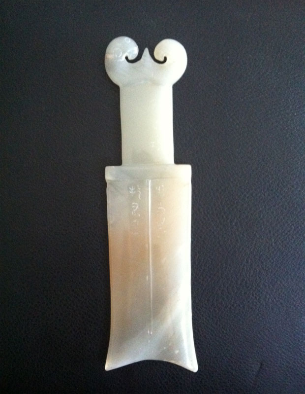

          
            
**2016.10.21**

弄璋之喜是什么？
>弄璋，汉族民间对生男的古称。始见周代诗歌中。古人把璋给男孩玩，希望他将来有玉一样的品德。旧时常用以祝贺人家生男孩。

璋什么样子？

后来出了个笑话叫“弄獐之喜”。
>李林甫的小舅子、太常少卿姜度的妻子生了一个男孩，举家欢庆，祝贺者络绎不绝。李林甫作为姐夫，当然也前去祝贺。姜度取出纸笔，请李林甫题写贺词，李林甫便当着众宾客的面，写下了“弄麞（獐）之庆”四个大字。宾客们见了，一个个掩口而笑。原来，李林甫想题写的是“弄璋之庆”，出典是《诗·小雅·斯干》：“乃生男子，载寝之床，载衣之裳，载弄之璋。”意思是祝贺所生的男孩长大以后执玉器为王侯，李林甫把“璋”误写成“麞（獐）”，使意思变成了祝贺孩子“与獐为伍”，闹了一个大笑话。这件事传出去以后，人们便在背后嘲讽李林甫为“弄獐宰相”。

獐什么样子？

这个“璋”写成“獐”，成了说人家的儿子是个小畜生了。

但就这样的文化水平，一步步能到宰相，并专权那么多年，也算是传奇了。

***下期预告：周末活动***

**个人微信公众号，请搜索：摹喵居士（momiaojushi）**

**喜欢作者写写哪些话题，可以公众号留言**

          
        