          
            
**2016.10.22**

周六啦，又是去上舞蹈课。

一早起床，上车吃饭。昨天傍晚的雨和风，终于吹散了雾霾。

开车向西，能看见西山，很快东边的阳光穿过云层，照进车里。

蓬头垢面进了教室，脱外套开始准备。

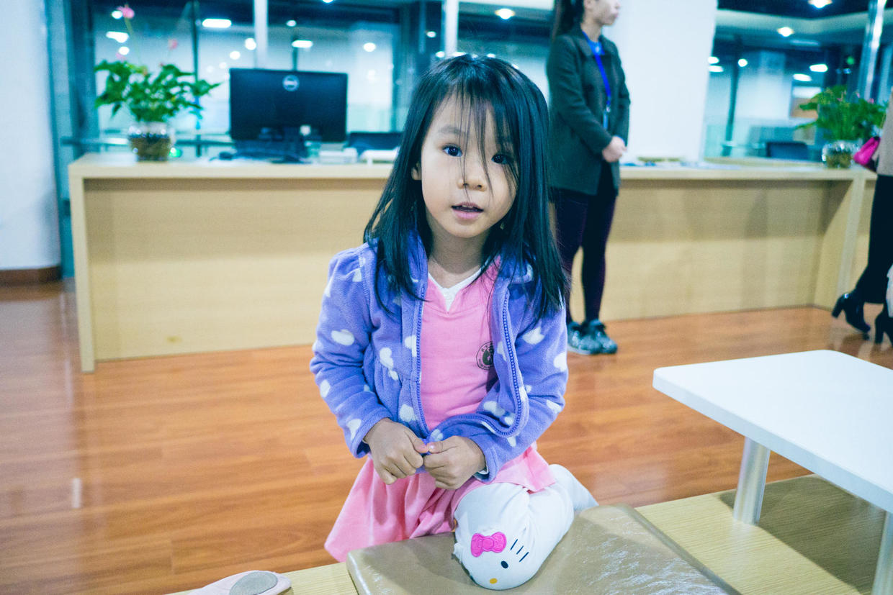

自己穿舞蹈鞋。

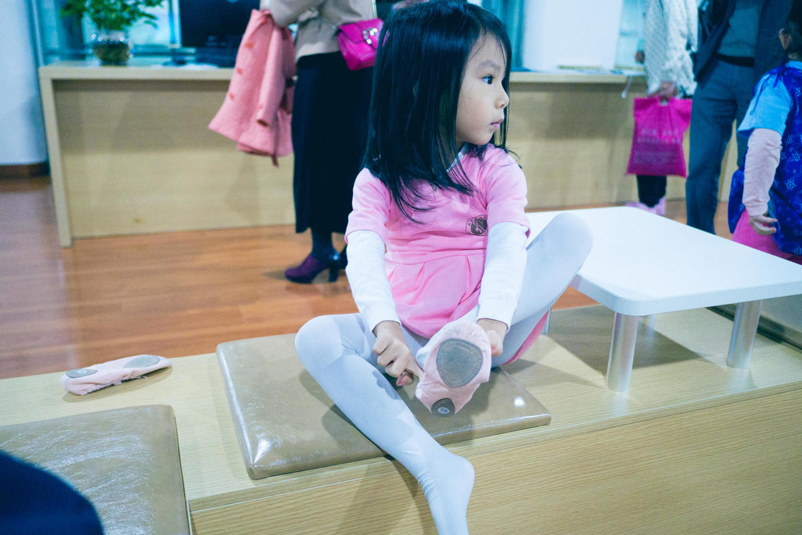

妈妈用梳子，把头发都拢起来。

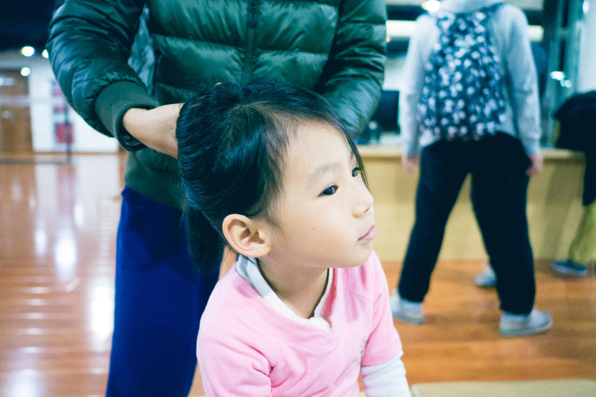

把卡子递给妈妈。

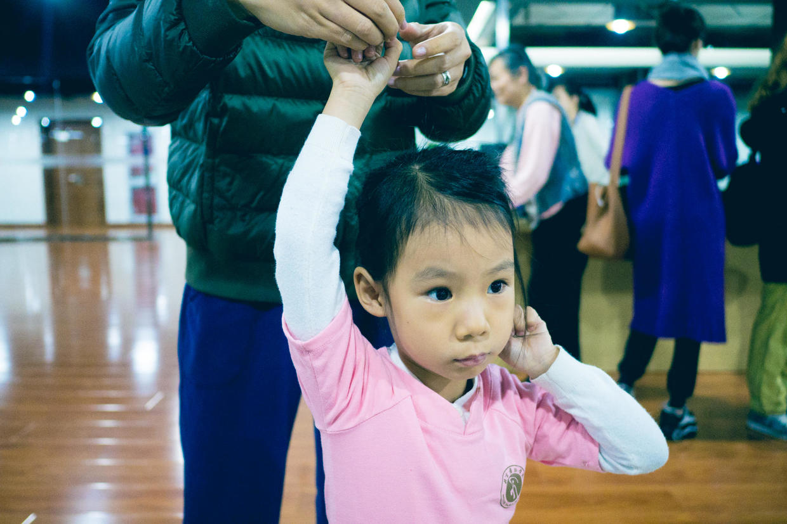

头上的小绒毛，都要固定住。

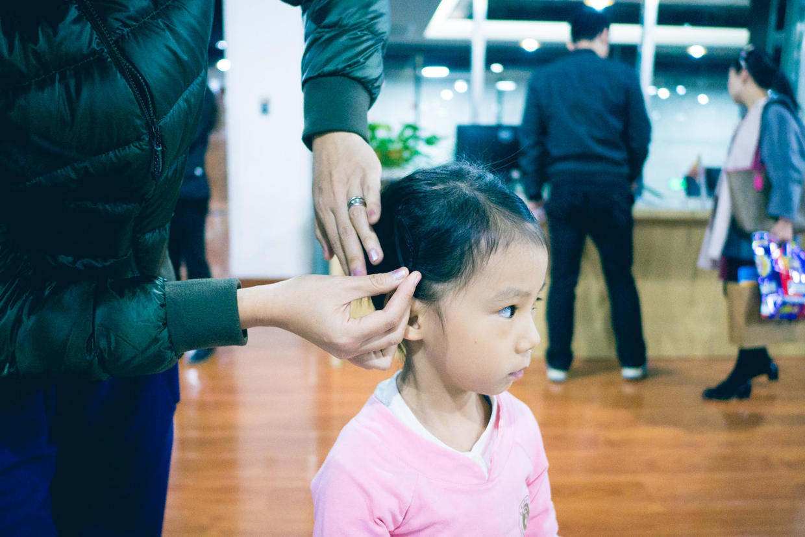

全都弄利索，开始玩儿。

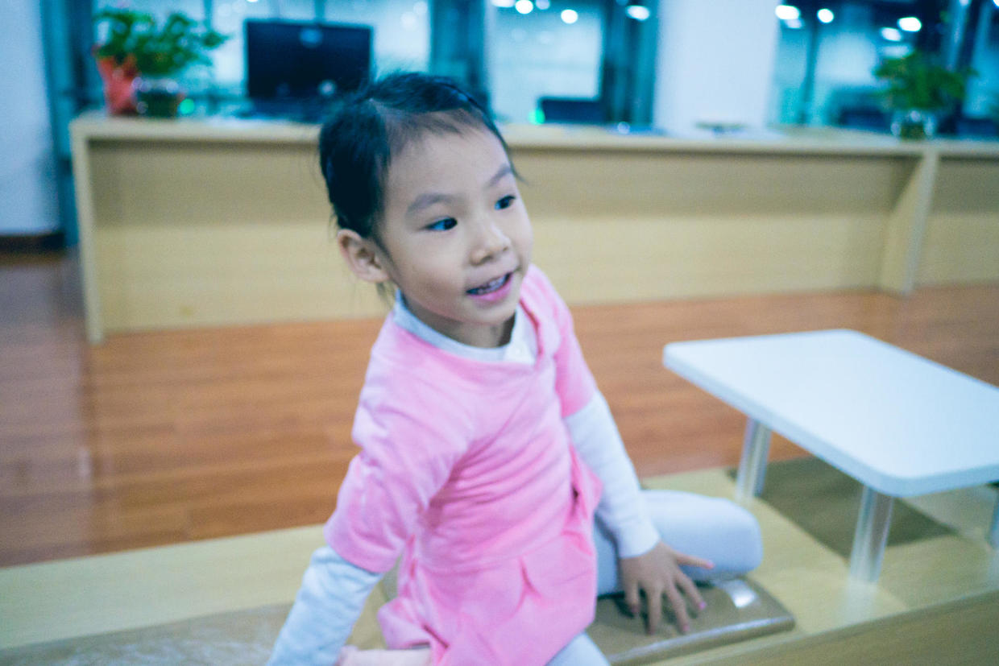

扶着椅子，小脚踮得很好。

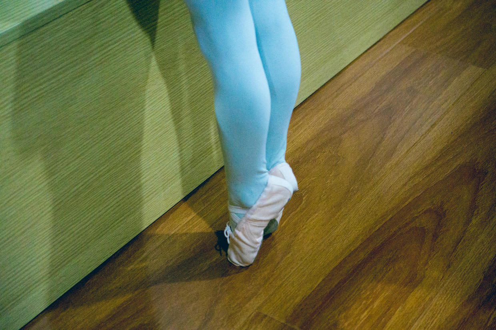

进教室放水壶。

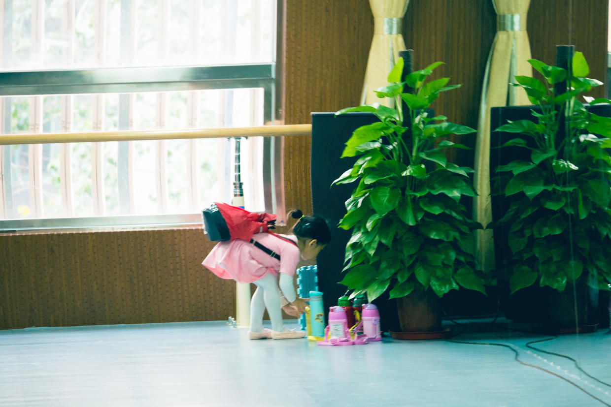

放自己的书包。

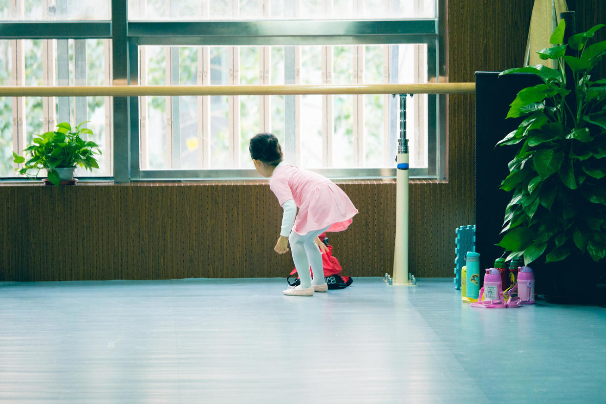

高兴地坐到同学身边。

看着妈妈很高兴。

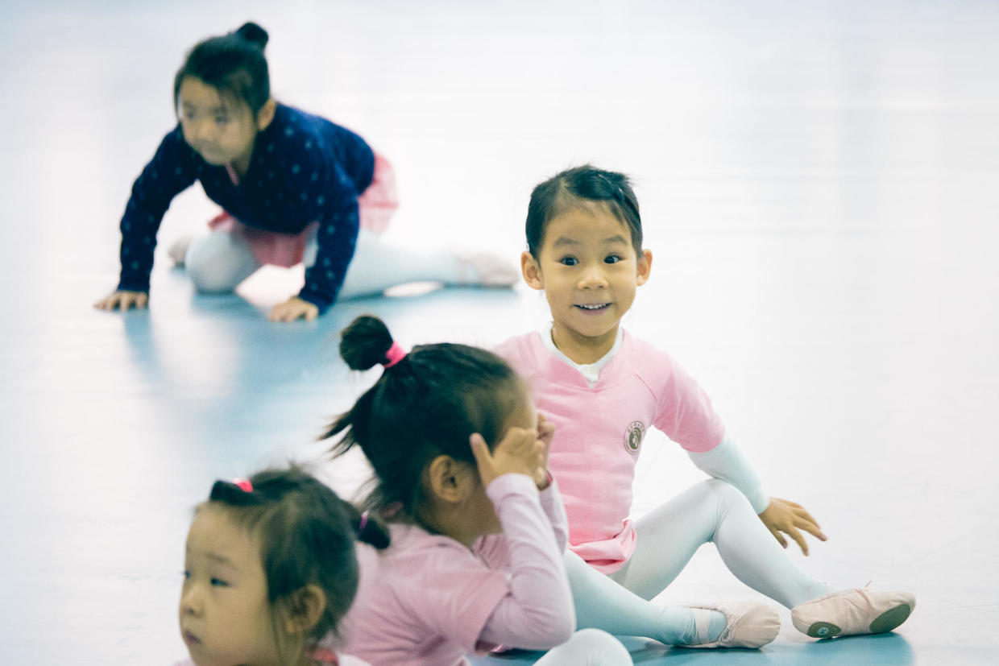

歪着小嘴，看周围的同学们。

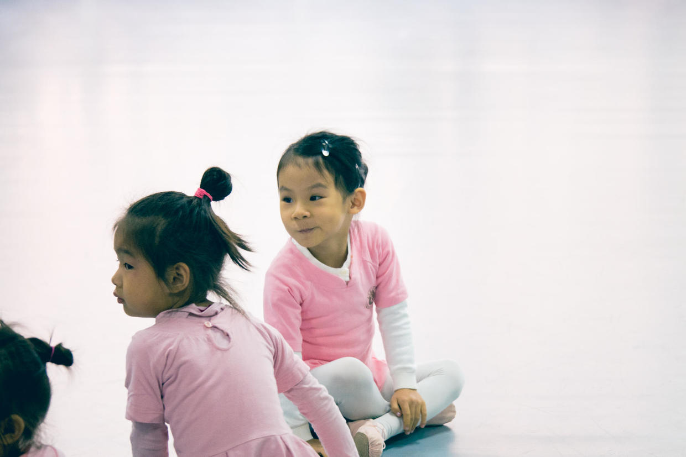

突然严肃起来。

认真地看着老师。

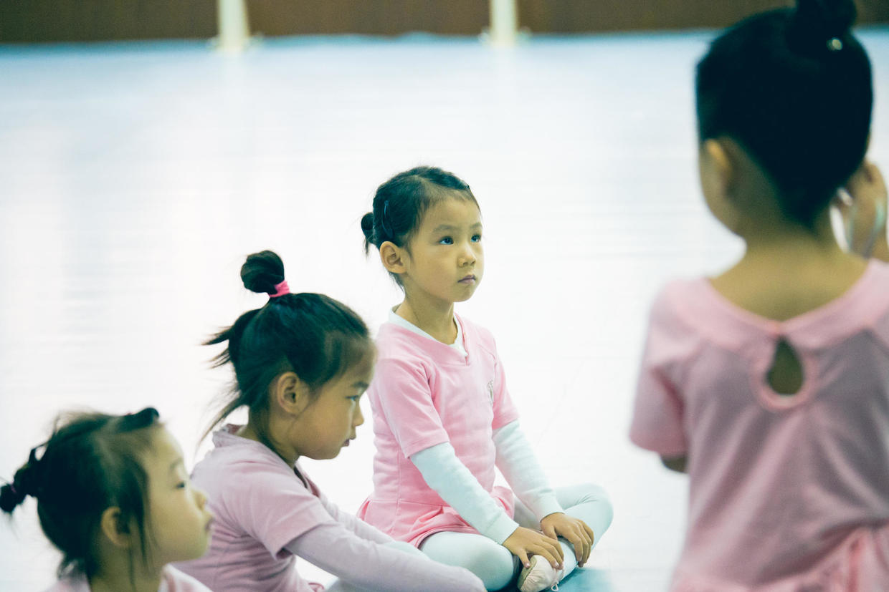

小手腕儿真柔软啊。

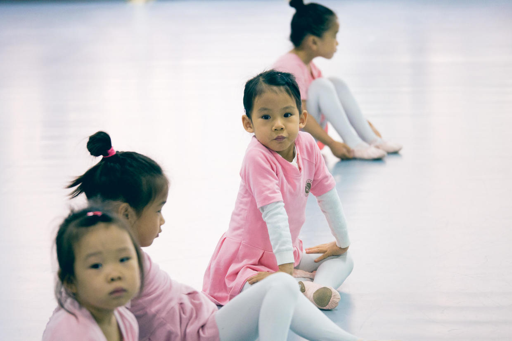

中午回家吃了一大碗面条，睡个好觉，起床再去透透气。

明天应该是个好天，出去看看秋天。

***下期预告：周末活动***

**个人微信公众号，请搜索：摹喵居士（momiaojushi）**

**喜欢作者写写哪些话题，可以公众号留言**

          
        