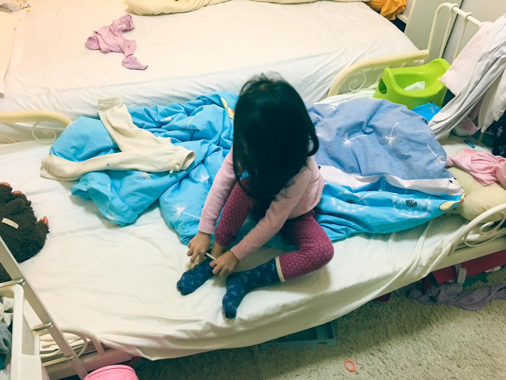
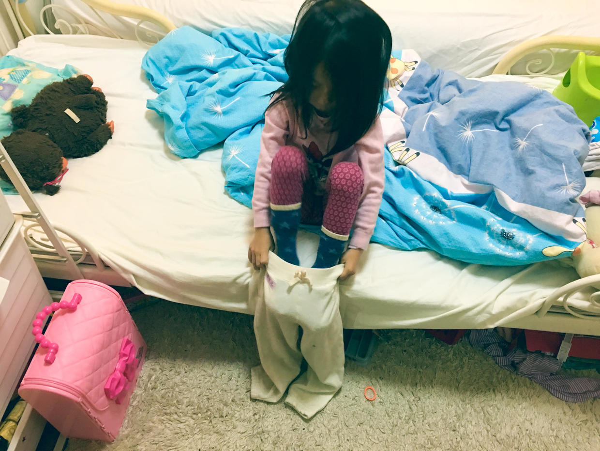
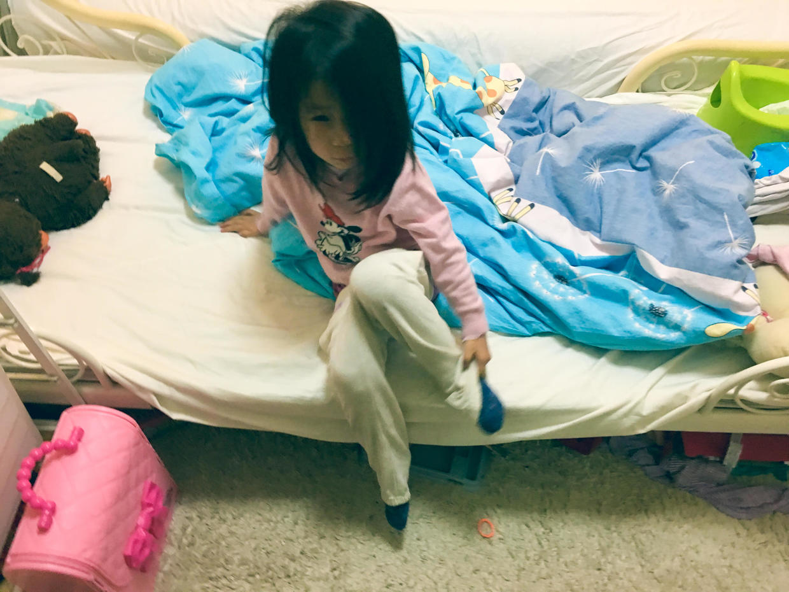
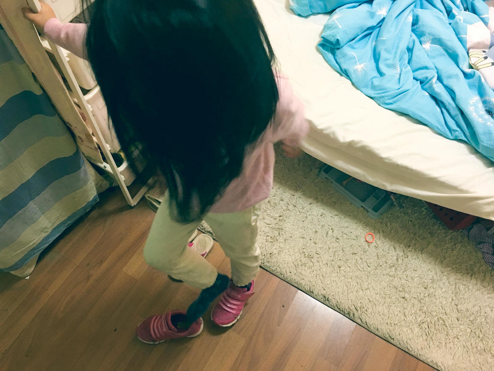

          
            
**2016.11.01**

随着冬天的临近，天亮得越来越晚了。

心里有些担心喵早上的起床问题，去年冬天时，喵就各种花样不起床，没办法只能软硬兼施。最后，硬是不起床，就愣起。

不过今年不一样了，到了起床的时间，太阳还没出场，打开一盏小灯。

轻轻呼唤几声后，喵还会蜷缩在被子里，抱着奇奇，翻个身。

接着如此大概5分钟，喵就朦胧地睁开一只小眼睛，问一下今天要去哪儿。

嘴上说不想去幼儿园，但是还是会开始穿衣服。

在被子里穿上秋衣，线衣。

穿秋裤，用秋裤把上衣掖好。

穿袜子，袜子也要把秋裤裤腿掖好。

在经过一年的练习后，终于学会了自己掖衣服、掖袜子。

接着穿好外裤，把衣服整理好，下床穿鞋。

一切穿好，选一个自己要带的玩具，做好出门准备后，去喝一杯牛奶。

整个过程大概20分钟。

到了幼儿园，还有时间排队玩儿一次秋千，和同学们一起跑跑。

进教学楼，洗手，擦手，放自己的手巾，进教室吃饭。

用喵的幼儿园歌曲来唱就是：
>快乐的一天开始啦。

***下期预告：黄叶***

**个人微信公众号，请搜索：摹喵居士（momiaojushi）**

**喜欢作者写写哪些话题，可以公众号留言**

          
        