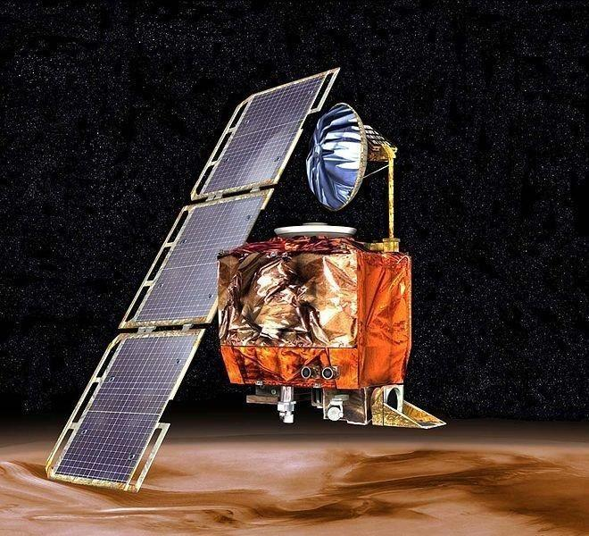

          
            
**2016.11.09**

最近看到一篇文章，提到了NASA曾经发射的一颗火星气候探测器，在进入火星大气层时，突然消失。

经过调查后，发现是研发推进器的洛克希德马丁公司，使用的是英制单位，而NASA用的却是公制单位。

这导致推力计算时，NASA说的是牛，而洛克希德以为是磅。最终探测器以超大推力冲进大气层烧毁。

于是，简单的看了看英制和公制单位的历史发展。

从小学学英语开始，就知道英尺是foot，当时就觉得太荒谬了，脚又不一样大。
>古英国时期因为没有国际公认的度量单位，所以人们往往使用自己的脚来测量实地的面积，久而久之，一种基于成年男子单脚的长度就被公认为英国等国家认可的标准度量衡。德国人出了一招，让最早从教堂出来的16个男子量出左脚的长度加在一起，再除以16，商就是一尺。

>重量单位：1磅=0.45392公斤，一磅等于一颗从麦穗的中间抽取的大麦的重量的7000倍；

后来，法国大革命时期，科学家们推动出现了公制单位。
>“米”的定义起源于法国。1米的长度最初定义为通过巴黎的子午线上从地球赤道到北极点的距离的千万分之一，并与随后确定了国际米原器。随着人们对度量衡学的认识加深，米的长度的定义几经修改。
1983年起，米的长度被定义为“光在真空中于1/299 792 458秒内行进的距离”。

>1795年4月7日，克在法国被规定为相等于“容量相等于边长为百分之一米的立方体的水于冰熔温度时的绝对重量”。由于商贸一般涉及的质量远比一克大，又由于以水为标准的质量既不方便又不稳定，所以为了商业法规必需制造出质量水定义的实化仪。于是，人们制造了一个临时的质量标准：一块金属人工制品，质量为克的一千倍——千克。

如今使用公制单位的国家越来越多，但是像美国，还是继续使用英制。

所以大家看NBA时，一说到某个球员，体重多少磅，身高多少英尺，脑子里面就会乱糟糟的。

美亚海淘时，买衣服，要换算英尺英寸。根据重量算邮费，又要换算磅，真是心累啊。

买个东西还是小事，对于那些移民到美国的公制建筑师，简直是灾难，基本都要重新回炉一下，才能重新建立起对单位的敏感。

这时再想想秦始皇统一度量衡，终于感受到伟大了。

***下期预告：长沙出差***

**个人微信公众号，请搜索：摹喵居士（momiaojushi）**

**喜欢作者写写哪些话题，可以公众号留言**

          
        