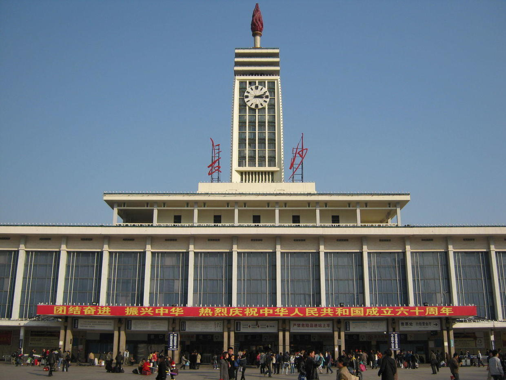
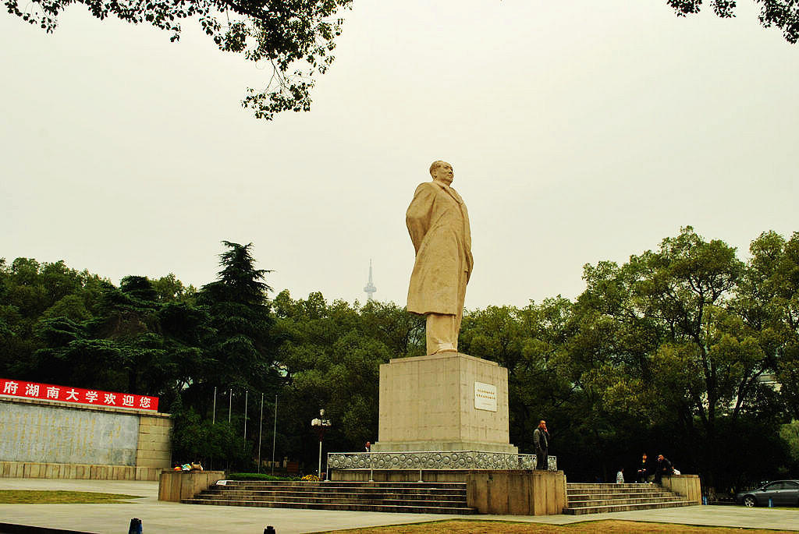

          
            
**2016.11.10**

又是一年的11月份，北京在一阵冷空气的突入之下，立刻进入了冬天，大家又开始议论起来为什么不能提前供暖。

每年到了这个时候，都会想起研究生时期，去长沙出差的经历。

研一的时候，进实验室，没想到很快就有了出差的经验，跟着指导老师去湖南大学实施项目。

3个学生，1个老师，一行4人，坐火车，去长沙。

北京到长沙的往返列车是T1/T2，据说是为了主席安排的。

夜里，火车过武汉，我起床想看看长江，可惜天太黑，只好朦朦胧胧地就这样第一次越过长江。

早晨下了火车，看到了雄伟的长沙站，我们打车直奔湖南大学。

一路上，橘子洲头挥斥方遒、湖南大学校区的宏大，都让我大开了眼界。

6点多，来到做项目的教学楼，整个校园还是空空荡荡，处处的绿色，在雨后显得更加氤氲。

在北邮巴掌大的校园待久的我，仿佛是刘姥姥进大观园，对这里的校园、人、习俗、饮食等等，都充满了好奇。

从那天开始，将近两周的紧张工作就展开了。

未完待续。

***下期预告：吃醋***

**个人微信公众号，请搜索：摹喵居士（momiaojushi）**

**喜欢作者写写哪些话题，可以公众号留言**

          
        