          
            
**2016.11.12**

周六照例是舞蹈课，本周一直流鼻涕，还咳嗽，休息了几天，状态好些了。

到了教室外，蓬头垢面地换衣服。

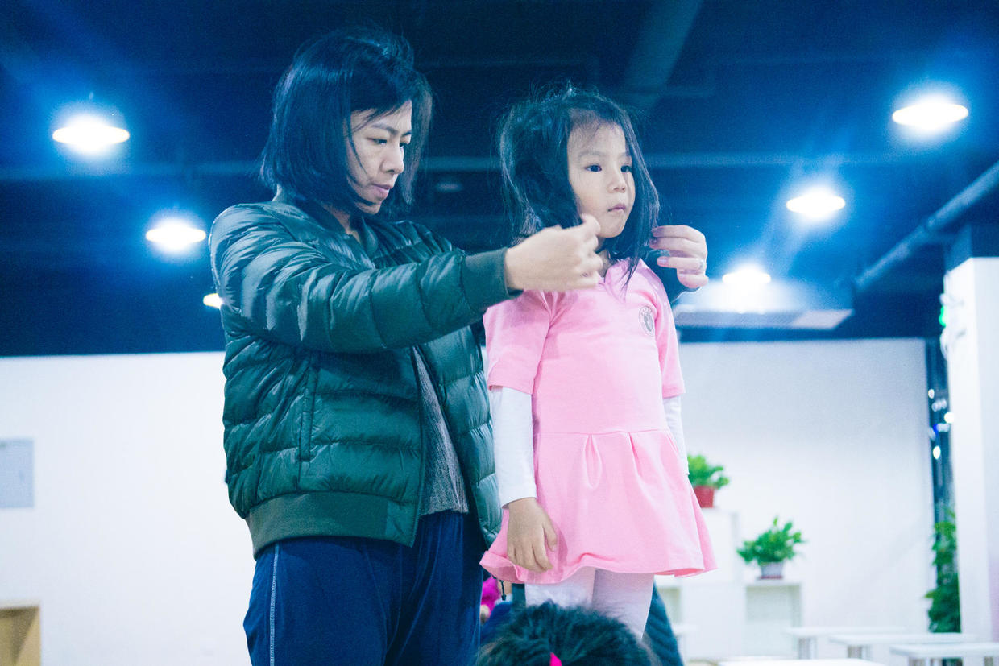

喵妈给梳辫子，满头的头发都要拢好。

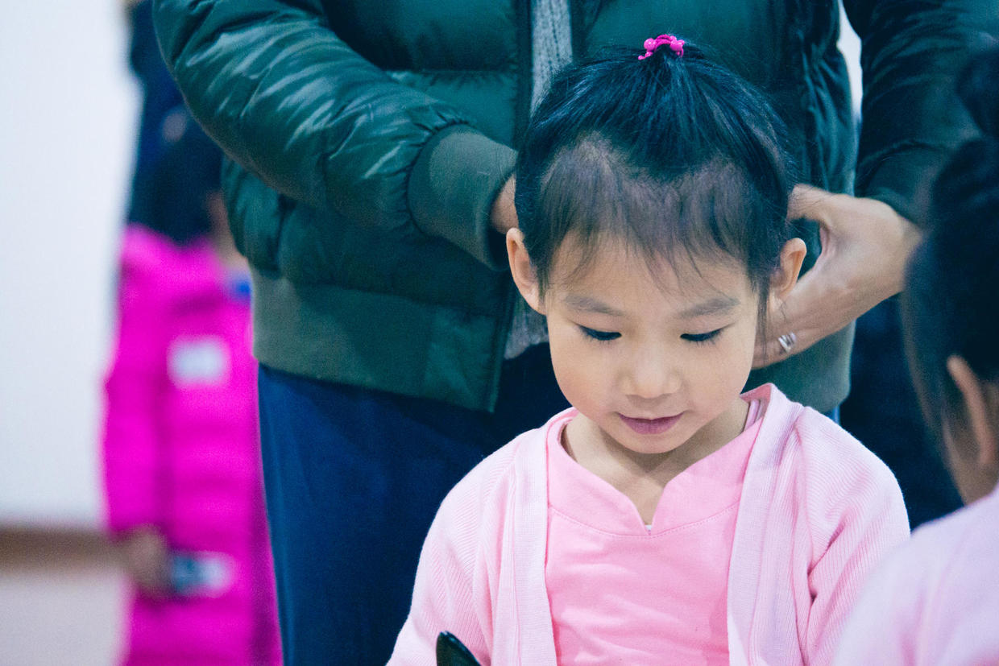

一边梳头，一边和自己的同学聊天。

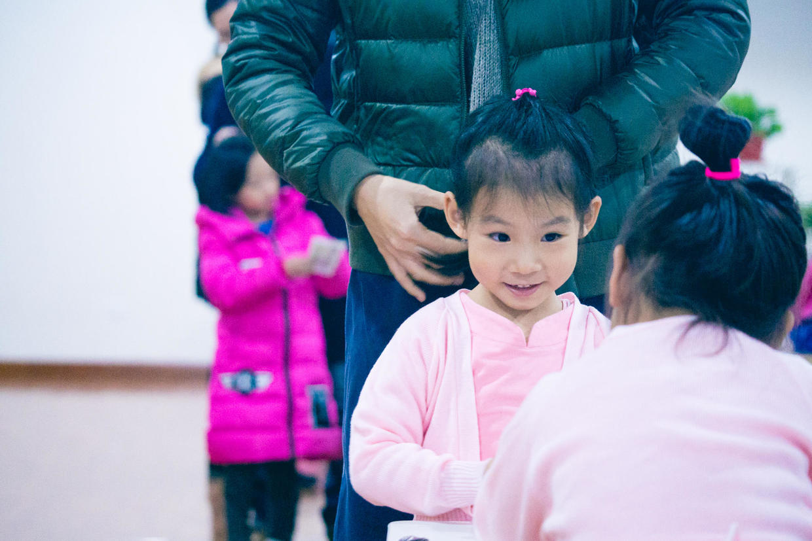

同学之间很熟悉了，聊得眉飞色舞的。

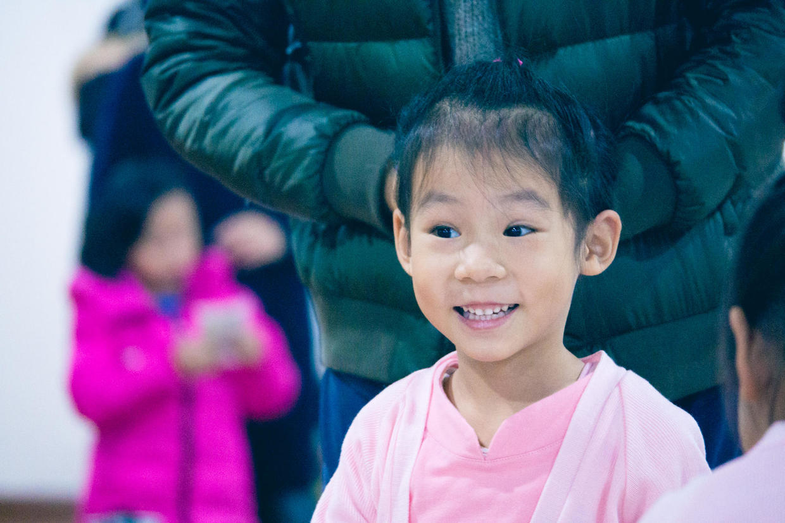

上课进教室前，要在大门口排好队。站在队伍里，还在和同学亲密交流。

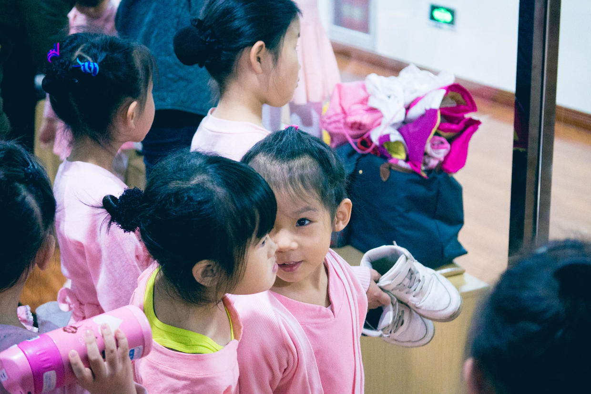

门口老师统计人数。

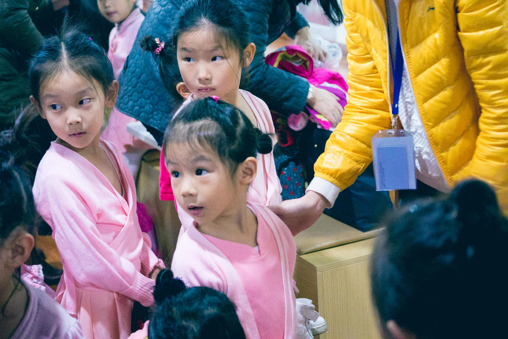

像个小大人，大踏步进教室。

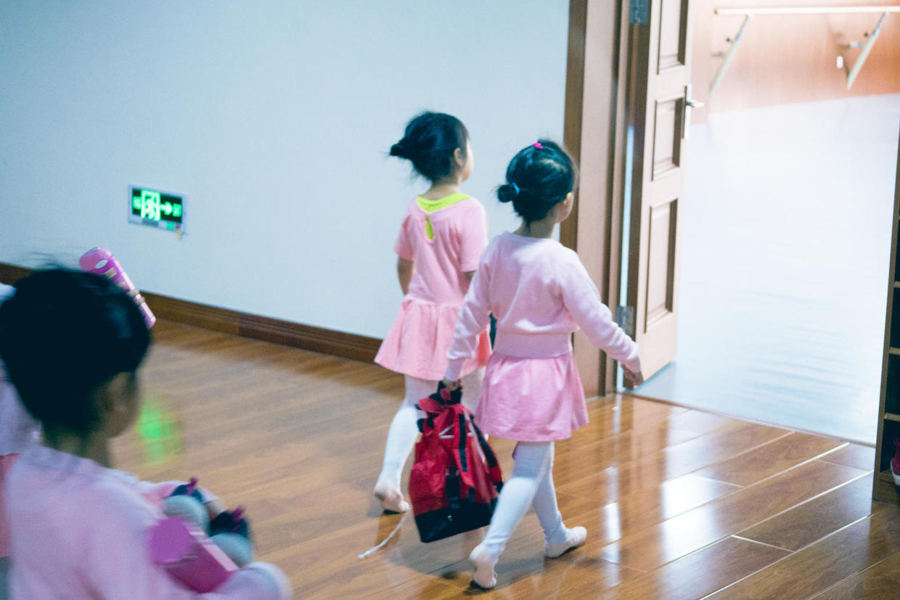

课间休息，老师带队出来上厕所。

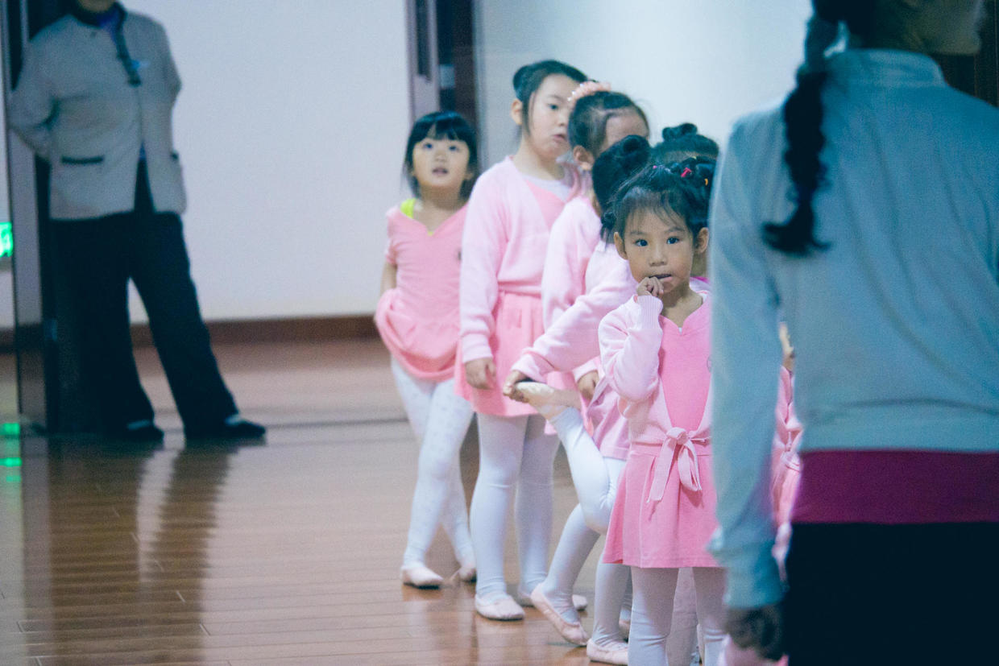

看见我们，隔着玻璃打招呼。

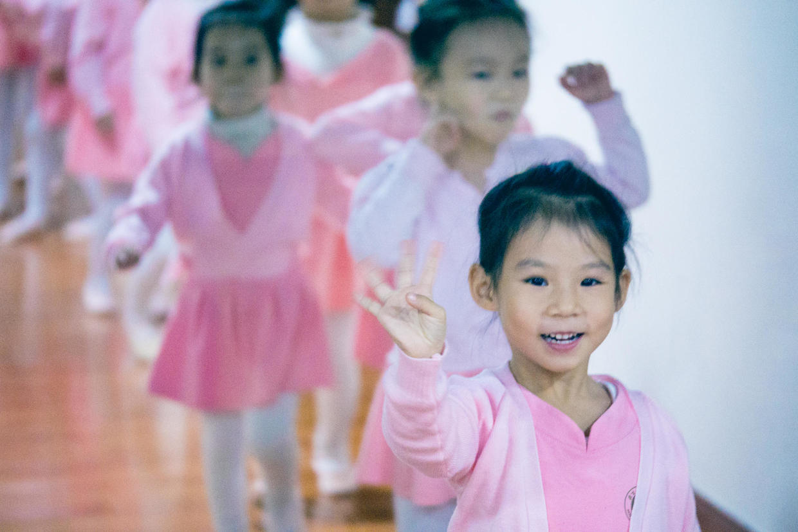

下课排队出教室。

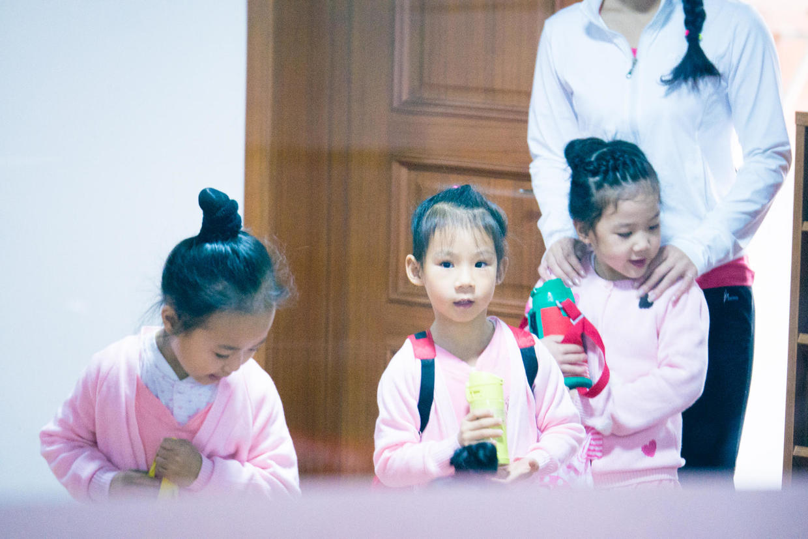

紧张的课程结束了。

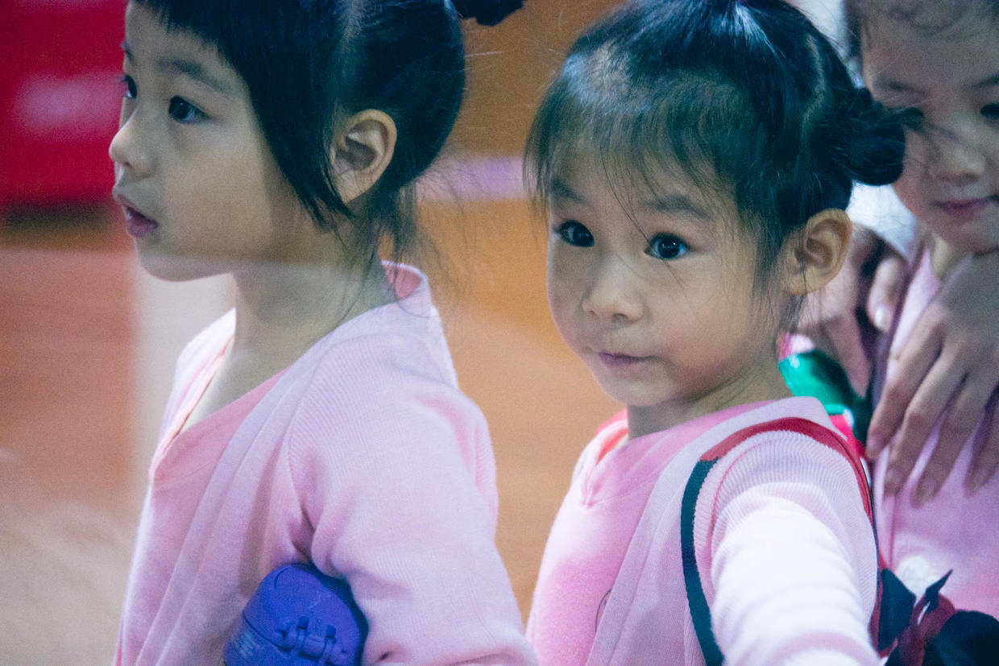

中午经过反复斗争，喵决定去海碗居吃炸酱面，不过面条也不没吃多少。

中午明显困了，早点睡觉，好好休息，下午可以去超市。

***下期预告：周末活动***

**个人微信公众号，请搜索：摹喵居士（momiaojushi）**

**喜欢作者写写哪些话题，可以公众号留言**

          
        