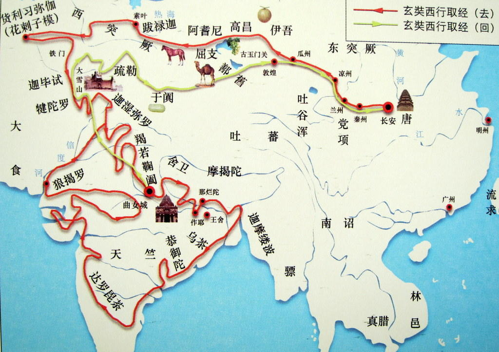

          
            
**2016.11.25**

最近在看玄奘的传记，不得不感慨其一生追求“真理”的坚强意志。

摘录百科上对他的简介如下：
>玄奘（602年~664年），唐代著名高僧，法相宗创始人，洛州缑氏（今河南洛阳偃师）人[1]  ，其先颍川人[2]  ，俗家姓名“陈祎（yī）”，法名“玄奘”，被尊称为“三藏法师”，后世俗称“唐僧”，与鸠摩罗什、真谛并称为中国佛教三大翻译家。

>玄奘为探究佛教各派学说分歧，于贞观元年一人西行五万里，历经艰辛到达印度佛教中心那烂陀寺取真经。前后十七年学遍了当时的大小乘各种学说，共带回佛舍利150粒、佛像7尊、经论657部，并长期从事翻译佛经的工作。玄奘及其弟子共译出佛典75部、1335卷。玄奘的译典著作有《大般若经》《心经》《解深密经》《瑜伽师地论》《成唯识论》等。《大唐西域记》十二卷，记述他西游亲身经历的110个国家及传闻的28个国家的山川、地邑、物产、习俗等。《西游记》即以其取经事迹为原型。

玄奘享年一共62岁，但是一生将近40年都在求法和译经。

纵观他整个西行的经历，面对的全是失败命运的赛点，但是他竟然一个个逆转过来。

贞观元年，边境封锁，朝廷不允许个人出关。

玄奘选择偷渡，在一个胡人帮助下，渡过大河，奔向玉门关。

正是这个胡人留给玄奘的老马，日后救了玄奘一命。

偷渡玉门关，后面有五座烽火台。玄奘到了第一座烽火台，夜里取水，被士兵放箭抓捕。

守关将领笃信佛教，是敦煌人，于是想请玄奘去瓜州讲法，将功折罪。

此时玄奘说出了掷地有声的话：
>宁向西方一步死，不向东土半步生。

于是被感动的将领，给玄奘指路，直通第四关。

第四关将领和第一关将军是亲戚，款待了玄奘，换了更好的装备，准备了更大的水囊。

在指点下，玄奘跳过第五关，直接进入了八百里沙漠。

估计是水囊太大，取水时打翻了，无奈之下只好东归取水，走了10几里之后，想起了自己之前的话，于是放弃取水，继续西行。

在精疲力尽，准备就死时，老马找到了水，终于成功走出了沙漠。

经历了这么多赛点后，其实只是旅行刚刚开始。

后面还有无数的生死考验。

***下期预告：周末活动***

**个人微信公众号，请搜索：摹喵居士（momiaojushi）**

**喜欢作者写写哪些话题，可以公众号留言**

          
        