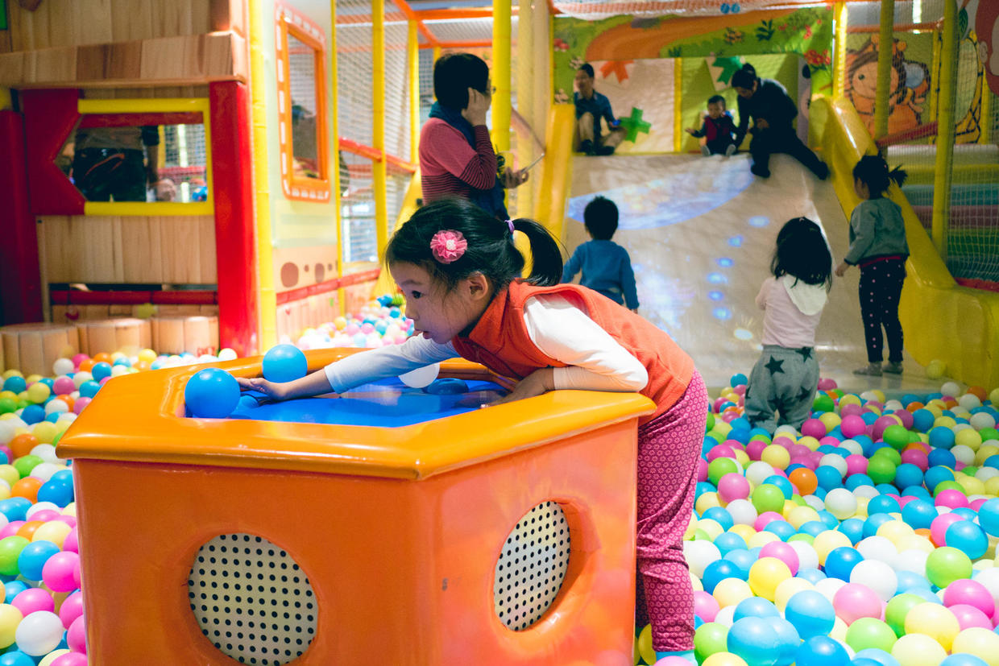
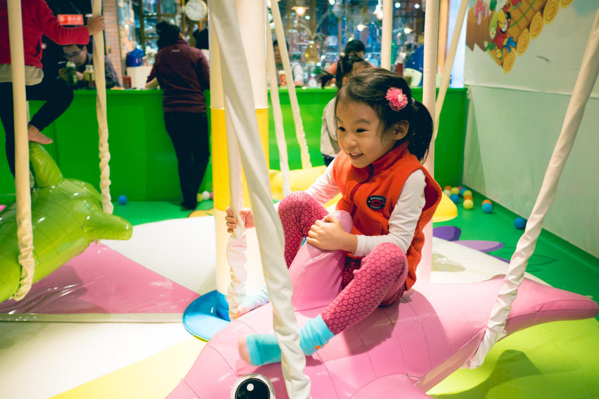
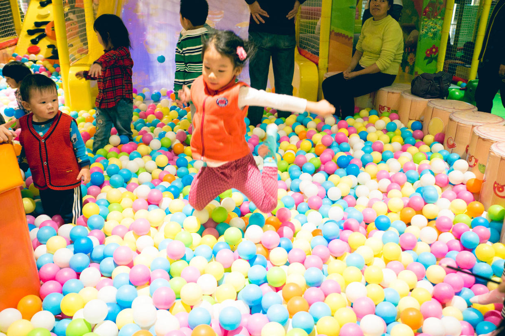
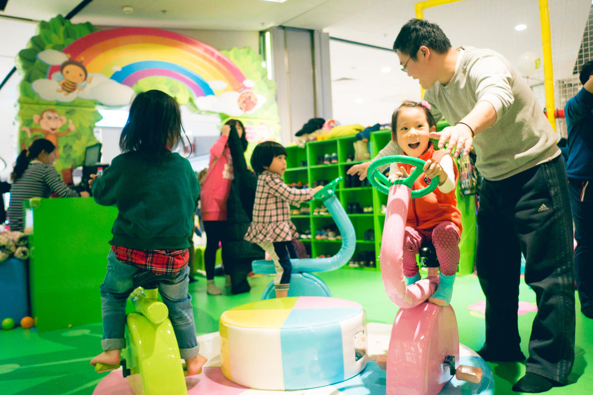
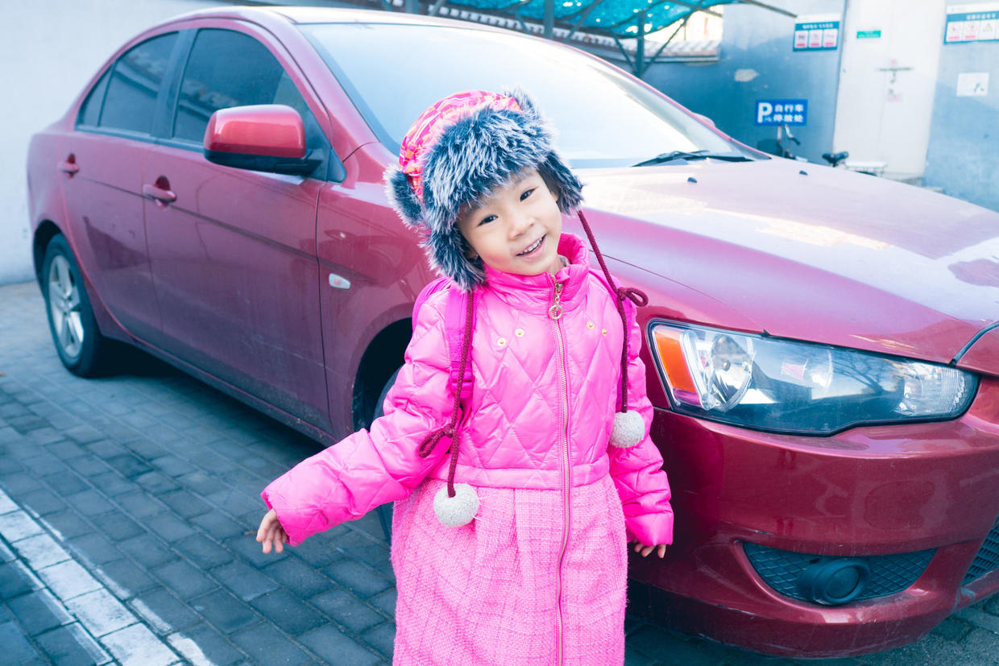
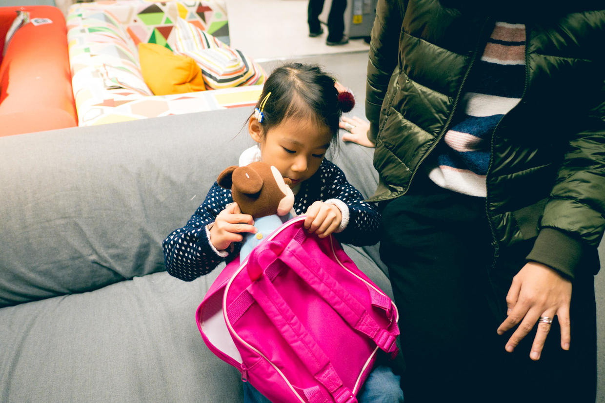
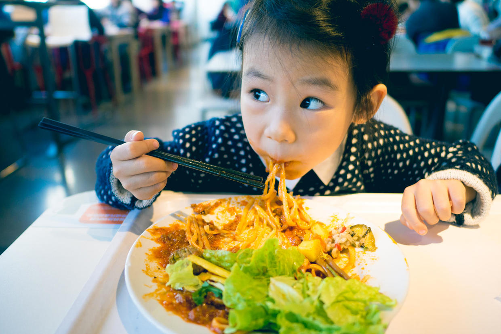
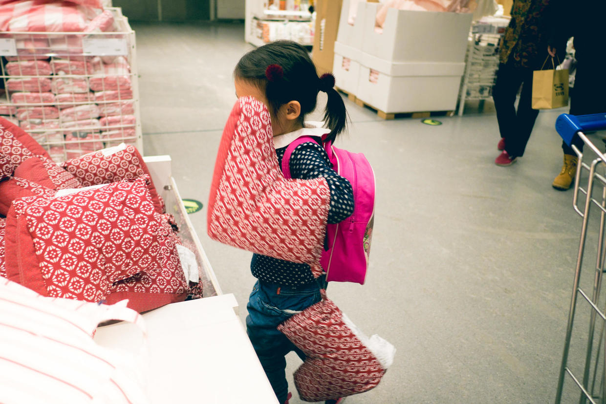
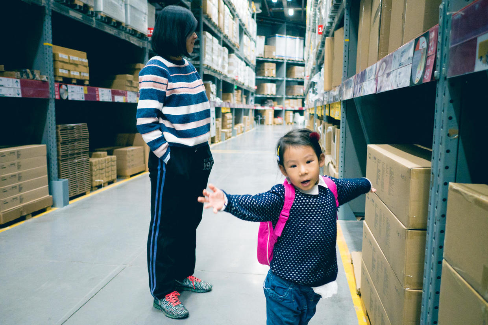

          
            
**2016.11.27**

周六晚上，雾霾到了顶点，继续室内活动。

找了商场的游乐场活动，海洋球区域里下饺子一样。

自己已经可以窜上旋转的小海豚了，自由上下。

在海洋球里，不停地高高跃起，上下翻飞。

坐旋转自行车，主动请旁边的一位叔叔帮忙推一下，一点也不害羞。

周日一早起来，狂风带走了雾霾，不过外面也是相当寒冷。

穿得严严实实地，去开车。

来到宜家，喵自己要求背书包，带上自己的米妮宝宝。

中午还是吃意面和蔬菜，一人能吃半盘子。

自己发现了大靴子，套在手上，非常有喜感。

从宜家出来前，特意跑到货架区，相比之下，显得她更小了。

中午回家睡个大觉，下午去晒晒太阳。

短短2天的周末，又飞快地过去了。

***下期预告：看图说话***

**个人微信公众号，请搜索：摹喵居士（momiaojushi）**

**喜欢作者写写哪些话题，可以公众号留言**

          
        