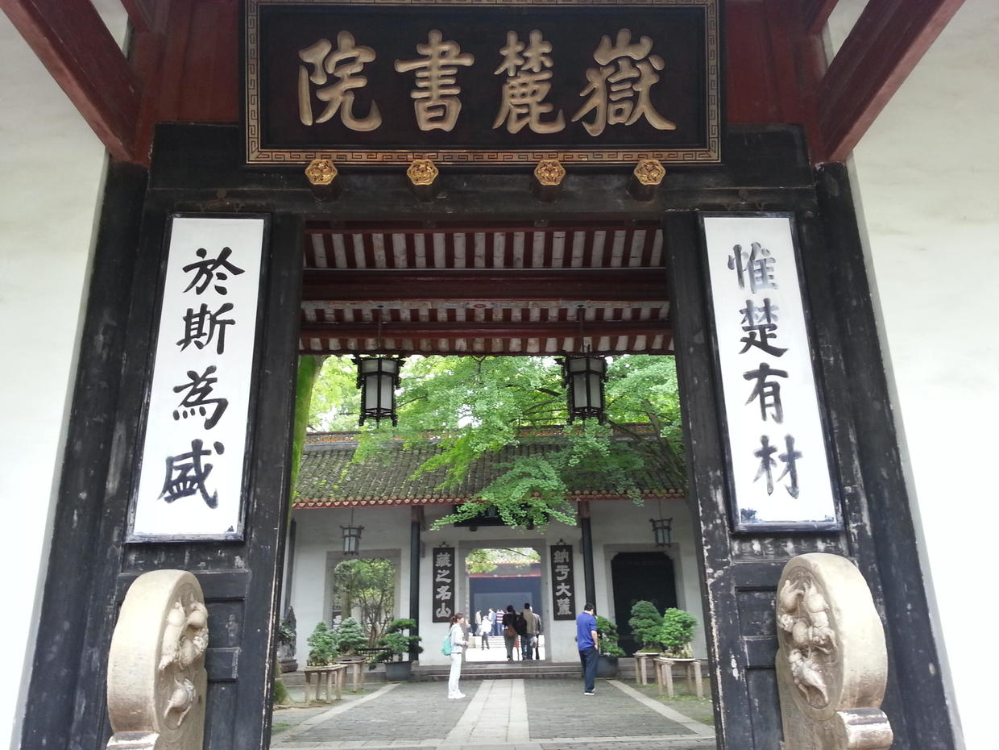
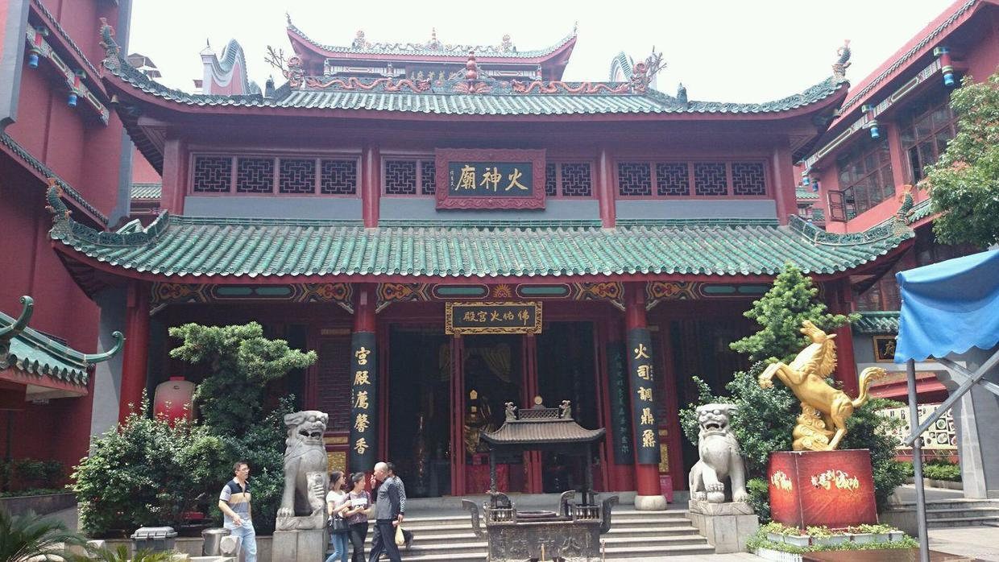

          
            
**2016.11.30**

承接上一篇[288.朝花夕拾51~长沙之自力更生](https://www.jianshu.com/p/f578164e9d96)，这次是一篇轻松的游记了。

结束了紧张的工作，终于可以轻松一下了。

老师带我们在长沙好好玩儿了一天。

首先去的当然是湖南大学里的岳麓书院了。

每天上下山都会经过岳麓书院，今天终于走进去了。来游览的人并不多，门口买票后，我们几个人一起合了影。

进到书院里，感觉并没有特别不同的地方，只是觉得一切都很平静。

那时对园林没有什么认识，感觉岳麓书院和团结湖公园风格很像。

本来想爬岳麓山，但考虑到夜里还要坐火车回京，就只能作罢了。

接着，我们坐公交到市中心，准备给家里买些东西。

我买了辣椒酱和各种牌子的槟榔，准备让家人们尝尝鲜。

到了傍晚，长沙市中心广场上大屏幕播出新闻，人们都沸腾了。

原来是北京奥运会吉祥物五福娃的形象曝光。

接着我们误打误撞来到了火宫殿，可惜不开门。老师在门外给我们科普了很多火宫殿的知识，现在都已经不记得了。

最后来到了火车站，终于到了和长沙说再见的时候了。

现在回想一下这个一日游，竟然没有去马王堆，实在是可惜可惜。

火车上一夜之后，终于回到了寒冬里的北京。

后面还会有一篇介绍在长沙期间的饮食。

***下期预告：丽江之大研古镇***

**个人微信公众号，请搜索：摹喵居士（momiaojushi）**

**喜欢作者写写哪些话题，可以公众号留言**

          
        